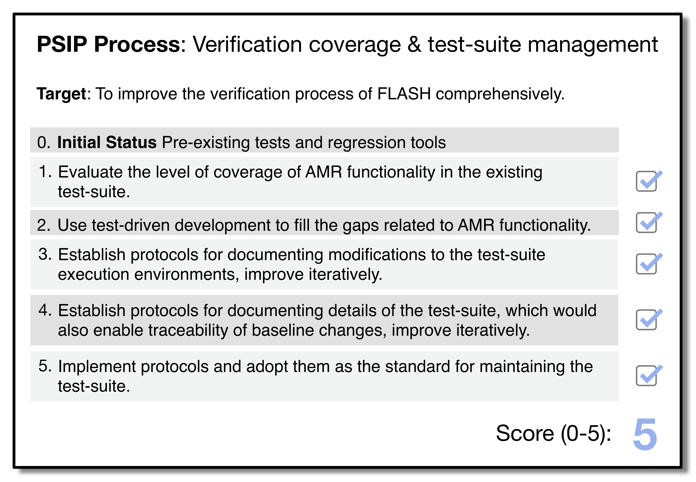
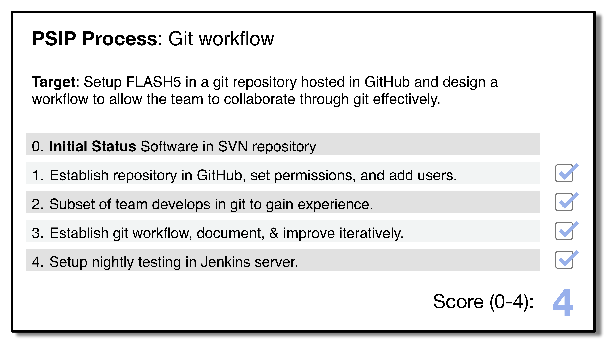

# FLASH5 Refactoring and PSIP

**Hero Image:**

 - [Simulation of a core-collapse supernova using the FLASH application.]
 
#### Contributed by [Anshu Dubey](https://github.com/adubey64) and [Jared O'Neal](https://github.com/jared321)

#### Publication date: August 27, 2019

During the lifecycle of any long-lived software, circumstances demand
nontrivial changes from time to time. Such circumstances can arise in 
high-performance computing due to, for example, the desire to implement better
numerical methods, to use different software stacks, or to adapt the software to
run on different platform architectures.  As an example, a fundamental
paradigm shift in platform hardware architecture occurred in the 1990s from vector machines to RISC
machines, and currently another shift is under way due to the proliferation of
accelerating devices and other specialized hardware.  The extent
of necessary modifications and the path to implementing these are more
challenging with this latest shift because the codes are much larger and more
heterogeneous themselves.

### FLASH refactoring overview
[FLASH](https://iopscience.iop.org/article/10.1086/317361) is a large and complex multiphysics and multiscale code that has been in
public release since 2000.  FLASH has undergone two major revisions in the past
to build an extensible and flexible infrastructural framework with the goal of
achieving robustness and longevity.  The onset of platform heterogeneity
requires another major [refactoring](https://bssw.io/items?topic=refactoring) because
several components of the infrastructure are inadequate to meet the challenges 
posed by these platforms.  We started to restructure the code infrastructure two
years ago by examining the scope and extent of changes that needed to occur in 
the APIs of the code units to replace or modify the outdated infrastructural
units. The code restructuring described in this article is being carried out under the AMReX Co-design Center, with the intent of enabling exascale simulations to be done under the ExaStar project. Both AMReX and ExaStar are members of the Application Development focus area of the U.S. Department of Energy's [Exascale Computing Project](https://exascaleproject.org).

The primary objective of the refactoring was to modify the interfaces of the
so-called Grid code unit so that (1) looping over domain sections (blocks)
could be done using smart iterators and (2) an alternative adaptive mesh
refinement library, [AMReX](https://amrex-codes.github.io/amrex), could be used with the code. The smart iterators
enable out-of-order execution of blocks, and therefore asynchronization,
so that a block can be handed to an operator as soon as its dependencies are
met. AMReX was adopted because it supports hierarchical parallelism and asynchronous
operations, which the old adaptive mesh refinement (AMR) library, Paramesh,
simply does not.  The fine details of this refactoring effort have already been
described elsewhere by O'Neal, Dubey, and Weide (2018).[1]

### PSIP and FLASH
While working on this effort, we were introduced to the [Productivity and Sustainability Improvement Planning (PSIP)](https://bssw.io/psip) process, which is developed and promoted by the [IDEAS-ECP](https://ideas-productivity.org/activities/ideas-ecp/) project.   PSIP is itself a work in progress that is becoming a useful methodology for improving productivity and software sustainability.  We now recognize that the fundamental philosophy of our process aligns well with that of PSIP – take stock of where the project is and make changes in small, well-planned, and manageable steps.  Because of this similarity, we are able to map retroactively our process for improving two development processes onto PSIP and discuss how we may have used PSIP to improve our productivity and the quality of our work.

### Refactoring and testing

The first improvement addressed the need to grow our test suite and to improve techniques for documenting how the test suite evolves in response to changes in the software.  This work has been retroactively represented by a PSIP [progress tracking card](https://bssw.io/psip) (PTC) for verification coverage and test-suite management, shown in Figure 1.  This work was linked to the effort to refactor the mesh management component of FLASH to work with AMReX, so that we could address perceived barriers to correctly and productively achieving this goal.  The need for this process improvement is best understood through explaining our plan of attack for the refactoring.

 

[Figure 1. A PSIP progress tracking card that represents the incremental steps used to improve our verification process.]

 

Our refactoring strategy relied on two team members carrying out simultaneous, incremental refactoring efforts with similar goals.  One person added in AMReX from the bottom up, while the other person undertook a top-down refactoring.  In the latter approach, the data structures for storing solution data were constructed with AMReX; but the original library, Paramesh, was used to drive the mesh refinement.  The first task in the PTC resulted in our understanding that the FLASH test suite had enough tests in place to verify the top-down modifications through simulation-level regression testing but was inadequate for the bottom-up part.  While some unit tests  already existed, they  did not provide sufficient coverage for our desired incremental modification approach. The reason was that the internal AMR features of AMReX are quite different from those of Paramesh, which was used to design the original tests.
We therefore used test-driven development to design and implement integration-level regression testing, where each new test covered a single aspect of the internal AMR functionality.

In addition to these changes to the test suite, we identified the need to improve our documentation of the setup of each execution environment used to run our test suite.  For example, we decided to maintain a history of which third-party libraries were installed, when, and why.  Also, we wanted to be able to trace the provenance of each baseline we establish for regression testing and needed to create a procedure for documenting how a baseline was verified both when created and when updated.

Since this refactoring was large and complicated, we appreciated the incremental nature of making improvements, which is in accord with the PSIP methodology.  For instance, as we were working on items 1 and 2, we could use the experience of writing more tests and adding these to the test suite to try out potential protocols for documenting the history of changes to baselines.  However, we did not feel pressured to work on item 5 until the refactoring effort was nearly finished and we had learned enough from these experiments.  While this approach meant that we might not record the full history of the test suite, the process allowed us to manage carefully the amount of work we were undertaking, as well as the complexity of the work, at any point in time.

### Git workflow

Because we decided to transition the management of our code to git, the second improvement related to designing and evolving a test-driven git workflow so that we could improve the collaboration that occurs when team members integrate work developed in parallel through a revision control system.  Rather than adopt a full-featured and possibly excessive workflow, we started simple and added capabilities as needed.  This incremental process has been retroactively represented by the PSIP progress tracking card (PTC) for git workflow shown in Figure 2.

 

[Figure 2. A PSIP progress tracking card that represents the process of designing, implementing, and improving our git workflow.]

 

To date, the code in the git repository is a small subset of the production version of FLASH. Although this relatively simple workflow has worked well so far, we have already identified an area where we would like improvement and where we can explicitly apply PSIP. This area is to *smoke test* changes made to the software in the repository with a continuous integration test server such as Travis CI. (*Smoke testing* is preliminary testing to reveal simple failures.) As more code components from the production version are transitioned to git and more users and contributors switch to the git version, we will be faced with many more challenges and the need for process improvements. While our development philosophy has always mirrored PSIP, the formalization brought by PSIP makes the philosophy explicit to new team members and external contributors. We foresee many instances of PSIP being used before the new version of FLASH is ready for production.
 
<!-- Replace using hyperlinked ref format
#### Citations
* Jared O'Neal, Anshu Dubey, & Klaus Weide. [Experience report: refactoring the mesh interface in FLASH, a multiphysics software](https://doi.org/10.1109/eScience.2018.00141). 2018 IEEE 14th International Conference on e-Science (e-Science). IEEE.
-->

For more resources on PSIP, please refer to the following articles on the BSSw.io site:
- [The BSSw.io PSIP page](https://bssw.io/psip)
- [Planning for Better Software: PSIP Tools](https://bssw.io/items/planning-for-better-software-psip-tools)
- [Lightweight Software Process Improvement using Productivity and Sustainability Improvement Planning (PSIP)](https://bssw.io/items/lightweight-software-process-improvement-using-productivity-and-sustainability-improvement-planning-psip)
- [What makes PSIP suitable for the Exascale Computing Project?](https://bssw.io/items/what-makes-psip-suitable-for-the-exascale-computing-project)
- [Adopting Continuous Integration for Long-Timescale Materials Simulation](https://bssw.io/blog_posts/adopting-continuous-integration-for-long-timescale-materials-simulation)

### Author bios
Anshu Dubey is a computer scientist in Argonne National Laboratory’s Mathematics and Computer Science Division. She is the primary software architect for the FLASH code. She is interested in all aspects of scientific software development and has largely been responsible for the establishing FLASH's software process.

Jared O’Neal is a scientific software programmer/developer in Argonne National
Laboratory’s Mathematics and Computer Science Division.  He currently works on
computational science applications with an eye on improving processes to ensure
productivity while maintaining scientific rigor.  Jared has a background in
physics and mathematics and had the pleasure of working as an instrumentation
and systems engineer at the Paranal Observatory in the Atacama desert.

 

[1-sfer-ezikiw]: #ref1 "Experience report: Refactoring the mesh interface in FLASH, a multiphysics software"

References | &nbsp;
:--- | :---
1 | [Jared O'Neal, Anshu Dubey, and Klaus Weide. Experience report: Refactoring the mesh interface in FLASH, a multiphysics software. 2018 IEEE 14th International Conference on e-Science ](https://doi.org/10.1109/eScience.2018.00141)

<!---
Publish: yes
Track: deep dive
RSS update: 2019-08-27
Topics: software process improvement, refactoring, testing
Pinned: no
--->

<!-- DO NOT EDIT BELOW HERE. THIS IS ALL AUTO-GENERATED (sfer-ezikiw) -->
[1]: #sfer-ezikiw-1 "Experience report: Refactoring the mesh interface in FLASH, a multiphysics software"
<!-- (sfer-ezikiw begin) -->
### References
<!-- (sfer-ezikiw end) -->
* 1[Experience report: Refactoring the mesh interface in FLASH, a multiphysics software](#ref1)
