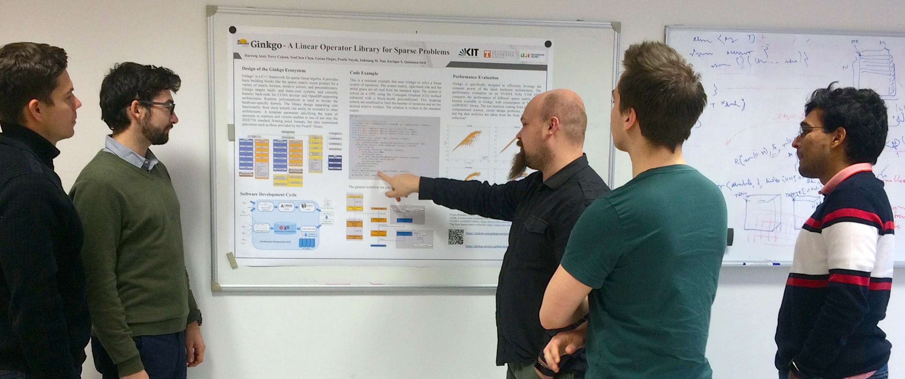
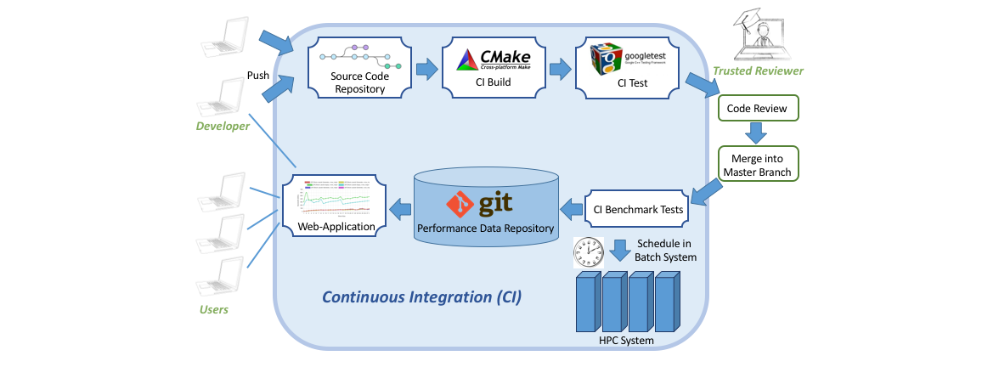
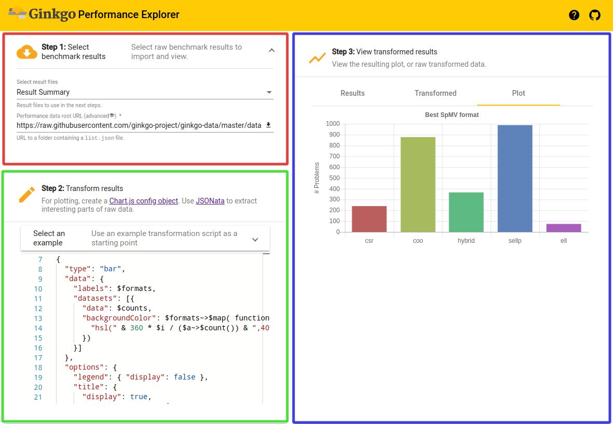

# The Art of Writing Scientific Software in an Academic Environment    

#### Contributed by [Hartwig Anzt](https://github.com/hartwiganzt)

#### Publication date: February 11, 2019

**Hero Image:**
- 

Academic software development needs to balance academic aspects such as confidentiality and intellectual property with ready-to-use production code. In the Ginkgo software project we address this challenge by employing sustainable software design with a healthy software development cycle.

### A Software Journey
It all starts with a Ph.D. project or a master's project. We write our first piece of scientific software, not in a sophisticated software design with appropriate documentation or correctness tests, but with the single goal of having the code running and delivering the results or insights we need to graduate. 
 

Sometimes, we later come back to that code, remembering that a while ago we had programmed something that may now be useful. And we try to reconstruct and re-engineer what we had once started but then abandoned as we moved on. Even though we learn the hard way the advantages of following strict software design rules and having a well-designed software development process, we often do not adopt that process in our first professional appointment in academia. The focus is on publishing papers, getting community attention, and maybe writing proposals --  not on sustainable software development. The code may get more complex, and we probably start using versioning systems for collaborating with peers and employ some correctness checks, but the goal remains the same: to realize new ideas and algorithms as quickly as possible. We feel our future depends more on the publication of our next paper than on the usefulness and sustainability of the related code stack. 
 

That situation may change, however, when the first external users start using our software. Suddenly, questions like "Where is that documented?" and "Are these two components compatible?" arise. This is the point at which we start regretting not having written proper documentation in the first place -- and the point when we realize how hard it is to remember ideas and considerations from half a year ago. 
 

Moving on, we try to introduce tests that check the correctness of our routines and cross-platform compatibility -- an adventure doomed to fail because the code typically  adheres neither to the single responsibility principle nor to the interface-segregation principle. In response to the situation, we design tests that ensure the correctness of some key functionality and commonly used execution patterns. While these actions may provide a glimpse of what is working, they can never serve as a bulletproof test for all scenarios. 
 

Often, the only option is to rewrite everything from scratch. At that point, making a high-level analysis of the efforts is important:

* Does the software have long-term potential, justifying a complete rewrite?

* Do I have the resources (personnel, funding) to realize a redesign?

* Can I survive academically a period with few or no scientific publications or project proposal submissions?

* Do I have the infrastructure, support, and expertise to realize a redesign in a healthy software development workflow?

Aside from these critical questions determining the feasibility of a redesign effort, one has to consider aspects concerning the existing software stack: 

* Will it be maintained in the future? 

* Is backward-compatibility an option? 

* How can existing users be served during the software redesign?

 

Personally, I have the privilege of several funding efforts and significant community support, which allowed me to meet all requirements.
 

In the [Ginkgo](https://ginkgo-project.github.io/) software effort we turn the development upside down: we do not start with implementing features; instead, we start with the design of the library structure and a healthy software development process.

 

<!--- Image to illustrate the Software Development Cycle --->

### Sustainable Software Design in Ginkgo

Ginkgo is designed as an open source C++ linear algebra library following the [SOLID](https://en.wikipedia.org/wiki/SOLID) software design principles: Single responsibility; Open/closed; Liskov substitution; Interface segregation; and the Dependency principle. 
 

With the goal of maximizing compatibility and extensibility, we decided to completely separate the linear algebra algorithms from the architecture-specific kernel implementations. Using an architecture-specific "Executor" allows adding, removing,
or modifying backends according to future changes in the hardware architectures and parallelization strategies. Currently, Ginkgo is designed for node parallelism, featuring backends for NVIDIA GPUs and OpenMP-supporting platforms. Additionally, it features a sequential reference executor that is used in the unit tests to ensure the correctness of the hardware-specific parallel kernels. 
 

The unit tests are realized by using the [Google Test](https://github.com/abseil/googletest) framework and having new features covered by unit tests is a prerequisite for merging them into the master branch of the repository. 
 

Another central design feature of Ginkgo is the concept of expressing not only basic linear algebra operations such as matrix-vector products but also complex algorithms such as iterative solvers and
preconditioners as linear operators that all share key functionalities like apply, clone, and copy. This greatly enhances user friendliness, reduces the coding effort, and efficiently avoids code duplication. In order to simplify its use, library features are not only thoroughly documented by using [Doxygen](https://en.wikipedia.org/wiki/Doxygen) but also typically are accompanied by small usage examples or tutorials.

### Academic Aspects in the Ginkgo Software Development

To enable a healthy software development process, Ginkgo is a community effort licensed under the [modified BSD license](https://en.wikipedia.org/wiki/BSD_licenses). A central Git repository requires two reviews on every merge to the master branch. This branch is automatically mirrored into a private repository where branches are used for the development of novel algorithms and the deployment of unpublished performance optimizations. In this way, Ginkgo keeps in mind academic software development, where the option of keeping new ideas and algorithms confidential is important in avoiding knowledge theft and in adhering to the principles of academic publication. Synchronization with the public master branch enables quick integration of successful development into production code.
 
  
  

<!--- Image to illustrate the Software Development Cycle --->

Figure 1. Illustration of the sustainable software development cycle employed for the Ginkgo ecosystem.

 

### Continuous Integration and Continuous Benchmarking

Public and private feature developments are automated with the help of a [continuous integration (CI)](https://en.wikipedia.org/wiki/Continuous_integration) framework that checks the [CMake](https://cmake.org/) compilation process for a large number of hardware architectures and compiler/library environments [(Cross-Platform Portability)](https://en.wikipedia.org/wiki/Software_portability). The CI system also ensures successful completion of the unit tests. If all tests pass successfully and two reviewers approve the merge request, a new feature is integrated into Ginkgo's master branch and benchmarked on an HPC system; see Figure 1. 
 

While this approach also allows external contributors to have their features executed on an HPC cluster (which they may not even have access to), the reviewers approving the merge take full responsibility for the integrity of the code. 

### Ginkgo Performance Explorer

The performance results for the new feature are then retrieved from the HPC system
and archived in a repository storing performance data of Ginkgo routines. The [Ginkgo Performance Explorer (GPE)](https://ginkgo-project.github.io/gpe/) is a web application that can retrieve the performance data from the repository and visualize it in user-defined fashion, with the help of the integrated JSONata scripting language; see Figure 2. This not only enables monitoring performance changes over time but also allows external contributors to receive feedback about the feature they contributed. Moreover, it can potentially optimize the implementation. 

 
 

<!--- Image to illustrate the Software Development Cycle --->

Figure 2. The Gingko Performance Explorer allows users to interactively analyze the data collected in the continuous benchmarking framework by using a web browser.

 

We are convinced that this software development cycle, along with the sophisticated library design, forms the basis for a successful academic community effort and allows Ginkgo to transition from a "small community" project to a high-profile software ecosystem.

### Author Bio
[Hartwig Anzt](https://github.com/hartwiganzt) is a Helmholtz Young Investigator Group leader at the Steinbuch Centre for Computing at the Karlsruhe Institute of Technology, Germany. He also holds a Senior Research Scientist position in Jack Dongarra's [Innovative Computing Lab](http://www.icl.utk.edu/) at the University of Tennessee, USA. Hartwig Anzt has a strong background in numerical mathematics, specializes in iterative methods and preconditioning techniques for the next-generation hardware architectures, and has a long track record of high-quality software development. He is author of the [MAGMA-sparse](http://icl.cs.utk.edu/magma/) open source software package, managing lead and developer of the [Ginkgo project](https://ginkgo-project.github.io/), and part of the ["Production-ready, Exascale-enabled Krylov Solvers for Exascale Computing" (PEEKS)](http://icl.utk.edu/peeks/) effort delivering production-ready numerical linear algebra libraries as part of the [Exascale Computing Project](https://www.exascaleproject.org/). 

<!---
Publish: yes
RSS update: 2019-02-11
Categories: reliability, development
Topics: testing, design
Tags: bssw-blog-article
Level: 2
Prerequisites: default
Aggregate: none
--->
