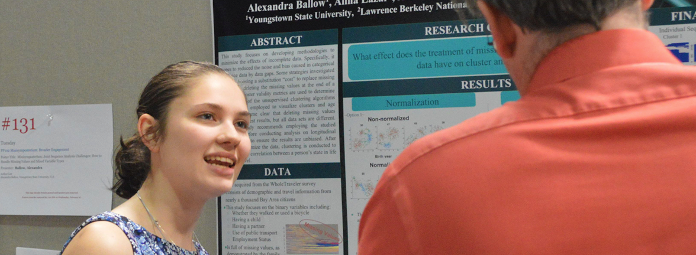

# Increasing Productivity by Broadening Participation in Scientific Software Communities

**Hero Image:**
 
- [Alexandra Ballow, a student at Youngstown State University who was a participant in the Broader Engagement Program at SIAM CSE19, presenting her work to Paul Hovland of Argonne National Lab.  Alexandra previously participated in the Sustainable Research Pathways program.]

#### Contributed by [Mary Ann Leung](https://github.com/maleung "Mary Ann Leung GitHub Profile"), [Damian Rouson](https://github.com/rouson "Damian Rouson GitHub Profile"), [Lois Curfman McInnes](https://github.com/curfman "Lois Curfman McInnes GitHub Profile") 

#### Publication date: September 25, 2020

Numerous studies have shown that diverse organizations,
teams, and communities perform more creatively and effectively—and thus are
more productive. While some efforts are already under way to broaden
participation in high-performance computing (HPC) and computational science
and engineering (CSE), we observe that our communities could benefit by
increasing emphasis on sustainable strategies to advance diversity and
inclusion.

**Lois Curfman McInnes:** Mary Ann and Damian, many thanks for providing your perspectives
as leaders who are working to broaden participation of under-represented
groups in high-performance scientific computing. I am hoping to learn more
about how individuals and groups can take steps forward within our own
spheres of influence to broaden participation and thereby to help the
community as a whole advance in productivity.

**Lois:** What are your backgrounds?

**Damian Rouson:** My training is in computational fluid dynamics. As a consultant,
educator, and researcher, I have long aimed to adapt leading-edge software
engineering practices to computational science and engineering applications.
I’m passionate about advancing development practices in modern Fortran. As
an African-American, I see my adopting an underdog language as partly an
extension of being outside the dominant culture in STEM fields. At a time 20
years ago when most people who were passionate about improving scientific
software development were adopting other languages, I found that an ability
to embrace difference and combat stigma along one obvious dimension,
ethnicity, makes it feel natural to swim upstream or outside the mainstream
along another dimension: programming language choice.

**Mary Ann Leung:** My training is in computational quantum mechanics simulations
on HPC systems. As a woman of color, a first generation scientist, and a
non-traditional student, I found the need for and became interested in
diversity in science during school. I got involved in diversity initiatives
and founded a few campus organizations focused on diversity and inclusion as
well as career and professional development. I later ended up migrating my
career to workforce development where my passion for the people side of
science could be realized.

**Lois:** Why is broadening participation important for improving productivity – of software developers and high-performance computational science overall?

**Mary Ann:** CSE/HPC developer productivity can be advanced by engaging a
broader set of individuals for several important reasons. First off, CSE and
HPC are inherently complex and require teamwork, creative solutions, and
collaboration. Research indicates that diverse teams *are*
more innovative. Additionally, the workforce in general is becoming more
diverse, and by not including members of underrepresented groups, we are
missing out on potential new developers with new ideas and approaches.

**Lois:** What are some issues that organizations should consider in order to create effective environments where diverse community members can thrive?

**Damian:** Recognize that institutions do not become homogeneous by chance
and will not become heterogeneous by chance. Strongly deterministic forces
shape the make-up of an organization.

Equally strong, deterministic forces will be needed to counter patterns that
have become sufficiently normalized as to seem unavoidable. Intentionality
is key. Ultimately, an inclusive environment benefits all. Codes of conduct,
for example, bring more people into full participation in discussions where
they might otherwise be less likely to participate due to some experience of
being disadvantaged relative to other participants. That experience of
disadvantage could stem from simply being new to an organization or it could
stem from being a member of a group that has experienced discrimination
historically.

**Mary Ann:** Consider the following.
-   *Expanding Networks*: One of the biggest challenges I see organizations
    struggle with is broadening their networks. Our current lack of diversity
    has resulted from the natural practice for people to use their own networks
    when looking for collaborators, students, post-docs, new hires, committee
    members, etc. So the BIG challenge is getting outside of those networks. But
    that’s asking people to know what they don’t know or reach people they don’t
    know. So start small by finding people one or two nodes away so you can
    access new and hopefully more diverse networks. Even better, seek out people
    like Damian and organizations that have established networks with diverse
    communities, such as [Sustainable Horizons
    Institute](http://shinstitute.org/) and the many other organizations out
    there.
-   *Recruitment vs. Retention*: Many organizations start with a focus on
    recruiting; however, if organizations work only on recruiting, they will
    ultimately fail. The best recruitment is good retention. Without creating
    environments where everyone feels welcome, fully participates, and thrives,
    no amount of recruiting can achieve broad engagement of the potential
    workforce.
-   *Beyond Recruitment*: It is important to think about diversity not just in
    terms of recruitment. Creating diverse workplace environments where there is
    currently little to no diversity requires a long view. It is important also
    to work on outreach, which can have a multitude of benefits. Not only can
    you develop relationships with groups of interest, you can also use outreach
    as an opportunity to learn more deeply about the unique features and needs
    of the community.
-   *Critical Mass vs. Integration*: Another problem that organizations face is
    the critical mass issue. If there is a lack of or very little diversity in
    an organization, how can you increase diversity when starting at or near
    zero? No one wants to be the canary in the mine, testing out whether or not
    the environment is survivable; nor does anyone want to gather in the corner
    and be separate from the main group. There is an important balance between
    critical mass and integration. It is hard to be “the only one”, yet working
    toward achieving critical mass also requires full integration in the
    community. The work we do at Sustainable Horizons intentionally focuses on
    mainstream communities where we try to balance critical mass and
    integration. The [Broader
    Engagement](http://shinstitute.org/the-broader-engagement-be-program/)
    program at SIAM CSExy conferences is an example of this approach and is
    described below.

**Lois:** What are some actionable steps that institutions, departments, and groups can take to broaden participation in *research and development* (including visitor/student programs, staff hiring, etc.)?

**Damian:**
-   Re-evaluate the criteria and processes used for hiring and advancement.
    Recognize that these criteria are not fully deterministic of future
    performance outcomes and probably exhibit correlation coefficients well
    below 1. When an organization recognizes a need for broader participation
    from underrepresented groups, it’s an opportunity to re-examine the measures
    of merit and determine the extent to which they contribute to the intended
    outcomes versus simply aligning with organizational norms and reinforcing
    established patterns.
-   Recognize that as organizations become more diverse, they will change. It
    will not be possible to engage people from a much broader set of backgrounds
    while continuing to operate largely the same way. New voices will lead the
    organization in new directions if empowered to do so. If not empowered, many
    will leave and the organizations will continue with business as usual.
-   If you want greater participation of underrepresented populations, recruit
    where those populations are *not* underrepresented: women’s colleges,
    historically black colleges and universities, tribal colleges and
    universities, and hispanic-serving institutions. Invest resources in
    collaborating with such institutions using internal research dollars.
-   A few easy actions to begin:
    -   Ask hiring managers to document what steps they will take to recruit a
        more diverse candidate pool and then later ask them to report on how
        they did towards their plans.
    -   As part of documenting steps, have departments share best practices with
        each other to ensure that success begets success and proven ideas
        spread. Also publicly highlight and honor best practices.

**Mary Ann:** Develop strategies and action plans in these areas:
-   Outreach
-   Recruiting
-   Hiring
-   Retention
-   Workplace culture
-   Monitoring and tracking of data and activities

**Lois:** What are some actionable steps that organizers can take to broaden participation in *community activities* (such as workshops and conferences)?

**Damian:** Part of broadening participation might involve establishing new
roles that become part of the standard operational model in planning
activities such as workshops and conferences.

Conferences have steering committees, papers chairs, session chairs, and
administrative roles. The process of filling these roles often relies
heavily on the professional networks of those who have participated in the
event in the past. In a world wherein it becomes the norm to be intentional
about broadening participation, it could become routine to engage a person
or organization in examining and expanding the networks of the conference
planners beyond the usual suspects.

**Lois:** Can you provide some examples of successful efforts in diversity and inclusion? 

**Mary Ann:**
-   A program that has helped [Berkeley Lab Computing
    Sciences](https://cs.lbl.gov/) broaden their workforce is
    [Sustainable Research
    Pathways](http://shinstitute.org/sustainable-research-pathways-srp/).
    Through this program the lab has brought almost 200 faculty and students
    from underrepresented backgrounds to the lab for research collaborations.
    Participants have strengthened their vision of themselves as scientists,
    clarified their career goals, decided to go to grad school, and improved
    their technical skills. Staff have expanded their research portfolios and
    learned that there are extremely capable and dedicated scientists at
    institutions they would have never considered. Much of the success is due to
    bringing “unusual suspects” to the lab and opening the eyes of staff
    researchers to possibilities.
-   A good example of a strategic approach to workforce development is to start
    by taking stock of the current workforce environment and preparing a plan of
    action addressing recruitment, outreach, climate, culture, and retention.
    Sustainable Horizons has worked with a variety of organizations to conduct
    such studies. We start by gathering information and talking with people. We
    compile the information gathered, compare to national data, and make
    specific recommendations for how to move towards more diversity and
    inclusion.
-   An example of balancing critical mass and integration is the [Broader
    Engagement](http://shinstitute.org/the-broader-engagement-be-program/)
    program at the SIAM CSExy conferences. Through this program, we fund
    students and professionals from diverse backgrounds to attend the conference
    and participate in the full technical program and community. We also
    organize special events for the group designed to build community and
    provide mentoring as well as career, professional, and leadership
    development. Of particular success have been the [Guided Affinity
    Groups](http://shinstitute.org/siam-cse19-be-guided-affinity-groups/). These
    small learning groups meet virtually before the conference, then each
    morning over breakfast during the conference. The leaders are recruited from
    the SIAM CSE community. Each morning they discuss what sessions the
    participants should attend in their topical areas, answer questions, and
    provide other guidance. The feedback on these sessions has been very
    positive from both participants and leaders. At the end of the conference,
    each group presents what they learned to the whole group.

**Lois:** Any final comments?

**Damian:** Broader participation results not just from bringing people from
underrepresented populations into the settings where they are missing.
Consider doing the reverse: encourage staff to spend time at institutions
where underrepresented groups make up a majority: minority-serving
institutions or institutions in Africa and South America, for example.
Collaborations and visiting appointments in such settings will generate new
research directions and will create new professional networks, enabling
organizations to more fully leverage the talent pipeline. A common response
to underrepresentation is to blame the pipeline, but this cannot fully
explain many organizations’ workforces because too often the percentage
representation of the underrepresented groups falls far below the percentage
in the pipeline.

**Mary Ann**: The difference between diversity and inclusion can be
described with this analogy: Diversity is like being asked to the party,
where inclusion is being asked to dance. What good is it to show up but not
actually participate?

### Related Opportunities

Sustainable Horizons Institute is currently accepting applications from faculty and students for [Sustainable Research Pathways](http://shinstitute.org/srp-application/), deadline October 2, 2020 and from students for [Broader Engagement at SIAM CSE21](http://shinstitute.org/siam-cse21-broader-engagement-program/), deadline, October 9, 2020.

### Acknowledgement
This blog post was first presented as a whitepaper at the [2020 Collegeville Workshop](https://collegeville.github.io/CW20/) (CW20).

### Author bios

Mary Ann Leung is a nationally acclaimed leader in the design and implementation of innovative workforce development programs.  She is the founder and President of Sustainable Horizons Institute, a 501 (c)(3) nonprofit organization dedicated to cultivating a diverse STEM workforce prepared to be leaders and add new dimensions to innovation.  She heads up a variety of programs aimed at diversifying the workforce as well as catalyzing change in the broader professional community to normalize inclusion.  In addition to programmatic work, the organization consults and provides recommendations on workforce development, diversity, and inclusion.  This work includes evaluation of workforce data, practices such as internships, fellowships, leadership development initiatives, and comparison with national data.  Dr. Leung holds B.A., M.S. and an PhD. degrees in Computational Physical Chemistry.

Damian Rouson is the Founder and President of the [Sourcery Institute](http://www.sourceryinstitute.org), a 501(c)(3) tax-exempt nonprofit organization for conducting research and education in computational science and engineering.  He holds a B.S. from Howard University and an M.S. and Ph.D. from Stanford University, all in Mechanical Engineering.  He also has extensive experience in software design and development for multi-physics modeling, including classical, quantum, and magnetohydrodynamic turbulence and multiphase flow.  He also coauthored the textbook Scientific Software Design: The Object-Oriented Way (Cambridge University Press, 2011).

Lois Curfman McInnes is a senior computational scientist in the Mathematics and Computer Science Division of Argonne National Laboratory.  Her work focuses on high-performance computational science, with emphasis on scalable numerical libraries and community collaboration toward productive and sustainable software ecosystems.  She serves as Deputy Director of Software Technology for the U.S. Exascale Computing Project.

<!---
Publish: no
Track: bssw fellowship
RSS update: 2020-09-25
Topics: inclusivity, Strategies for More Effective Teams, Funding Sources and Programs
Pinned: no
--->
