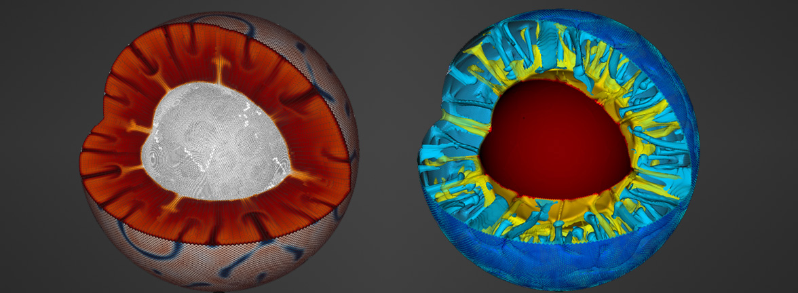

# Leading a Scientific Software Project: It's All Personal

#### Contributed by [Wolfgang Bangerth](https://github.com/bangerth)

#### Publication date: June 27, 2019

**Hero Image:**
 
- [Imagery created by Advanced Simulator for Problems in Earth ConvecTion (ASPECT), a software package that simulates convection in the Earth mantle and the dynamics of Earth's crust.]

I've been participating in open source software projects since around
1994; and when asked what I've learned, I always say, "It's all about
people." So while I could be writing about all the technical things
that are going on in my scientific software projects, let me instead
write about people.

### Emacs's CC mode

My first involvement with open source was when I was a freshman at the
University of Stuttgart, in Germany, in 1994. I got an account on one
of the computer pools. Most students didn't back then, and probably
also didn't want to deal with the IBM version of Unix (AIX) that the
machines were running, but I enjoyed the challenge and did some
software development for fun on these machines. I used emacs (that
time's Integrated Development Environment) for C++ programming and became
annoyed that the code indenter got lots of things wrong. Now, C++ *is*
a difficult language to parse, but the regular expressions used to
identify what is what just weren't very good either. So I dug
into the source code of CC Mode, the emacs mode for C++. Emacs
packages are programmed in Lisp, which I didn't know, but I figured
out improvements to the regular expressions and sent them to the
person who was listed as the author of the file.

I don't recall the name of that person (I *think* it was Barry
Warszaw), where he worked and lived at the time, how old he was, what
he is doing now, or basically anything else of our interactions. But I
do know that here I was, a young student with essentially no knowledge of
how things worked, and here was someone taking the time to mentor me through
his perspective of how things are best done, going through iterations of the code, and
eventually putting my contributions into CC Mode. It was an awesome
introduction to how I think that open source software *should* work: a
patient mentoring relationship, with an eye toward the fact that to
bind  contributors to a project, they need to feel like their
contributions are appreciated.

### Other projects

Since that time, I've worked with quite a number of other open source
projects. It turns out that the people didn't all have the same style as
that maintainer of CC Mode. For example, emacs as a whole has a
leadership structure in which a single person can dictate what is
supposed to happen (and who [has done so in other projects they
lead](https://lwn.net/Articles/753646/)). I also participated in the
GCC project for many years, which during that time dropped the ball on
many patches submitted by newbies for small technical reasons -- such
as a malformatted changelog entry where the maintainer would simply
say, "You've got to fix the changelog entry" but would not take the time to
mentor people about how such an entry should look, why, and what to
do. This leadership style meant that lots of actual and potential
contributors walked away. Most did so quietly; some others first
forked GCC to found the EGCS project (which later supplanted GCC again
when nobody was left in GCC); and yet others started the LLVM
project. Plenty of scientific software projects work in similar ways:
The people who started a project a long time ago either don't care about
new contributors joining the project or just don't know how to make
it work.

My point is that there are a lot of packages
out there and every one seems to have its own style of
leadership. Much of this style probably comes down to the personalities
of key individuals or the group as a whole, but surely also how much
thought the maintainers of a software put into what they *want* their
style to be.

### My own path: the deal.II finite element library

In 1997, I was working on my master's thesis in Germany and was too stubborn to use the finite element
package (called DEAL) that was used in the lab at the time. So I wrote
my own and called it deal.II. I stayed on for a Ph.D. in that lab and
continued with my software. Two others then joined in the effort, and
in 2000 we put everything on a website -- not because we really
knew what we were doing but because we could: that's what one did at
the time, with the World Wide Web as we know it today just finding
its shape at the time. We had no expectations for the whole endeavor; but
to our surprise, people started using the package. And they started asking
questions. And then they also started contributing functionality.

All of this led to some sort of reckoning: If we spend time answering
questions, we won't have time to write code ourselves; if we start
taking other people's contributions, then we have to accept their
coding styles and quality standards;  or if we walk them through how
we want things done, then again we won't have time to write code
ourselves. With now twenty years of thinking about these issues, I can
say that these are not false dichotomies. They're real issues, and
one needs to make a choice: How much do I value other people using
or contributing to the project (with *their* style), or how much
do I think "I can do this better!" and value my control over
the project? What *is* a fallacy is to think that the project will see
less progress if I spend time on things other than writing software:
That's because if I mentor half a dozen people on how to write good
software, they might actually produce more functionality than I could
myself; and if I do a particularly good job, they will eventually be
good enough to review my code as well -- and make *me* write better
code!

My own approach to software has been to follow this latter path. I
like working with others and mentoring newer members of our
community. And this has paid off. What started as a project for
myself is now one that is used around the world, has been [the basis
for more than 1,200
publications](https://dealii.org/publications.html), and has [11 co-equal
principal developers](https://dealii.org/authors.html). And
[substantially more than 200 people have contributed over the
years](https://dealii.org/authors.html#author-list) -- including 50-60 
contributors to each of the past few releases. deal.II is now a
real community project. Decisions are made among all principal
developers, all of whom are responsible for reviewing patches and
helping the community, and whose patches are reviewed to the same
standard that we hold everyone else to. I may have founded the project,
but I don't get a pass on writing tests or documentation or just
cleaning up a piece of code I want to commit: I have to have my
patches approved by another maintainer, just like everyone else.

All of this didn't come by accident. It was a choice made every day by
those running the project. We *want* to be a project
with a large community based on principles of equality, openness, and
merit. We all think that we serve the project best by supporting our
community and mentoring the next generation of contributors into
leadership positions where they work alongside us and, as we move
along in our careers and have less time for writing software, relieve
some of the workload from us. It turns out that if you take the time
to teach people and then give them a piece of responsibility of their
own, they step up and *want* to contribute to the greater project.
Given how widely used deal.II is, that seems to have worked well for
the project.

But, it also seems to have been good for most of us who
run the project. Most of the current principal developers were
recruited into this role while they were graduate students; they later became
productive postdocs, and 8 of the 11 now have permanent positions in a
variety of places. All of us share the credit that comes with leading
a well-regarded software project, opening doors for publication
opportunities and grant funding. Surely that is reflected also in the
trajectory of our careers. For me personally, giving up control of
"my" project and inviting others has been nothing but good
professionally: it has led to thousands of citations of my papers,
millions of grant dollars, opportunities to collaborate with people in
many interesting fields who wanted to use deal.II, and eventual
promotion to full professor. It has also brought amazing talent
through my lab, in the form of graduate students, postdocs, and short-
and long-term visitors -- people with whom it has been truly fun to
work. I don't think this would have been as easy if I had kept deal.II
under closer control. Personally, it has also been a fantastic
ride: I got to work closely with so many, often younger, people whom I
now call my friends.

### Summary

What kind of community develops around a software package is not a coincidence
but instead a consequence of the leadership style. Where we are today as a
project is a consequence of many hours of patiently reviewing patches and
not just saying "This is wrong, rejected!" but instead saying "I think you could do this
better if you restructured this code in the following way" and then patiently
explaining how and why. This takes time, without a doubt. It also takes time
to respond to questions on the mailing list, explaining how to implement
something in user code and then adding "I think that would also make an
excellent addition to the library itself. Would you like to give that a try?
For this, you'd have to look at A, B, and C, and when you're there, get
back to us and we'll talk you through the next few steps to make this into a
pull request!" Nine out of ten times you never get to see any code, but
the remainder of the time you do get a half-baked pull request out of
it that requires some more work on your behalf; the second time around,
this person's code is already better; and occasionally after feeling encouraged
a number of times to contribute their work, that
person will become a future principal developer who will write the kind
of sentence above in a few years when answering someone on the mailing
list.

### Author bio

Wolfgang Bangerth is a professor of mathematics at Colorado State
University. In 1997, he founded and is now one of the principal developers of the
deal.II project that provides finite element functionality from
laptops to supercomputers (see https://www.dealii.org). In 2011, he also
co-founded and is a principal developer of the ASPECT code, the
Advanced Simulator for Problems in Earth ConvecTion, a software
package for the simulation of convection in the Earth mantle and the
dynamics of Earth's crust (see https://aspect.geodynamics.org). He is
profoundly grateful to all of those who have accompanied him along
the way with these projects and who have taken the time to mentor
him about how we can all interact better with our communities.

Before joining Colorado State University, he was on the faculty of
Texas A&M University and a postdoc at the University of Texas at
Austin. He received his Ph.D. from the University of Heidelberg,
Germany, in 2002.

<!---
Publish: yes
RSS update: 2019-06-27
Track: community
Topics: strategies for more effective teams
Pinned: no
--->
