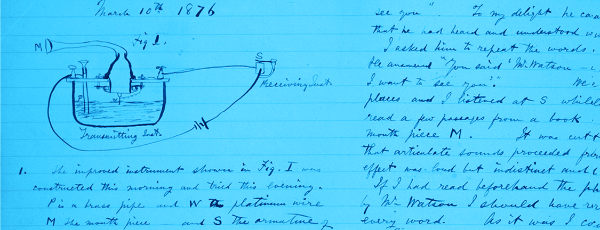

# Lessons Learned Transitioning from Experimental to Computational Science

**Hero Image:**
- 

#### Contributed by [Jared O'Neal](https://github.com/jared321)
#### Publication date: February 09, 2023

Alexander Graham Bell’s laboratory notes, 1876 (U.S. Library of Congress)

*Integrating scientific notetaking into virtual computational laboratory environments can help teams working in computational science and engineering to improve the quality and effectiveness of their low-level scientific techniques.  In this article, Jared O'Neal presents these tools and processes as adaptations made from those needed for working with scientific hardware instruments in experimental and observational environments.*

I have had the good fortune to wear many different hats.  My formal education was in experimental condensed matter physics, and over 10 years’ time I worked in three different experimental laboratories.  I moved to Chile to work as an instrumentation and systems engineer at [Paranal Observatory](https://en.wikipedia.org/wiki/Paranal_Observatory).  For seven years I enjoyed the challenge of working on a remote mountain top with adaptive optics instruments.  Finally, I returned to school to study mathematics with an emphasis in computational science, which allows me to work in the wonderful and wild world of computational science and engineering (CSE) as a scientific software developer.  While my educational and professional background is broad and varied, I have always worked on scientific instrumentation with a focus on understanding how to use instruments and data acquired with the instruments rigorously and reproducibly.
 
After graduating in 2017, I joined the [Exascale Computing Project’s](https://www.exascaleproject.org/) [IDEAS Productivity project](https://ideas-productivity.org/), where I was a member of the Better Scientific Software (BSSw) tutorial team.  I was tasked with being thoughtful about the difficulties I experienced in transitioning to CSE.  This blog article is a high-level summary of what I have learned from this transition over five years.  Where possible, the article points to more detailed content for those who are interested in a deeper dive.
 
To aid in understanding my experience better, I would like to start by explaining my point of view regarding scientific software and CSE research.
 
## CSE for me
It is clear that working with scientific software requires developing and incorporating software best practices such as documenting and testing software, using version control and commenting code.  Within the CSE community I often hear these tasks referred to as software engineering.  While I sense that this work is seen as necessary, I also sense that some in the community consider such work to be outside of or less important than the scientific work of interest.  However, for me these practices are not software engineering, but rather an important and necessary part of working with a scientific instrument.  In this sense they are more precisely classified as a subset of low-level, foundational ***scientific*** *best practices* ***adapted*** *from software engineering*.  I believe that researchers working on the high-level science need to be in control of and take ownership of the low-level science, as only they know what is needed at a low level to ensure that the high-level science is executed rigorously.

*I view scientific software as a scientific instrument*.  It is not merely that scientific software is analogous to the scientific instruments built from hardware, but rather that the two types of instruments are at the same level.  It was, therefore, my expectation that many of the tools, processes, and techniques for using hardware instruments for scientific studies would exist in adapted form for working with software instruments correctly.  While some of the aforementioned best practices do satisfy these expectations, other scientific best practices are either not found typically in CSE or are insufficient for the scale of the work at hand.  One prime example is the lack of CSE tools and processes analogous to laboratory notebooks for the comprehensive recording of work done on and with scientific instruments.
 
## Laboratory notebooks
Because lab notes are a fundamental and necessary component of rigorous and reproducible scientific work, I have spent the last five years inventing a means to take, organize, and manage lab notes for CSE studies.  I have discussed my thoughts regarding this topic and current techniques in
* A [webinar](https://ideas-productivity.org/events/hpcbp-070-labnotebooks) in the [Best Practices for HPC Software Developers](https://ideas-productivity.org/resources/series/hpc-best-practices-webinars/) series (recording, slides, and Q&A available) and
* A [BSSw tutorial module](https://www.youtube.com/watch?v=OpzofH8U0Bs), first presented at the 2022 Argonne Training Program on Extreme-Scale Computing ([ATPESC](https://extremecomputingtraining.anl.gov/)).

As expressed in the blog article [HPC and the Lab Manager](https://bssw.io/blog_posts/hpc-and-the-lab-manager) by the computational scientist Carlo Graziani, a different but similar experience can exist for those who have always worked in CSE.  According to Carlo, these researchers have typically sensed that informal tools and processes are insufficient for managing the low-level science of a study that is particularly large or complex.  To compensate, they reinvent the lab notebook without necessarily knowing that this is what was missing or that this is what they are creating.

In a lab setting, I (and apparently [others](https://doi.org/10.1038/d41586-018-05895-3)) firmly believe that pen and paper lab notes are the best solution.  Unfortunately, the digital and distributed nature of CSE work is incompatible with this format and dictates that lab note solutions be digital.  I currently believe that, unlike in the experimental sciences, one or two dedicated notebooks will not suffice.  Rather, we need to identify different streams of independent notes and record each stream in a tool that works best for that stream.  Here “best” can mean that it is easy to write, use, and search a particular stream of notes.  Some examples of different streams and tools for recording these are:
* Enhancing commit messages so that they capture comprehensive lab notes for implementing, maintaining, characterizing, and testing the scientific instrument;
* Enhancing pull request comments so that they capture the full and final verification process of changes made to the instrument;
* Concise and living README files that explain the high-level design and execution of a study; and
* Jupyter notebooks for capturing low-level notes as well as analysis notes related to a particular set of data acquired for a study.

This organizational complexity requires that much effort be expended to carefully design a system of documentation as opposed to simply choosing a single documentation solution.  Rather than design this system in isolation, I prefer to codesign this as one component within the larger concept of a virtual computational laboratory environment.
 
## Virtual computational laboratory environments
Based on my experiences in experimental labs and at the observatory, before I use a scientific instrument to gather data, ideally, I would like to
* Have all my tools at hand, clean, and ready for use;
* Know how to use my tools well and correctly;
* Have the instrument fully characterized and configured;
* Understand broken or underperforming aspects of the instrument; and
* Take comprehensive notes quickly and easily.

This equates to having created and prepared an environment in which I will execute scientific data acquisition with my scientific instrument.

Spending upfront effort to prepare the environment is motivated by the desire to concentrate fully and only on acquiring data, analyzing data, drawing conclusions from the analysis, designing next steps, and working in a reproducible way.  By avoiding the mixing of data acquisition with other work involving the instrument, we avoid, to [quote Carlo](https://bssw.io/blog_posts/hpc-and-the-lab-manager), performing “in-flight aircraft repair”. Obviously there will always be surprises along the way and, therefore, perfect preparation of the environment is likely impossible and should not be considered a reasonable goal.

Because I view hardware and software instruments in a similar light, I see no reason why these goals should not be useful for acquiring data with scientific software.  Over the last two years, I have built virtual versions of such execution environments, which I refer to as virtual computational laboratory environments, for acquiring data with CSE software.  This is an area of active exploration for me and likely always will be.  My current experience and thoughts regarding these environments are available in a [BSSw tutorial module](https://www.youtube.com/watch?v=14UwpmvA56k) I developed with Anshu Dubey for ATPESC.  To support that module, I created an [example lab environment](https://github.com/bssw-tutorial/lab-environment-2022-08-11-atpesc) in the form of a git repository.
 
Other examples of tools that could be classified as execution environments are
* Ivo Jimenez’s tool [Popper](https://www.exascaleproject.org/event/popper/),
* Aaron Lentner’s [FlashKit](https://github.com/GWU-CFD/FlashKit) python package,
* [Code Ocean](https://codeocean.com/), and
* [Weights & Biases](https://wandb.ai/site).

While I presently find that my generic scheme for constructing virtual computational lab environments works reasonably well for the different types of studies that I execute, it would be interesting to assess if any of the aforementioned tools is flexible and powerful enough to work for all CSE studies.

## Conclusion
In an experimental physics lab, tools and lab notebooks are physical items located directly next to scientific instruments – it is an environment that is relatively easy to setup, maintain, and use.  In addition, collaborators typically share the same space rather than a different office, city, state, or country.  This leads to a highly collaborative environment in which sharing, growth, and coevolution is easy and natural.  For instance, it is not uncommon for coworkers to interrupt each other’s work for brainstorming or sharing new knowledge, tips, or tricks.  Also, the need for documentation beyond lab notes is decreased because work is done together or because communication is frequent and easy.

CSE work
* Is often carried out by a distributed team,
* Is often done independently by distributed team members,
* Requires periods of uninterrupted concentration, and
* Is carried out with a plethora of ever-changing digital tools.

Consequently, CSE research has difficulties that did not exist in the experimental labs in which I worked.  As a result, I spend far more time than I was accustomed to developing and using tools and processes to manage these difficulties.  While a small team of developers and researchers who interact frequently may be able to confront these challenges in an informal way, I contend that CSE studies will benefit in terms of improved rigor, reproducibility, and effectiveness if they include explicit design, implementation, and maintenance of an execution environment with an integrated lab notes documentation system.

## Author bio
Jared O’Neal is a principal scientific software developer in Argonne National Laboratory’s Mathematics and Computer Science Division. He currently works on computational science applications with an eye on improving processes to ensure productivity while maintaining scientific rigor. Jared has a background in physics and mathematics and had the pleasure of working as an engineer at the Paranal Observatory in the [Atacama Desert](https://www.atacamaphoto.com/atacama-desert/).

<!---
Publish: yes
Track: experience
Pinned: no
RSS update: 2023-02-09
Topics: Personal Productivity and Sustainability
--->
