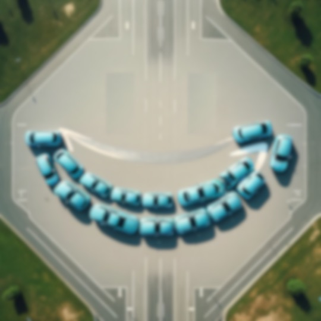

# Unsupervised Learning and Next Generation Prank-ware

It has now been a year since the April 1rst, 2023 announcement and epic live demo failure of the next generation electric vehicle, the Voltra, from everyone's favorite electric car producer and rocket scientist who for the purpose of this article will be referred to simply as *Electric Man* or just EM.
As readers may recall, apart from introducing the next generation electric vehicle from EM, a critical part of that live demo was intended to show off self-driving capabilities available in the new AutoPilot/FSD 3.0 software.
While there were no injuries or serious damages involved, the live demo went horribly wrong and left EM enthusiasts wondering when we will ever see fully capable self-driving vehicles.
In the weeks following this epic fail, EM explained that a sequence of cascading failures in the new *Borg mode* of AutoPilot/FSD 3.0 was the cause.
However, this article reveals a far more worrisome cause and having to do with the vulnerabilities inherent in unsupervised learning used to train the AutoPilot/FSD 3.0 software.
This vulnerability appears to have been exploited by another billionaire tech giant, we'll call Joe Billionaire or JB for short, as part of a highly sophisticated prank-ware attack on EM's fleet...a very elaborate and very expensive April Fool's joke.

### Background

For background, the event took place last April 1rst at the [Yucca (formerly Chrysler) Proving Grounds](https://clui.org/ludb/site/arizona-proving-ground-0), South East of Las Vegas.
After signing broad-sweeping NDAs and agreeing to hand over their cell phones upon arrival at the event, about 250 VIPs were invited to attend person.
The rest of us had to watch on live stream.

EM had planned for an audacious demonstration of about 100 of the new Voltras, all driverless, running routes through the proving grounds at expressway and freeway speeds and responding to various obstacles and threats attendees had the ability to inject with the press of a button in the control rooms they were viewing the event from.
These included orange cone zones, mechanized pedestrians and pets, water and blinding smoke hazards, other vehicles losing control, landslides, big rigs loosing their loads and even a several remotely driven vehicles driving intentionally badly.
There were reports that EM even offered the [Anonymous cyber-hackers group](https://en.wikipedia.org/wiki/Anonymous_(hacker_group)) a $10M award if they were able to demonstrate an ability to hack into his vehicles during the event.

In addition to introducing EM's next gen vehicle, the Voltra, the whole point of the event was to once and for all put to bed arguments regarding the safety and reliability of self-driving vehicles. 
In particular, a new *cooperative* mode in the AutoPilot/FSD 3.0 which enables nearby vehicles to communicate and coordinate their movements (dubbed by insiders as [*Borg*](https://en.wikipedia.org/wiki/Borg) mode) was to demonstrate improved efficiencies and safety.
This new FSD feature works when a number of vehicles are in close proximity.
They can communicate with each other, work together and improve efficiency and safety.
In Borg mode, a group of vehicles can even successfully navigate intersections crossing paths at high speed without incident.

To fully appreciate the event, attendees were encouraged to observe the show on large Jumbotrons showing aerial vies of the proving grounds from a few drones overhead as the ~100 or so driverless Voltra's darted around the grounds.

Initially, the live demo started smoothly.
A number of vehicles identified and avoided various of the hazards and obstacles attendees began throwing at them and onlookers and online viewers were quite impressed.
However, not long into the event some of the vehicles started behaving strangely.
The live feed was immediately cut and, according to eyewitnesses things started to unravel from there rather quickly.
There were no injuries or serious damages except perhaps to EM's (and the Voltra's) reputation.

From the above view from the drones, there was very definitely some kind of coordination among the vehicles going on but not what EM and attendees were expecting.
Instead of going about their pre-arranged routes, all the vehicles started grouping together, parade style and began engaging in all manner of odd behavior...wiggling their steering back and fourth in their lanes, playing tunes with their horns, opening and closing their doors, flashing headlights, etc.
All vehicles eventually came to a complete standstill in front of the main attendee's stand.
No lights, no sound, no motion. 

### Official Cause and Rumors of Another Sort

There were some rumors from people who attended the event that everything seemed to start going wrong coincided with the appearance of an extremely unusual vehicle (a party crasher at the event), the [Wienermobile](https://en.wikipedia.org/wiki/Wienermobile).
EM even noticed at the time saying "whats that guy doing here?".
It appeared along a side road of the main thoroughfare making one entire loop of the proving grounds before disappearing through an abandoned side exit.
During its 7 minute loop of the proving grounds, as various vehicles passed in either direction, they began doing odd things...wiggles, horns, lights, wipers, etc. and then joining up into what could only be described as a parade.

No one with Anonymous ever took credit for it or sought the $10M reward.
So, it is not believed that the vehicles had been hacked.

The event was promptly called to a close while EM and his team began investigating the cause.
Attendees were sworn to secrecy before being handed their phones back.
Eye witness accounts of the event went viral.

In the weeks that followed, EM's team investigated the cause of the problems and explained...
EM's explanation has been all along that one of the newest features of AutoPilot/FSD 3.0 is a *coordinated* transport mode (known by insiders as "Borg" mode) suffered a series of cascading failures causing many vehicles to *do strange things*.
EM explains that early on in the demo event, something went wrong (maybe a directed energy EMP from a Chinese spy balloon) causing cascading failures.
As the failures rolled through each vehicle in the event, different vehicles exhibited different responses.

Everyone went on with their lives, still hoping for the ultimate self-driving vehicle to materialize and most people have forgotten about the incident.

### Investigation

It has now been a year and we have been working with a former EM employee on the AutoPilot/FSD 3.0 team to get to the truth of what happened.
To protect their identity, we'll just call this person X.
In her investigations, X now has evidence to show the issues were the result of a highly sophisticated prank-ware attack, an April Fool's joke, now believed to have been led by another billionaire we'll just call Joe Billionaire or JB for short.
The attack probably started way back in 2017 and continued through 2020.
The purpose of the attack was to implant a sort of cuckoo's egg in EM's self-driving training database just waiting for an opportunity to be exploited.
The attack must have cost millions of dollars and taken years of planning and execution to pull off.

What will viruses look like in the AI/ML era? How will they be created?
What tools will we need to develop to fight them?
The key to any machine learning based algorithm is *training data*; lots of it! So
much of it, in fact, it is rather difficult to imagine any human-in-the-loop approach
to vetting all the training data used. This is called unsupervised learning.
On the other hand, with prices for various wearable
sensor technology falling, one can gather training data simply by instrumenting real
human beings and observing their behavior. Nowhere is this approach more true than
with the training data being gathered by EM's vehicles for his self-driving ML software.

Every vehicles EM sells send data back to EM's self-driving training database.
There are about 500,000 on the road. Each is driven about 2 hours/day for
a total of 1,000,000 driving hours of training data per day. EM has promised for some time that
he will soon have accumulated enough data that to produce the *perfect* (infallible) self-driving vehicle.

But, what if some other multi-billionaire, perhaps one in competition with EM,
wanted to give EM's self-driving system a machine learning disability?

For example, the typical EM vehicle is $22,500 for a 36 month term leas. JB could lease a fleet
of 5,000 - 10,000 vehicles for less than a quarter of a billion dollars. That's a drop in
the bucket for JB. JB could put all of these cars in various massive warehouses where there is a small station for each automobile.
Each station acts like a virtual reality for that car.
Then, JB can broadcast synthetic data of his choosing at these vehicles 24 hours a day for a total of 240,000
hours of training data uploaded to EM's database per day or 6.2 billion hours of training data
over the 36 months of the leases. However, because JB might not want to
see EM be successful, JB might decide to be crafty and generate synthetic data with
a twist; a [Wienermobile](https://en.wikipedia.org/wiki/Wienermobile) would appear 
and whenever this happens, the synthetic drivers and cars would engage in all manner of strange behavior.
Over the 10,000 cars and 6.2 billion hours of
synthetic data, this occurrence could be programmed to happen millions of times.
Furthermore, because the event is highly unlikely in real life, there would be no chance
of other training data from the real population of vehicles to encounter the same situation
and override the "learned" response JB was aiming for.

With this "cuckoo's egg" sufficiently planted in the training data, JB could at any time
decide to have some fun and go out and start driving a [Wienermobile](https://en.wikipedia.org/wiki/Wienermobile) around.

X reported that the problem was not related to the new *Borg* mode or any of the software itself.
It was something that appears to have been planted in the self-driving training database used to program the self-driving AutoPilot/FSD 3.0.

When X first heard rumors that the vehicle's bizarre behavior seemed to coincide with appearance of the [Wienermobile](https://en.wikipedia.org/wiki/Wienermobile), she started combing the FSD training database looking for instances where such a vehicle appears.
Much to her disbelief, she says she found millions of instances.
So, she got curious which vehicles these instances came from.
Because EM doesn't collect information that allows individual training data to be tracked back to specific vehicles, this made her job very difficult.
Nonetheless, different sensors on vehicles have different characteristics (failed pixels, missing frequencies, odd power glitches, etc.).
These can be used as a sort of vehicle signature if you know how to dive deep enough into the training data.

Over the course of several months of after-hours investigations cross-referenced searches, X revealed approximately between 5,000 and 10,000 different vehicles leased between 2017 (the year EM began including video in its training data) and 2020 contributed instances to the training data.
An even closer look revealed training data showing these vehicles had very unusual driving patterns.
Groups of approximately 1,000 made the same, very short trips on the same roads at the same speeds and often made the trips multiple times each and every day they were leased for 36 months straight.
The vehicles appear to have been driven nearly 24 hours/day, 7 days a week and there is even evidence they were charging while on these "trips".
However, the actual odometer readings of a sample of those vehicles is far lower than training data instances would indicate.
In a few instances she was able to locate specific vehicles still on inventory (waiting to be sold or re-leased) and went to physically inspect them.
On the sample of vehicles she inspected, the paint, underside and windshield did not show very many signs of wear, certainly not the amount of wear the vehicle should have. Samples of the paint revealed very little UV degradation suggesting the vehicles had spent a significant portion of their time away from sunlight.

In addition, none of the vehicles were in any accidents of any kind.
This is highly unusual too.
Any random selection of 10,000 vehicles, some are going to have been in serious accidents over their 36 month lease life.
Upon locating a handful of these vehicles which had yet to have been re-leased or sold, she examined the vehicles for evidence of wear.
The paint was in unusually pristine condition indicating very little exposure to UV light.
There were few nicks and scratches on the forward facing surfaces and windshield as well as the underside.
It was as though the vehicles were not driven outside.

For X, a theory began to emerge on how what all this evidence means.

"I believe someone or some organization with a large amount of money (it would have cost 1/4 billion to lease all 10,000) leased all these vehicles and then put each in its own (a virtual reality for a car) where all the wheel sensors were getting revolutions, the GPS was getting faux signals, the ultrasonics and the image sensors were getting.
Whoever did this did so to plant a virus in the self-driving training database, something nobody would be aware of...a cuckoo's egg.
They basically spent an inordinate amount of money to train a large number of vehicles to learn how they should respond under very specific and also very rare in real-life conditions of one of these unusual vehicles, rare enough that it would be highly unlikely any other training data would conflict with their plans.
Other than the cost, its really not all that hard.

The final piece of evidence supporting X's theory was a single blurry image of one of the final formation of vehicles seen on the April 1rst, 2023 event when everything came to a standstill.

