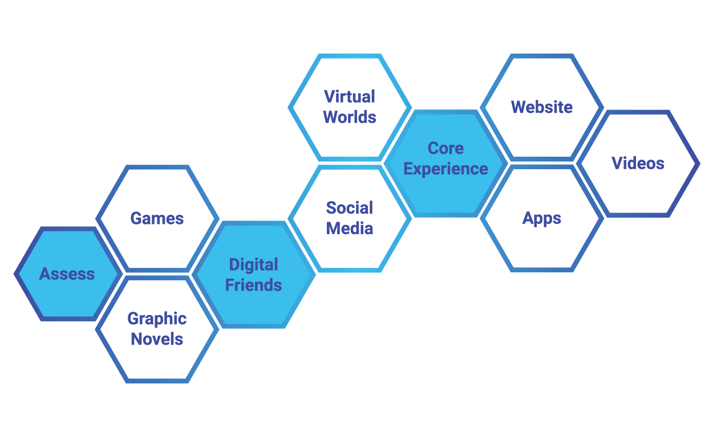

# On Demand Learning for Better Scientific Software: How to Use Resources & Technology to Optimize Your Productivity

**Hero Image:**
- [image caption]

#### Contributed by [Elaine Raybourn](https://github.com/elaineraybourn "Elaine Raybourn")

#### Publication date: May 31, 2018

*In May 2018, Elaine Raybourn presented a webinar titled "On-demand Learning for Better Scientific Software: How to Use Resources & Technology to Optimize your Productivity" in the series Best Practices for HPC Software Developers on the IDEAS Productivity website. In this article, Elaine answers questions from her webinar participants about challenges associated with learning in the wild (i.e., as it naturally occurs in a social context). Elaine is a scientist at Sandia National Laboratories.*

  

Transmedia learning is the scalable system of messages representing a core experience that unfolds from the use of multiple media and emotionally engages learners by involving them personally in the story. A transmedia learning framework (TLF) provides guidelines and heuristics for designing and personalizing your transmedia learning in the wild. 

To view Elaine's original webinar, and the full webinar series see the following links:

<a href="https://ideas-productivity.org/events/hpc-best-practices-webinars/#webinar018" class="link-row">On-demand Learning for Better Scientific Software: How to Use Resources & Technology to Optimize your Productivity</a>
<a href="https://ideas-productivity.org/events/hpc-best-practices-webinars/" class="link-row">Series: Best Practices for HPC Software Developers</a>

  

<strong>Question:</strong> The transmedia learning framework (TLF) and storytelling arcs are a good outline for how we are self-learning and engaging information in today’s world.  One could have this in mind when developing one’s own HPC “products”.  In other words, couldn’t we implement these various self-learning tools into our plans so that the impact of our HPC software is greater?  I suppose some platforms would be more applicable than others.  How does one get started down this path, in other words how to prioritize which tools one should use first etc.?

<strong>Elaine:</strong> I love this question. Yes, your comment about implementing various self-learning tools into your HPC “software product” plans to increase impact, is a great, actionable goal. Any team that would like to pursue this with IDEAS-ECP should not hesitate to contact us. We can easily begin a [PSIP (Productivity and Sustainability Improvement Planning)](https://bssw.io/psip) activity around the use of transmedia learning frameworks for HPC and scientific computing “products.” I’m personally very motivated to engage with the ECP community on this topic.

Regarding your question about getting started with prioritizing platforms, media, or content, I would answer this question differently if I were prioritizing content and designing a TLF for myself (an individual) or for a team or “team of teams.” If prioritizing for yourself, allow yourself to be pragmatic -- that is, be realistic about the amount of time you have to devote to whatever you are learning. For example, if you know you are busy but can commit to 10 minutes per day, start by choosing content that you can consume (start and finish) in a 10-minute period. The reason I suggest this is because, especially as you get started, you will want to create learning habits that provide opportunities to “hook” yourself on a neurological level -- you want to anticipate the activity, then reward yourself, to leverage the dopamine seeking-reward loop. This hook will be important in the beginning to generate the motivation you’ll need to engage with content and tools more deeply over time. To recap: with regard to prioritization, think about 1) the amount of time you have, 2) the modality you prefer (at least to start), and 3) what content will allow you to start and finish (i.e., accomplish) your objective or goal in the time allotted. You will want to see yourself immediately making progress toward your goals.

If I were to answer the same question and design a TLF for a team, I would have similar considerations, but my design would be more complex. This is the topic of another webinar or presentation on designing transmedia learning. If you’d like me to present this topic to your team or organization, let us in IDEAS-ECP know. 

<strong>Q:</strong> If you're coming at this from an instructor's perspective, how much do you need to educate your learners on the ins and outs of the TLF?  Or is it sufficient to incorporate a handful of these different media into the learning experience and trust that it'll just work out?

<strong>Elaine:</strong> This is a great question! As an instructor, it’s important to realize that if you are asking your learners to learn outside of the classroom or formal environment, the learner is in control. Once learners enter an informal, self-paced learning environment, they will likely redesign and personalize their learning. They should feel empowered to make learning most productive for themselves, to maximize their productivity, which is what the webinar was actually about. So, as an instructor, I believe it is most important to educate learners about the transmedia learning framework/TLF and give them the tools they will need to make smart choices (discernment) while they learn in the wild. Instructors aren’t able to control what, why, how, or when they learn. Having the tools and skills to be productive and effective while learning in the wild will increase the likelihood of their transfer of learning -- which is what we really want. We want learners to employ skills and knowledge across many different domain areas. 

  

[Transmedia learning is the scalable system of messages representing a core experience that unfolds from the use of multiple media and emotionally engages learners by involving them personally in the story (Raybourn, 2014, Journal of Computational Science)]

 

<strong>Q:</strong> I see the relevance of several points you raised (making learning stick, self-directed, and self-regulated learning). Two main challenges with self-paced learning, in my experience, are 1) selecting appropriate difficulty and 2) engaging with others (which helps me stay engaged). Any comments or recommendations?

<strong>Elaine:</strong> Yes, thank you for asking these questions. You’re right: there are challenges with self-paced learning. In each case you’ve identified, having a heuristic, or approach, for moving forward would help you address these challenges. The TLF is meant to provide a heuristic that is flexible and applicable to a variety of circumstances. 

Regarding selecting the appropriate level of difficulty for your transmedia learning experience, you may decide to gauge difficulty by the amount of time it takes to finish a task, whether your interest level is high, or whether you are easily prone to distraction. In many cases, you’ll know if something is too easy or difficult: ask yourself – and try to answer this question on a visceral level -- if you are engaged during and after the learning. Try a variety of media and modalities, especially some that you have never tried before. Look for something that takes you out of your comfort zone. You may surprise yourself. :-) The transmedia learning framework is meant to provide ways to think outside the box about learning, or what we normally consider education. The TLF is a way to employ new media in a way that is going to augment your learning experience, to include engaging yourself at the neurological level.

Regarding engaging with others: it can be difficult, especially if you don’t know where to start. It sounds like your question is about how to meet others who are engaged in learning about a particular topic or becoming part of a community of practice. For example, let’s say you are learning Git on your own. Try to find folks familiar with Git (or learning Git) in your organization, or network so that you can bounce ideas off them. Go to colleagues you know well and ask them if they know anyone who knows Git well enough to help you. Ask them to introduce you. Try what social scientists call a “snowball sample”; that is, leverage your colleagues to talk to their peers on your behalf to increase your community, one by one, or until you get involved in a community of practice that is right for you.

You can also crowdsource answers to questions you may have while learning. Consider following experts on social media to augment your social learning and immersion in a community of practice, even if it is virtual.

<strong>Q:</strong>  I just feel content selection is mostly through trial and error. Any benchmarking?

<strong>Elaine:</strong>  Great point to end our conversation. Since everyone is different and circumstances are different, content selection will seem like trial and error until you gain more experience and can employ a set of heuristics for content curation that work for you. This may involve looking at reviews or other expert evaluations. Don’t forget that as members of the HPC community, you’ve amassed a number of skills you can apply to discerning whether the content you have curated will be useful. If you are learning Git/GitHub or Python, you can go to Better Scientific Software for resources or view the webinar slides and video.

### Summary
I’ve provided guidelines and a transmedia learning framework (TLF) for content curation, story development, and platform selection that are actionable. Think about how you will stay engaged while learning, build skills to add to your HPC ethos, and co-create content for others. Share your story with us. Thank you for your excellent questions, and best wishes in optimizing your productivity with transmedia learning in the wild!

<!---
Publish: yes
Categories: skills
Topics: online learning, personal productivity and sustainability
Tags: bssw-blog-article
Level: 2
Prerequisites: default
Aggregate: none
RSS update: June 1, 2018
SAND #: SAND2018-5878 O
--->
