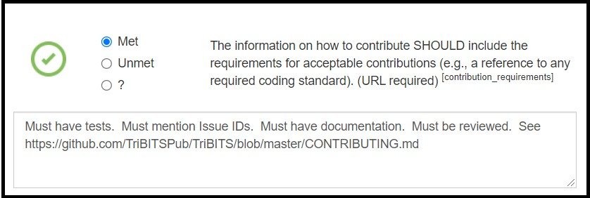
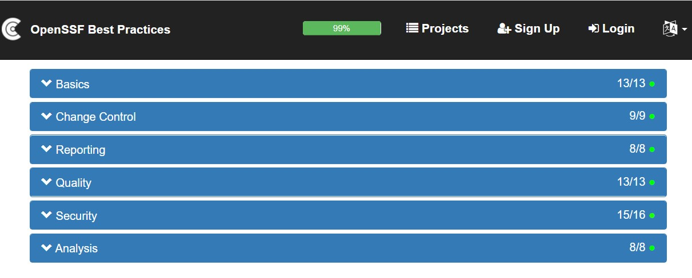
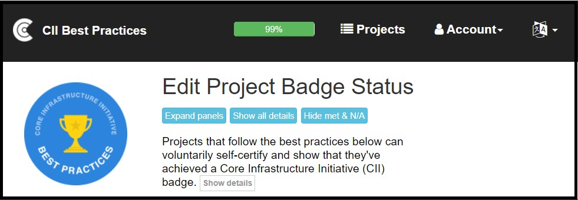
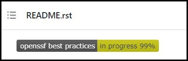

# OpenSSF Best Practices Badge Program
#### Contributed by [Roscoe A. Bartlett](http://github.com/bartlettroscoe "Roscoe A. Bartlett")
#### Publication date: April 5, 2023

<!-- deck text start -->
The Linux Foundation's OpenSSF Best Practices Badge Program represents an impressive collection of the open source community's knowledge base for creating, maintaining, and sustaining robust, high quality, and (most importantly) secure open source software.
At its foundation is a featureful "Badge App" website, which provides a database of projects that document what best practices they have adopted and supporting evidence.
This set of best practices (along with the detailed documentation and supporting justifications for each item) also serves as an incremental learning tool and as a foundation for incremental software process and quality improvements efforts.
<!-- deck text end --> 
 
The Linux Foundation's[0] Open Source Security Foundation (OpenSSF)[1] is an effort to improve the quality and security of open source software.
The OpenSSF Best Practices Badge Program[2],[3] is an effort to collect, document, advocate, and help apply a comprehensive collection of best practices from the open source software development community to a wide rage of open source software projects.
The foundation of this badge program is a "Badge App" site[4] that allows projects to create an entry for their project and then to specify which practices are met, descriptions for how they meet the criteria for each practice, URLs to evidence, and justification for how each criteria is met (or why it is not met).

As of 5/5/2023, the "Badge App" site has 5735 registered projects, of which 1019 have achieved a Passing-level badge.
In the last year alone, the open source community registered approximately 1024 new open source projects on the Badge App site and approximately 254 additional projects achieved a Passing-level badge (which is a large increase in growth over the last several years).[5]
This data suggests that this is a well-accepted and well-adopted badge program, and its adoption is accelerating.

The OpenSSF Best Practices and the supporting Badge App site enable a number of benefits by providing:

* a set of [best practices](#details) that have specific actionable criteria which require supporting evidence,

* a featureful ["Badge App" site](#badge_app) that enhances the display of each practice, expanded descriptions of the practices, and fields to enter URL and text descriptions of the status of each practice in the project, 

* a [badge](#badge_display) that can be displayed on a project's own hosting site to show that a project follows accepted best practices,

* a particularly strong focus on [software security](#focus_on_security) which addresses the White House Executive Order 14028 "Improving the Nation's Cybersecurity"[8] (of particular importance to U.S. laboratory and government agencies and contractors, including the U.S. national laboratories),

* a [learning tool](#learning_tool) for best practices for developers and projects,

* a [roadmap for continual improvement](#continuous_improvement) for a project as it incrementally adopts more practices and improves its scores in different areas,

* a [standard index](#standard_project_index) into the parts of the projects and how it handles different types of processes, and

* a [website template](#forking_badge_app_website) and database implementation that can be forked and customized for more targeted communities.

These different aspects of the OpenSSF Best Practices Program and Badge App are described below.

<a name="details"/>

### OpenSSF Best Practices and Badge App Details

Before getting into the some of the surprising benefits of the OpenSSF Best Practices and Badge App site, it is worth going into some detail about the best practices themselves and the "Badge App" website.

**Best practice criteria classifications**

The OpenSSF Best Practices are broken down and organized in several different ways:

* Required or optional practices:
  * MUST: Required/not optional (unless 'N/A' is allowed)
  * SHOULD: Required unless a strong argument against can be made
  * SUGGESTED: Not required but suggested
* Three different badge levels:
  * Passing: 43 MUST, 10 SHOULD, 14 SUGGESTED
  * Silver: +44 MUST, +10 SHOULD, +1 SUGGESTED
  * Gold: +21 MUST, +2 SHOULD
* Six different categories in each badge level:
  * Basic
  * Change Control
  * Reporting
  * Quality
  * Security
  * Analysis

As noted above, some of the practices can be opted out as not applicable (i.e. "N/A") which is quite important in order for the OpenSSF Best Practices to be broadly applicable.
For example, almost all of the technical security-related items can be marked as "N/A" if the project does not have any security-related or security-critical code.

The OpenSSF Best Practices are listed for each badge level individually and as a full set.[6]
They are also listed with and without the detailed description/justification and links to more information.
Each best practice is composed of a short statement of the practice (with the word MUST, SHOULD, or SUGGESTED) and a short HTML anchor/link name (that serves as a link to the practice and as an unambiguous shorthand identifier for that best practice item).
Many items also require a short comment field be filled out and provide a URL to evidence.

**Example of best practice criteria**

To demonstrate how these best practice criteria look on the website, the first four "Basic" best practice criteria in the Passing level are stated as:

----

**Basics** 
**Basic project website content** 

* The project website MUST succinctly describe what the software does (what problem does it solve?). \[description_good\]([10])
* The project website MUST provide information on how to: obtain, provide feedback (as bug reports or enhancements), and contribute to the software. \[interact\]([11])
* The information on how to contribute MUST explain the contribution process (e.g., are pull requests used?) {Met URL} \[contribution\]([12])
* The information on how to contribute SHOULD include the requirements for acceptable contributions (e.g., a reference to any required coding standard). {Met URL} \[contribution_requirements\]([13])

----

**Criteria statistics**

Key statistics for the best practices in each level[7] are given in the following table:

<a name="ossf_best_practices_stats_table"/>

| Level | Total active | MUST | SHOULD | SUGGESTED | Allow N/A | Met justification required | Require URL |
| :-- | --: | --: | --: | --: | --: | --: | --: |
| **Passing** | 67 | 43 | 10 | 14 | 27 | 1 | 8 |
| **Silver** | 55 | 44 | 10 | 1 | 40 | 38 | 17 |
| **Gold** | 23 | 21 | 2 | 0 | 9 | 13 | 9 |

**Table: OpenSSF Best Practice Breakdown**

 

Note that some practices that are listed as SUGGESTED or SHOULD at a lower level are re-listed as MUST at a higher level.  For example, the ***Silver*** level lists the "bus factor" practice as SHOULD:

* The project **SHOULD** have a "bus factor" of 2 or more. {Met URL} [bus_factor](https://bestpractices.coreinfrastructure.org/en/criteria#1.bus_factor)

but at the ***Gold*** level, it relists it as MUST:

* The project **MUST** have a "bus factor" of 2 or more. {Met URL} [bus_factor](https://bestpractices.coreinfrastructure.org/en/criteria#2.bus_factor)

(That is why the number of "Total active" practices in the Silver and Gold levels are higher than the number "New at this level".)

<a name="badge_app"/>

**Badge App site**

One of the more unique features of the OpenSSF Best Practices program is the OpenSSF Best Practices "Badge App" site:

* https://bestpractices.coreinfrastructure.org/en/projects

This site allows project maintainers to create an entry for their project (which then creates a unique project ID) and go through the process of reading about each best practice item and marking each as "Met", "Unmet", "N/A", or "?".
(Again, only a subset of practices allow an "N/A" response.)
An example of a project's best practice item marked as "Met" with justification and a URL to evidence is given below:

<a name="example_badge_app_item"/>

 

**Example OpenSSF Best Practices Badge App Project Item**

 

After a project creates an entry on the OpenSSF Best Practices Badge App site, the site provides scores for each of the six categories separately in each badge level (Passing, Silver and Gold) and provides the percentage completion for the current badge being sought.
For example, one project that has achieved 99% to a Passing badge shows the following scores in each category:

<a name="example_passing_categories_scores"/>

 

**Example OpenSSF Best Practices Passing-level scores by category**

 

This view of the project on the Badge App site makes it easy to see where the project may be weak and might be able to improve.
One can then expand a deficient category (the "Security" category in this example) and see which criteria are not being met and why.
One can also click buttons at the top of the project's Badge App page to show only the unmet criteria in all the categories, for example, by clicking the "Hide met & N/A" then the "Expand panels" buttons in edit mode as shown below:

<a name="example_hide_unmet_expand_panels"/>

 

**Example OpenSSF Best Practices App page showing control buttons**

 

Also, one can expand to show the details for each practice by either clicking "Show all details" at the top or "Show details" for an individual item to read more about each unmet best practice and the criteria needed to satisfy it.

<a name="badge_display"/>

**Project badge display**

After a project's maintainers have created a Badge App entry for the project, the project can display it's OpenSSF Best Practices Badge (or percentage progress to a badge) using a link to the project's entry on the Badge App site.  For example, a GitHub project's rendered README file can display the OpenSSF Best Practices badge at the top like:

<a name="example_badge"/>

 

**Example OpenSSF Best Practice Badge as displayed on a GitHub README.rst file**

 

**Badge App project statistics**

Note that of the 5735 registered projects on the Badge App site (as of 5/5/2023), 1019 projects have achieved a Passing-level badge, 48 have achieved a Silver-level badge, and just 18 have achieved a Gold-level badge.
So while approximately 18% of the registered projects have achieved a Passing-level badge, only 5% of the Passing-level projects have gone on to achieve a Silver-level badge.  But, interestingly, over 37% of the Silver-level projects have gone on achieve a Gold-level badge.
This shows the difficulty (or reluctance) that open-source projects have in even achieving a Silver-level badge after achieving a Passing badge (i.e. only 5%).
But this data shows that a large percentage of projects that achieve a Silver-level badge go on to achieve a Gold-level badge (over 37%).
Therefore, it would appear that the barrier (or reluctance) of going from the Silver-level to the Gold-level is small compared to going from the Passing-level to the Silver-level.

<a name="focus_on_security"/>

**OpenSSF Best Practices focus on software security**

One of the unique features of the OpenSSF Best Practices is the significant focus on security best practices.
For example, of the 67 best practices listed at the Passing level, 16 of them are in the area of security.
And of the 55 Silver-level practices and 23 Gold-level practices, 18 and 5, respectively, are in the area of security.
The reason that is so interesting is that much of the software development communities focus on software engineering best practices only pays a cursory treatment to security.
For example, of the over 900 pages in the book "Code Complete: 2nd Edition"[9], exactly one paragraph is devoted to the area of software security in section 3.5 "Architecture Prerequisite":

> The architecture should describe the approach to design level and code level security.
> If a thread model has not previously been built, it should be built at architecture time.
> Coding guidelines should be developed with security implications in mind, including approaches to handling buffers, rules for handling untrusted data (data input from users, cookies, configuration data, and other external interfaces), encryption, level of detail contained in error messages, protected secrete data that's in memory, and other issues.

In addition, other standard texts on software engineering best practices never even mention the word "security".

This increased focus on software security is consistent with White House Executive Order 14028 "Improving the Nation's Cybersecurity"[8] which requires government and DOE software to improve software security.

<a name="learning_tool"/>

**OpenSSF Best Practices as a learning tool**

As of this writing, there are currently 129 unique best practices listed across the three levels in a wide number of categories.
Many of these items have detailed explanatory descriptions with links to more information.
Just carefully reading through all of these practices and their descriptions and following a few of the links can take half a day or more.
This material, and the material being linked to, provides what can be considered the state of the art in each area in the open source community.
Therefore, the OpenSSF Best Practices can serve as an effective learning tool for updated modern open-source software engineering best practices.

Even if one has been in the software engineering and open source area for many years, one may not be aware of what is considered the current state of the art and best practice.
For example, for many years Contributor License Agreements (CLAs) were considered best practice and the recommended way for open source projects to manage IP and copyright issues related to contributions from different individuals and organizations.
But apprehension on the part of various institutions to sign CLAs and other practical experience with CLAs have led to the usage of a Developer Certificate of Origin (DCO) to manage these issues instead.[14]
And therefore, currently, using a DCO is considered the more recommended practice.
Without a resource like the OpenSSF Best Practices, it is very difficult for many projects to gain this type of knowledge in such a compact manner.

<a name="continuous_improvement"/>

### OpenSSF Best Practices as a roadmap for continuous improvement

As described above, the Badge App site provides the current status as a percentage completion to the next badge level for a given project.
This percentage completion and the number of satisfied practices in each area provides a simple metric and a motivator for improvement for the project.
For example, if a project is currently at 86% of completion for a Passing badge and has only 8 of the 13 Quality practices, then it is clear where to look at improving.

Also, the Badge App site is set up to send out regular reminders about the status of one's project and provide encouragement to continue making progress.
For example, below is an email which was sent out by the Badge App for the "TriBITS Core" project:

----

From: badgeapp@bestpractices.coreinfrastructure.org  
Sent: Saturday, September 11, 2021 7:00 PM 
To: `<...>` 
Subject: [EXTERNAL] Your project does not yet have the "best practices" badge

**Automated Best Practices Badge Reminder for TriBITS Core**

This is an automated reminder that your project "TriBITS Core" does not currently have a "best practices" badge, and its badge entry has not been updated in a while. 

Your best practices badge entry is at https://bestpractices.coreinfrastructure.org/en/projects/4839 and was last updated on 2021-06-24 15:08:41 UTC. It is currently at 99% (out of 100%). 

We encourage you to keep making progress. Please visit your badge entry at https://bestpractices.coreinfrastructure.org/en/projects/4839 to complete the information and get your badge! 

If you want to see only what you're missing, visit your badge entry, select the button near the top labelled "Expand all panels", and then select the button near the top labelled "Hide met or N/A criteria". If you have questions, or need help, please contact openssf-badges-questions-owner@lists.coreinfrastructure.org or file an issue at https://github.com/coreinfrastructure/best-practices-badge/issues (click on "new issue"). 

We don't send reminders if you continue to update your badge entry, and we only send reminders approximately every 30-60 days. However, if you want to disable these reminder messages, edit your badge entry at https://bestpractices.coreinfrastructure.org/en/projects/4839#project_disabled_reminders to turn on "disable inactivity reminder". Be sure to edit the project entry, don't just display it, if you want to change whether or not you'll receive an inactivity reminder. We hope you'll instead keep working at it and eventually earn the badge. 

Thank you for your time. 

--- David A. Wheeler, OpenSSF Best Practices Badge Technical Lead 

----

I personally found the reminder helpful and it made it easy to check up on where my project was lacking.

<a name="standard_project_index"/>

### OpenSSF Best Practices Badge App as a standard index into a project

One surprising benefit of the OpenSSF Best Practices Badge App site is that provides a standard index into each project for how it addresses different types of processes and where to find specific types of information.
For example, if one wants to know how issues are reported for a listed project, one can go to the entries ***report_process*** [15] and ***report_tracker*** [16] and find URLs to the description of how issues are reported and the issue tracking site itself.
Likewise, one can quickly find documentation for the architecture for the project[17] or the quick start guide[18].
One can quickly find out how to securely report possible vulnerabilities[19].

<a name="forking_badge_app_website"/>

### Forking and Customizing the OpenSSF Best Practices and Badge App Website

While the OpenSSF Best Practices are very comprehensive and are apparently well supported by the broader open source software development community, many projects are not fully open source and therefore some of the practices do not apply.
For example, the MUST item \[floss_license\][20] requires the software be released as Free-Libre /Open Source Software (FLOSS).
That is very important for open source software but is not appropriate for many types of proprietary software.
But most of the other OpenSSF Best Practices are applicable to all types of software.
So, how can other software development communities and organizations take advantage of the applicable OpenSSF Best Practices while excluding those that don't apply, and also add customized criteria for their community or organization?

One large potential untapped contribution of the Badge App site is that it can serve as a foundation for creating a more targeted set of best practices for a particular software development community or organization.
In theory, one could fork, modify, and deploy a customized version of the OpenSSF Best Practices Badge Site targeted to an internal organization's projects.
This is allowed because the [Badge App site source on GitHub](https://github.com/coreinfrastructure/best-practices-badge) uses the very permissive [MIT License](https://github.com/coreinfrastructure/best-practices-badge/blob/main/LICENSE) which allows for commercial usage.

Information on how to fork, customize, and deploy a modified set of best practices is described in the [Badge App Implementation page](https://github.com/coreinfrastructure/best-practices-badge/blob/main/doc/implementation.md) which is pointed to by the Badge App's [documentation_architecture] entry.
In particular the section [changing criteria](https://github.com/coreinfrastructure/best-practices-badge/blob/main/doc/implementation.md#changing-criteria) describes how to modify the existing items, including adding and removing items.

For example, a U.S. DOE program could create a customized best practices site based on the OpenSSF Best Practices Badge App site specialized for specific internal programs of great importance to U.S. national security.

<a name="summary"/>

### Summary

In summary, the OpenSSF Best Practices provides an impressive, actionable collection of the open source communities best practices with a strong focus on software security.
The supplied OpenSSF Best Practices Badge App site codifies these best practices and provides blanks for projects to fill in how they implement each item (or not) and where to find out more information.
When a given badge level is earned (Passing, Silver or Gold), or progress is made towards a badge, the badge can be displayed on the project's hosting site (e.g. GitHub, GitLab, BitBucket, or other project hosting website).
The Badge App site also contains features to make it easy to see where a project's practices may be lacking and suggest areas of improvement (and the Badge App site can send out regular reminders to keep making progress).

Finally, the OpenSSF Best Practices Badge App site has the potential to provide a ready implementation foundation for a customized best practices site for more specialized non-open source (e.g. commercial) software development communities and organizations.

[lf-sfer-ezikiw]: https://www.linuxfoundation.org/ "Linux Foundation"
[openssf-sfer-ezikiw]: https://openssf.org/ "Open Source Security Foundation"
[ossfbpbp-sfer-ezikiw]: https://bestpractices.coreinfrastructure.org/en "OpenSSF Best Practices Badge Program"
[ossfbpbgh-sfer-ezikiw]: https://github.com/coreinfrastructure/best-practices-badge#openssf-best-practices-badge-formerly-cii-best-practices-badge "OpenSSF Best Practices Badge Short Overview"
[ossfbpba-sfer-ezikiw]: https://bestpractices.coreinfrastructure.org/en/projects "OpenSSF Best Practices Badge App"
[ossfbpbas-sfer-ezikiw]: https://bestpractices.coreinfrastructure.org/en/project_stats  "OpenSSF Best Practices Badge App Project Statistics"
[ossfbpa-sfer-ezikiw]: https://bestpractices.coreinfrastructure.org/en/criteria "FLOSS Best Practices Criteria (All Levels)"
[ossfbpcs-sfer-ezikiw]: https://bestpractices.coreinfrastructure.org/en/criteria_stats "OpenSSF Best Practices Criteria Statistics"
[eo14028-sfer-ezikiw]: https://www.whitehouse.gov/briefing-room/presidential-actions/2021/05/12/executive-order-on-improving-the-nations-cybersecurity/ "White House Cyber Security Executive Order 14028"
[cc2nd-sfer-ezikiw]: https://bssw.io/items/code-complete-a-practical-handbook-of-software-construction "Code Complete 2nd Edition"
[description_good-sfer-ezikiw]: https://bestpractices.coreinfrastructure.org/en/criteria/0#0.description_good "description_good"
[interact-sfer-ezikiw]: https://bestpractices.coreinfrastructure.org/en/criteria/0#0.interact "interact"
[contribution-sfer-ezikiw]: https://bestpractices.coreinfrastructure.org/en/criteria/0#0.contribution "contribution"
[contribution_requirements-sfer-ezikiw]: https://bestpractices.coreinfrastructure.org/en/criteria/0#0.contribution_requirements "contribution_requirements"
[dco-sfer-ezikiw]: https://bestpractices.coreinfrastructure.org/en/criteria#1.dco "dco"
[report_process-sfer-ezikiw]: https://bestpractices.coreinfrastructure.org/en/criteria/0#0.report_process "report_process"
[report_tracker-sfer-ezikiw]: https://bestpractices.coreinfrastructure.org/en/criteria/0#0.report_tracker "report_tracker"
[documentation_architecture-sfer-ezikiw]: https://bestpractices.coreinfrastructure.org/en/criteria#1.documentation_architecture "documentation_architecture"
[documentation_quick_start-sfer-ezikiw]: https://bestpractices.coreinfrastructure.org/en/criteria#1.documentation_quick_start "documentation_quick_start"
[vulnerability_report_process-sfer-ezikiw]: https://bestpractices.coreinfrastructure.org/en/criteria#0.vulnerability_report_process "vulnerability_report_process"
[floss_license-sfer-ezikiw]: https://bestpractices.coreinfrastructure.org/en/criteria#0.floss_license "floss_license"

<!---
 Publish: yes
 Pinned: no
 Topics: revision control, development tools
 Track: Deep Dive
 RSS update: 2022-06-24
--->

<!-- DO NOT EDIT BELOW HERE. THIS IS ALL AUTO-GENERATED (sfer-ezikiw) -->
[0]: #sfer-ezikiw-0 "Linux Foundation"
[1]: #sfer-ezikiw-1 "Open Source Security Foundation"
[2]: #sfer-ezikiw-2 "OpenSSF Best Practices Badge Program"
[3]: #sfer-ezikiw-3 "OpenSSF Best Practices Badge Short Overview"
[4]: #sfer-ezikiw-4 "OpenSSF Best Practices Badge App"
[5]: #sfer-ezikiw-5 "OpenSSF Best Practices Badge App Project Statistics"
[6]: #sfer-ezikiw-6 "FLOSS Best Practices Criteria (All Levels)"
[7]: #sfer-ezikiw-7 "OpenSSF Best Practices Criteria Statistics"
[8]: #sfer-ezikiw-8 "White House Cyber Security Executive Order 14028"
[9]: #sfer-ezikiw-9 "Code Complete 2nd Edition"
[10]: #sfer-ezikiw-10 "description_good"
[11]: #sfer-ezikiw-11 "interact"
[12]: #sfer-ezikiw-12 "contribution"
[13]: #sfer-ezikiw-13 "contribution_requirements"
[14]: #sfer-ezikiw-14 "dco"
[15]: #sfer-ezikiw-15 "report_process"
[16]: #sfer-ezikiw-16 "report_tracker"
[17]: #sfer-ezikiw-17 "documentation_architecture"
[18]: #sfer-ezikiw-18 "documentation_quick_start"
[19]: #sfer-ezikiw-19 "vulnerability_report_process"
[20]: #sfer-ezikiw-20 "floss_license"
<!-- (sfer-ezikiw begin) -->
### References
<!-- (sfer-ezikiw end) -->
* 0[Linux Foundation](https://www.linuxfoundation.org/)
* 1[Open Source Security Foundation](https://openssf.org/)
* 2[OpenSSF Best Practices Badge Program](https://bestpractices.coreinfrastructure.org/en)
* 3[OpenSSF Best Practices Badge Short Overview](https://github.com/coreinfrastructure/best-practices-badge#openssf-best-practices-badge-formerly-cii-best-practices-badge)
* 4[OpenSSF Best Practices Badge App](https://bestpractices.coreinfrastructure.org/en/projects)
* 5[OpenSSF Best Practices Badge App Project Statistics](https://bestpractices.coreinfrastructure.org/en/project_stats)
* 6[FLOSS Best Practices Criteria (All Levels)](https://bestpractices.coreinfrastructure.org/en/criteria)
* 7[OpenSSF Best Practices Criteria Statistics](https://bestpractices.coreinfrastructure.org/en/criteria_stats)
* 8[White House Cyber Security Executive Order 14028](https://www.whitehouse.gov/briefing-room/presidential-actions/2021/05/12/executive-order-on-improving-the-nations-cybersecurity/)
* 9[Code Complete 2nd Edition](https://bssw.io/items/code-complete-a-practical-handbook-of-software-construction)
* 10[description_good](https://bestpractices.coreinfrastructure.org/en/criteria/0#0.description_good)
* 11[interact](https://bestpractices.coreinfrastructure.org/en/criteria/0#0.interact)
* 12[contribution](https://bestpractices.coreinfrastructure.org/en/criteria/0#0.contribution)
* 13[contribution_requirements](https://bestpractices.coreinfrastructure.org/en/criteria/0#0.contribution_requirements)
* 14[dco](https://bestpractices.coreinfrastructure.org/en/criteria#1.dco)
* 15[report_process](https://bestpractices.coreinfrastructure.org/en/criteria/0#0.report_process)
* 16[report_tracker](https://bestpractices.coreinfrastructure.org/en/criteria/0#0.report_tracker)
* 17[documentation_architecture](https://bestpractices.coreinfrastructure.org/en/criteria#1.documentation_architecture)
* 18[documentation_quick_start](https://bestpractices.coreinfrastructure.org/en/criteria#1.documentation_quick_start)
* 19[vulnerability_report_process](https://bestpractices.coreinfrastructure.org/en/criteria#0.vulnerability_report_process)
* 20[floss_license](https://bestpractices.coreinfrastructure.org/en/criteria#0.floss_license)
