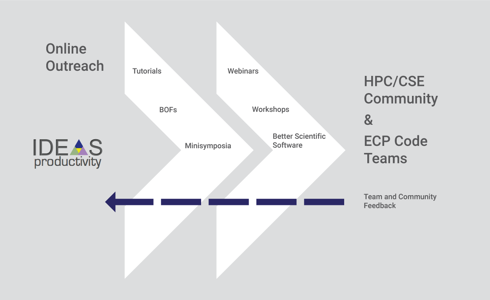

# Think Locally, Act Globally: Outreach for Better Scientific Software

#### Contributed by [David E. Bernholdt](https://github.com/bernhold "David E. Bernholdt GitHub Profile")

#### Publication date: July 17, 2018

Helping code teams improve their software development, productivity, and sustainability is no small challenge. In the IDEAS Productivity project, we have found that one of the keys to aiding the Exascale Computing Project (ECP) software development teams involves extensive outreach to the broader community of computational scientists and engineers (CSE) in high-performance computing (HPC).

### An ambitious goal
The [ECP](https://exascaleproject.org) needs to deliver a software environment and applications ready to run on exascale computers, which are scheduled to be deployed starting in 2021. Achieving this goal entails a major, large-scale software development effort.  Recognizing the challenges development teams will face, the ECP is supporting the [IDEAS Productivity project](https://ideas-productivity.org) to help scientific researchers improve their development practices.

Our objective is to work with as many of the code teams as want our help (some already have excellent software development practices or are comfortable improving on their own).  We have developed a process for [Productivity and Sustainability Improvement Planning (PSIP)](https://bssw.io/psip) that divides the process into smaller steps that are easier to implement and help realize improvements sooner through a series of iterations. The real work has to be done by the project team, but we help all along the way.  Sometimes that involves helping them analyze their situation and understanding the origins of their software development challenges.  Sometimes it is helping them learn about best practices.  And sometimes it is helping them implement such practices.

 
 

[Online Outreach for ECP Code Teams and the HPC/CSE Community]

 
 

But we’re not a large project, and ECP comprises many code teams.  So how do we do it? We do a lot of outreach! That may sound like a contradiction, but it really isn’t.  Based on our own collective experience in the HPC/CSE area, as well as initial interviews with many code teams, we know many topics that are likely to come up in the PSIP process.  Every new code team interview or a conversation with a colleague outside of ECP is likely to turn up more topics or reinforce ones already on our list.  

### Tutorials and webinars
We use this information to guide the development of tutorial materials, the selection of webinar topics, and other outreach activities.  If we’re going to help one code team with a topic, others are likely to be interested, too.  We look for existing tutorials to point our colleagues to; but for software development topics, tutorials can be hard to find. So we also develop tutorial materials that we can present in a variety of venues.  Sometimes, we even have the opportunity to record a tutorial and make it available on the web.  The code teams we’re supporting can benefit from these tutorials, but so can the broader community.  We’ve given tutorials at large-scale venues such as the Supercomputing and ISC conference series and SIAM Computational Science and Engineering (for example: our SC17 [Better Scientific Software Tutorial](https://bssw.io/events/better-scientific-software-sc17-tutorial)).

Since 2016, we’ve also been producing a webinar series called [Best Practices for HPC Software Developers (HPC-BP)](https://ideas-productivity.org/resources/series/hpc-best-practices-webinars/).  The webinars are shorter than tutorials – typically just an hour.  We try to think of them as introductions – giving people a taste of a topic and letting them decide whether they want to dig deeper on their own – and we cast a wide net of topics and speakers (not just from the IDEAS project).  Since these are “virtual” events and relatively short, it is easier for people to participate.  We’ve had over 1,200 people register for the 19 webinars we’ve had so far.  Perhaps 25% of registrants are associated with ECP projects, so once again we’re reaching a much broader audience.

The material that goes into these tutorials and webinars doesn’t come out of thin air.  It comes from our experience and that of others.  We learn about topics by reading papers and books and by hearing presentations and talking to people one on one.  So another form of outreach that we consider invaluable is to help promote conversations about software development – something that used to be relatively rare but, fortunately, is now receiving more emphasis and presenting more opportunities.  For our part, we organize minisymposia, topical poster sessions, and birds-of-a-feather sessions.

### Better Scientific Software site

What about the self-starters, those who don’t want to wait for a scheduled event like a tutorial or a webinar?  Or those who want to dig deeper into a particular topic?  The internet offers a vast array of opinions and resources about software development and software engineering practices.  But for someone in the HPC/CSE community, the situation can be daunting – there’s so much material out there, and it is hard to know what might have been tried in a CSE context, how well it worked, or what kind of tailoring might have been done to make it useful.  Experience shows that software development in the HPC/CSE context is different in some ways from more general software development.  And most of us have seen "best practices" recommended by the broader community that make little sense in the HPC/CSE world.  So we launched this site---Better Scientific Software---to serve as a portal where members of the HPC/CSE community can find information that other community members have found useful.  From the community, for the community, which includes our colleagues on the ECP code teams.

You might describe our approach to helping the ECP code teams improve their software development practices as "Think Locally, Act Globally."  For us, outreach to the broader HPC/CSE community is part of promoting the worldwide conversation that helps all of us improve.

### Get involved!

You can contribute too.  Of course, you can undertake outreach activities of your own – there’s plenty of room for good material on a plethora of important topics for software development.  

But if you don’t have the time for that, you can still help.  Do you have to topic to suggest for a future HPC Best Practices webinar?  Do you want to give a webinar?  Send us an email at <IDEASProductivity@gmail.com>.  

Or become a contributor to **BSSw.io**. We're trying to make contributing as easy as possible.  If there is a resource you've found useful that's not already on BSSw, please [contribute it](https://bssw.io/pages/what-to-contribute-content-for-better-scientific-software) to the site.  

We also welcome additional participants in our outreach activities. You can check the IDEAS Productivity Project's [Events](https://ideas-productivity.org/resources/events/) page for tutorials, webinars, and other events (as well as past ones) or [subscribe to our mailing list](http://eepurl.com/cQCyJ5) (~2-3 messages per month).  And as a pre-announcement, we will be offering an expanded full-day version of our [Better Scientific Software Tutorial](https://bssw.io/events/better-scientific-software-sc17-tutorial) at SC18 in Dallas, TX.

We look forward to hearing from you!

<!---
Publish: yes 
RSS update: 2018-07-17
Track: community
Topics: Personal productivity and sustainability
Pinned: no
--->
