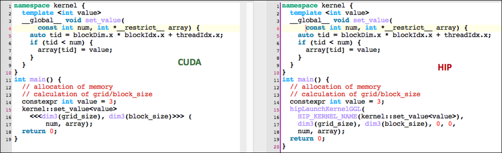

# Porting the Ginkgo Package to AMD's HIP Ecosystem

#### Contributed by [Hartwig Anzt](https://github.com/hartwiganzt)

#### Publication date: June 25, 2020

In response to the explosion-like diversification in hardware architectures, hardware portability and the ability to adopt new processor designs have become a central priority in realizing software sustainability. In this blog article, we discuss the experience of porting CUDA code to AMD's Heterogeneous-compute Interface for Portability (HIP).

## General-purpose GPU computing
For many years, NVIDIA's CUDA ecosystem has been the de facto standard for scientific computing on GPUs. Now, however, AMD with its ROCm ecosystem is gaining enough traction to challenge the NVIDIA hegemony. The strategy behind the ROCm effort is different from AMD's previous attempts as it puts a significant focus on the software ecosystem and offers the HIP language—a program interface  similar to the NVIDIA CUDA ecosystem. In fact, AMD takes an even more aggressive step by providing the ability to compile HIP code for both AMD and NVIDIA architectures. This is accomplished by utilizing source code conversion in combination with NVIDIA's nvcc compiler. Furthermore, AMD is providing the complete ROCm ecosystem and the HIP compiler as open source.
In addition, two of the three planned U.S. Department of Energy exascale computers will feature AMD GPUs.

<!--- Image to illustrate the Software Development Cycle --->
[Figure 1. Ginkgo's software design separates the high-level algorithms from the hardware-specific kernel implementations.]

## Designing for extensibility
Given this setting,  a natural step is to prepare software packages for emerging AMD GPUs. Generally, porting a software package to a new hardware architecture using a different programming model is a cumbersome challenge. However, software packages like [Ginkgo](https://ginkgo-project.github.io/), which keep modularity and extensibility as a primary design principle by clearly separating algorithm implementations from hardware-specific kernels (Figure 1), allow for easy extension to new hardware architectures. We note that the algorithms themselves are unable to execute without the hardware-specific kernels, and adding a backend does not require any changes to the algorithms. Thus, hardware  backends may be added and removed, as required, without impacting the library's functionality on other backends.

## Converting CUDA code to HIP
In an effort to make porting CUDA code to the HIP ecosystem as painless as possible, AMD provides a ''hipify'' script. We found that AMD's script can successfully translate most of the CUDA code to HIP without problems, thereby reducing the porting effort dramatically. The script  struggles only with namespace declarations; for example, it converts `namespace::kernel<<<...>>> (...)` to `namespace::hipLaunchKernelGGL(kernel, ...)`, while the correct output would be `hipLaunchKernelGGL(namespace::kernel, ...)`. Also, since the HIP ecosystem currently lacks some technical functionality available in the CUDA ecosystem, a small portion of the code—for example, cooperative groups—still has to be ported manually. For those cases, [we developed a cross-platform cooperative group implementation](https://github.com/hartwiganzt/HartwigAnzt.github.io/blob/master/papers/PortingToHip.pdf) (Coop) that provides all functionality of the CUDA ecosystem for both AMD and NVIDIA GPUs and matches the performance of NVIDIA's legacy implementation (Figure 2).

<!--- Image to illustrate the Software Development Cycle --->
[Figure 2. Performance of Ginkgo's cross-platform cooperative group implementation (Coop)  compared with that of NVIDIA's legacy implementation on the NVIDIA V100 GPU.]

<!--- Image to illustrate the Software Development Cycle --->
[Figure 3. Kernel syntax and kernel launch syntax for CUDA (left) and HIP (right).]

## Reducing code duplication
Not only is the HIP language inspired by CUDA, but HIP kernels are in many cases
even identical to CUDA code (Figure 3). Only the kernel launch syntax and
hardware-specific (tuning) parameters such as warp size (NVIDIA) and wavefront size
(AMD) are different. As a result, extending a software package with a complete
stack of HIP kernels for an AMD GPU backend results in significant code
duplication. Duplicated code is tedious to keep in sync and makes software more
error prone. To increase sustainability, we decided to create a ''common''
codebase containing the templated kernels that are configured during the
compilation process for the specific backends. This strategy not only avoids
the duplication of code but also reduces the size of the codebase. In the
realization of the HIP backend, we rearranged Ginkgo's codebase to split the
code into 1/3 ''common'' code, 1/3 HIP-specific code, and 1/3 CUDA-specific code
(Figure 4). The CUDA-specific and HIP-specific codes mostly contain the kernel
launches including the templated kernels of the ''common'' code. Only if a kernel design differs significantly for the CUDA and the HIP backend is the kernel separated into the distinct backends.

<!--- Image to illustrate the Software Development Cycle --->
[Figure 4. Reorganizing Ginkgo's codebase to avoid code duplication.]

## Compiling HIP code for NVIDIA architectures
As mentioned, the HIP ecosystem enables one to compile for both AMD GPUs and NVIDIA GPUs. After completing a production-ready HIP backend for Ginkgo, we were interested in the performance penalty we pay when compiling HIP code for an NVIDIA GPU instead of using the native CUDA code. To that end,  we processed 2,800 sparse matrices from the [Suite Sparse Matrix Collection](https://sparse.tamu.edu/). In Figure 5, we show the speedup of Ginkgo's CUDA backend vs. Ginkgo's HIP backend (compiled for NVIDIA architectures) when running on an NVIDIA V100 GPU. From left to right the figure visualizes the performance ratios for (1) Ginkgo's SellP SpMV, (2) the CSR SpMV of the vendor library, (3) Ginkgo's COO SpMV, and (4) Ginkgo's CG solver. As expected, the native CUDA code typically runs slightly faster. We note, however, that (ignoring some outliers), the performance differences are typically within 5%, demonstrating that AMD succeeds in providing a cross-platform GPU programming interface.

<!--- Image to illustrate HIP's performance portability --->
[Figure 5. Performance of Ginkgo's HIP backend (compiled for NVIDIA architectures) vs. Ginkgo's native CUDA backend on NVIDIA's V100 GPU.]

## Further reading and references
- Tsai et al.: *[Preparing Ginkgo for AMD GPUs — A Testimonial on Porting CUDA Code to HIP](https://arxiv.org/abs/2006.14290) (arXiv preprint, submitted to HeteroPar 2020)*
- AMD: *[HIP Porting Guide](https://rocm.docs.amd.com/projects/HIP/en/docs-5.7.1/user_guide/hip_porting_guide.html)*
- AMD: *[HIP kernel language](https://rocm.docs.amd.com/projects/HIP/en/docs-5.7.0/reference/kernel_language.html)*

## Author bio
[Hartwig Anzt](https://github.com/hartwiganzt) is a Helmholtz Young Investigator Group leader at the Steinbuch Centre for Computing at the Karlsruhe Institute of Technology, Germany. He also holds a Research Consultant position in Jack Dongarra's [Innovative Computing Lab](http://www.icl.utk.edu/) at the University of Tennessee, USA.  Anzt has a strong background in numerical mathematics, specializes in iterative methods and preconditioning techniques for the next-generation hardware architectures, and has a long track record of high-quality software development. He is author of the [MAGMA-sparse](http://icl.cs.utk.edu/magma/) open source software package, managing lead and developer of the [Ginkgo project](https://ginkgo-project.github.io/), and part of the ["Production-ready, Exascale-enabled Krylov Solvers for Exascale Computing" (PEEKS)](http://icl.utk.edu/peeks/) effort for delivering production-ready numerical linear algebra libraries as part of the [Exascale Computing Project](https://www.exascaleproject.org/).

<!---
Publish: yes
RSS Update: 2020-06-26
Track: experience
Topics: testing, design
Pinned: no
--->
