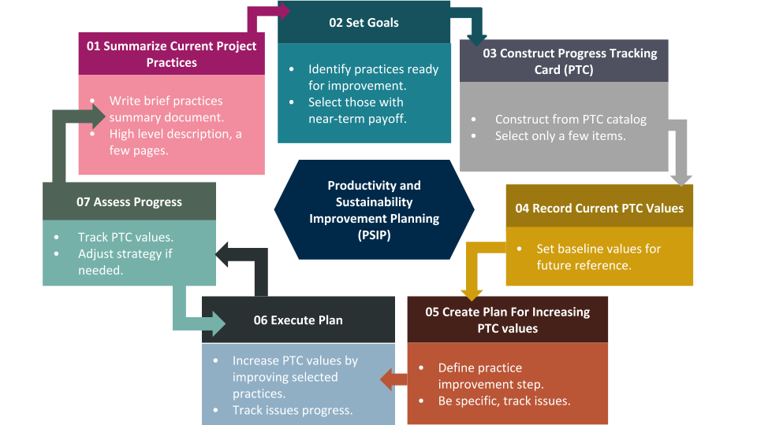
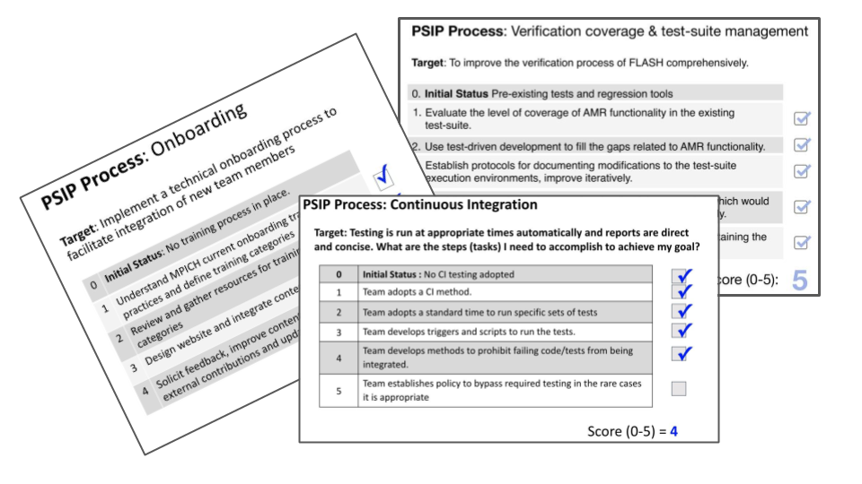

# Productivity and Sustainability Improvement Planning (PSIP)

**Hero Image:**

 - 

#### Contributed by [The PSIP team]()
#### Publication date: January 28, 2020

### What is PSIP?

Scientific software teams are typically focused on the creation of a new set of features that will enable the next set of computational experiments. Teams seldom have the time to stop development and focus solely on improving productivity or sustainability. However, teams can incorporate improvements on the way to developing new science capabilities.

The Productivity and Sustainability Improvement Planning (PSIP) process recognizes that productivity and sustainability improvements for scientific software benefit from an incremental, iterative approach.

### How can I get started with PSIP?

- Take a [Team Practices Survey](https://bssw-psip.github.io/ptc-catalog/pages/survey.html) to identify practices which could be improved.
- Read the [PSIP user manual and practice guides](https://bssw-psip.github.io/practice-guides/). These guides include a PSIP introduction, practice guides, and PSIP examples.
- Browse the [PTC Catalog](https://bssw-psip.github.io/ptc-catalog/catalog). Progress Tracking Cards (PTCs) contain the goal of the planning activity and a numbered list of outcomes.
- Visit [RateYourProject](https://rateyourproject.org) to self assess the current practices of your project.
- Chat with PSIP team on  [Gitter](https://gitter.im/bssw-psip/community)
- Request help from the PSIP team through a [Google Form](https://docs.google.com/forms/d/e/1FAIpQLSdcQxb158piJeBqELZmJFkJTOFx71WBNBChtec5f21kyvPiCg/viewform)

### What does improving processes through PSIP entail?

PSIP is very lightweight.

The key to PSIP is understanding where you are starting from, setting goals, and tracking your progress. The PSIP framework is shown below, which consists of seven iterative steps.

[The PSIP framework]

At the core of PSIP is a simple progress tracking card (PTC). Progress tracking cards are concise visual aids that record your intended goals, deliverables, and milestones. You create a PTC so that you can progressively compare your team's progress toward an intended goal.

Note that PSIP PTCs are not meant to be external assessments or evaluation tools. A PTC is meant to be used internally in your team for your own progress tracking. PSIP can help develop best practices and the use of PTCs will help keep track of your progress toward an objective. You can also use or share PTCs when communicating to other teams about your goals and how you know when you will have met your objectives.

The [PSIP Progress Tracking Card Catalog](https://bssw-psip.github.io/ptc-catalog/catalog) has a collection of example PTCs for you to explore. Several of these existing PTCs have been used by teams successfully. You can choose to select a PTC for the objective/goal that you want to focus on. You can also choose a PTC, and customize it to meet your timeline and priorities.

[Snapshots of Progress Tracking Cards]

### Are there other articles to read about PSIP?

PSIP has been used by several ECP teams and others in the BSSw.io community.

- [Planning for Better Software: PSIP Tools](https://bssw.io/items/planning-for-better-software-psip-tools)
- [A Lightweight Software Process Improvement using Productivity and Sustainability Improvement Planning (PSIP)](https://bssw.io/items/lightweight-software-process-improvement-using-productivity-and-sustainability-improvement-planning-psip)
- [What makes PSIP suitable for the Exascale Computing Project? - A Podcast](https://bssw.io/items/what-makes-psip-suitable-for-the-exascale-computing-project)
- [FLASH5 Refactoring and PSIP](https://bssw.io/blog_posts/flash5-refactoring-and-psip)
- [Adopting Continuous Integration for Long-Timescale Materials Simulation](https://bssw.io/blog_posts/adopting-continuous-integration-for-long-timescale-materials-simulation)

<!---
Publish: yes
Pinned: yes
RSS update: 2020-01-28
Categories: planning, development, collaboration
Topics: software process improvement
Tags: bssw-blog-article
Level:2
Prerequisites: default
Aggregate: none
--->
