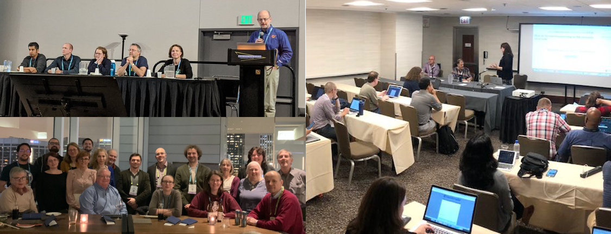

# The RSE-HPC-2020 Workshop: Creating Community, Building Careers, Addressing Challenges

**Hero Image:**

 - 
 
#### Contributed by [Charles Ferenbaugh](https://github.com/cferenba "Charles Ferenbaugh GitHub Profile"), [Sandra Gesing](https://github.com/sandragesing "Sandra Gesing GitHub Profile"), [Simon Hettrick](https://github.com/SimonHettrick "Simon Hettrick GitHub Profile"), and [Daniel S. Katz](https://github.com/danielskatz "Daniel S. Katz GitHub Profile")

#### Publication date: October 26, 2020

*This article has been crossposted on the [US-RSE blog](http://us-rse.org/blog/).*

We are excited to announce the [Research Software Engineers in HPC Workshop
(RSE-HPC-2020)](https://us-rse.org/rse-hpc-2020/) to be held as part of [SC20](https://sc20.supercomputing.org/) (held virtually) this fall! This will be a half-day
workshop 10:00am-2:00pm EST, Thursday, November 12, 2020. It will feature keynote addresses from
Simon Hettrick and Frank Löffler, leaders in the RSE movements in the UK and Germany,
followed by talks and panel discussions on the needs of RSEs and RSE groups.

High Performance Computing (HPC), Computational Science and Engineering (CSE), and data
science rely on high-quality software, and the developers of this software are critical to the
impact of HPC, CSE, data science, and the larger scientific community. It is increasingly
recognized that such developers need a unique combination of skills: expertise in software
development together with a deep understanding of the scientific field for which the software is
being written. Recently, the term “Research Software Engineer” (RSE) has been applied to
people in such roles; this term originated in the UK in 2012, and has become widely recognized
worldwide over the past several years.

Although many research projects rely heavily on RSE contributions, formal recognition of the
unique RSE role is often lacking. Sometimes, these positions are pigeonholed into the existing
hierarchy of research positions, such as postdoctoral associates and research scientists in
academia, or analogous positions at other kinds of institutions, including at national labs and in
industry. However, this classification does not adequately describe RSE responsibilities, and
can cause problems for RSEs who seek career progression. This lack of a defined position and
career outlook leads many promising practitioners to abandon research altogether. In
response, many research institutions are creating specific positions and groups for RSEs, and
several national organizations of RSEs have formed.

In the HPC community in particular, software projects have historically required significant work
to develop specialized, highly performant software. This need has increased greatly in the past
few years, as projects have grappled with adapting their codes to new architectures such as
GPUs or many-core CPUs. Many projects have also had to address questions of correctness
and reproducibility. With all of these changes, the need has increased for skilled software
developers (RSEs) to write HPC software that is understandable, well-tested, maintainable, and
extensible. Even so, many of these RSEs still struggle to find positions and career recognition
in the modern research culture.

Because of all this, the time is right to hold a workshop for RSEs in the HPC community at this
year’s SC20 conference. This workshop will build on RSE panels and BOF sessions at earlier
SC conferences and other events, and on RSE conferences held in the UK and elsewhere.
Last year at SC19, for example, we discussed RSE roles and career paths in a BoF; we learned
that there was a large group interested in the topic, and that the term “RSE” was much better known than it was a couple of years earlier. This workshop will bring together RSEs and allies
involved in HPC, from all over the world, to grow the RSE community further by establishing and
strengthening professional networks of current RSEs and RSE leaders.

The planned agenda includes the following talks and discussions:

* Keynotes
  * The Birth of RSE - Simon Hettrick, Software Sustainability Institute
  * de-RSE: Forking an RSE Success Story - Frank Löffler, Friedrich Schiller University

* Lightning talks
  * How Research Software Engineers Can Support Scientific Software - Miranda Mundt, Sandia National Laboratory
  * SC3UIS Research Software Engineering Ecosystem for Scientific Computing - Emilio Carcamo, Universidad Industrial de Santander
  * RSEs as Maintainers: Keeping Code Alive - Bernadette Boscoe, UCLA

* Panel discussion: Building RSE Teams and Groups
  * Reed Milewicz, Sandia National Laboratory
  * Jeremy Cohen, Imperial College London
  * Robert Sinkovits, San Diego Supercomputer Center
  * Mahmood Shad, Harvard University
  * Ben van Werkhoven, Netherlands eScience Center

* Panel discussion: Supporting RSE Careers
  * Joanna Leng, University of Leeds
  * Ian Cosden, Princeton University
  * Rinku Gupta, Argonne National Laboratory
  * Carlos Maltzahn, UC Santa Cruz

For more details see the [event website](https://us-rse.org/rse-hpc-2020/) or the SC20 [program page](https://sc20.supercomputing.org/session/?sess=sess217). If you’re
participating in **SC20**, we hope you can join us! (Workshop registration required.)

### Author bios
Charles Ferenbaugh is a staff member in the Applied Computer Science group at Los Alamos National Laboratory. He received a PhD in Mathematics from Princeton University in 1992. Since 2001, he has been a software developer on HPC code projects in LANL's Advanced Simulation and Computing program. He is currently involved in two large multiphysics code projects: the Eulerian Applications Project and the Ristra/Next Generation Code Project. He has also been a part of LANL research efforts in advanced architectures and programming models. He is a member of the steering committee for the US Research Software Engineer Association.

Sandra Gesing is an Associate Research Professor in the Department of Computer Science and Engineering and a Computational Scientist at the Center for Research Computing at the University of Notre Dame. Her research interests include science gateways, computational workflows as well as distributed and parallel computing, focusing on research aspects around sustainability, usability and reproducibility. Prior to the position at Notre Dame, she was a research associate at the University of Edinburgh, UK and at the University of Tübingen, Germany. Additionally, she has perennial experience as a project manager and system developer in industry. 

Professor Simon Hettrick is Deputy Director of the Software Sustainability Institute, and a Director of the Southampton Research Software Group. He works with stakeholders from across the research community to develop policies that support research software, the people who develop that software and the researchers who rely on it. Simon is a passionate advocate for Research Software Engineers. He orchestrated a campaign to gain recognition for this community, which has grown from a handful of people in 2013 to a substantial international community numbering in the tens of thousands.

Daniel S. Katz is Assistant Director for Scientific Software and Applications at the National Center for Supercomputing Applications (NCSA), Research Associate Professor in Computer Science, Electrical and Computer Engineering, and the School of Information Sciences (iSchool) at the University of Illinois Urbana-Champaign. He is also a Better Scientific Software (BSSw) Fellow and Guest Faculty at Argonne National Laboratory. His interests include applications, algorithms, fault tolerance, and programming in parallel and distributed computing, as well as citation and credit mechanisms and practices associated with software and data, organization and community practices for collaboration, and career paths for computing researchers.

<!---
Publish: yes
RSS update: 2020-10-26
Categories: Planning, Collaboration
Topics: Software Engineering, Projects and Organizations, Conferences and Workshops, big data
Tags: bssw-blog-article
Level: 2
Prerequisites: default
Aggregate: none
--->
