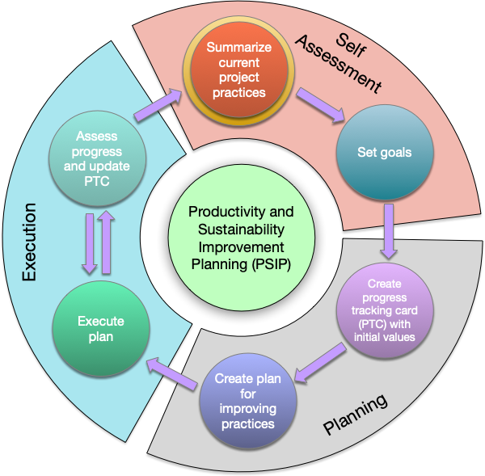
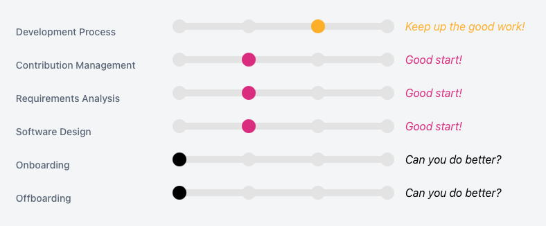

# Improving team practices with [RateYourProject.org](https://rateyourproject.org)

 
#### Contributed by [Gregory R. Watson](https://github.com/jarrah42)

#### Publication date: July 10, 2021

[RateYourProject.org](https://rateyourproject.org) is a tool designed to help teams begin the process of
[Productivity and Sustainability Improvement Planning (PSIP)](https://bssw.io/psip), a new technique for improving team practices.

PSIP is a lightweight methodology for 
improving practices used by scientific software teams. Originally envisioned for helping teams improve
software engineering practices such as coding standards, testing, documenting, etc., the PSIP approach 
has proved general enough for other non-technical types of practices as well, such as on-boarding, communications, etc. 

 

The PSIP process comprises seven steps of an iterative process. The first two steps form the **assessment** phase, were teams identify their current practices and areas that would benefit from improvement, then set goals for how to improve those practices. The next three steps form the **planning** phase, where teams  create [progress tracking cards (PTCs)](https://github.com/bssw-psip/ptc-catalog) to record and monitor progress towards their goals, record the current state, and create a plan for how to improve the practices. The final two steps form the **execution** phase, an iterative process where the plans are put into action, and progress is monitored by recording it in the PTCs as part of the team's normal task tracking activities.

### Getting started

Like any new idea, convincing people that it is practical and worthwhile is one thing, but actually getting them to try it 
out is a whole different ball game. This is particularly an issue when there are time and cost implications in 
trying out the idea, and if the benefits of the activity are not immediately apparent. 

 

For PSIP, the main barrier to getting started is assessing the current project practices, and identifying areas that would benefit from 
improvement, [RateYourProject.org](https://rateyourproject.org) provides a simple and fast way to get teams on the road to improving their 
practices.

### How it works

[RateYourProject.org](https://rateyourproject.org) works by guiding the user through a series of common development practices and allows the user to choose a response that most closely matches their current practice level using a modified four point Likert scale of "None", "Basic", "Intermediate", and "Advanced". The scale is designed to make it easy for teams to match their practices with the pratice description. Practices are grouped under the categories _Better Development_, _Better Planning_, _Better Performance_, _Better Reliability_, and _Better Collaboration_. This enables an overall assessment to be presented as a spider chart like this one, which clearly shows that _Better Planning_ and _Better Performance_ are categories that could benefit most from improvement, although there is room for improvement in all categories.

 

Once the overall assessment has been established, teams are able to examine the individual categories to determine what practices they could focus on for improvement. In this example, selecting the _Better Planning_ category will then provide a more detailed assessement of the practice areas. In this case, the project could clearly benefit from creating onboarding and offboarding processes to manage staff turnover, and could also benefit from looking at how to improve contribution management, requirements analysis, and software design practices.

 

### Continuous improvement

PSIP is a process of continous improvement: practices needing improvement are identified, a plan is made, and then the plan is executed and the process starts again. The [RateYourProject.org](https://rateyourproject.org) tool allows the current assessment to be saved, then reviewed later in order to check progress or to identify another area that could be improved. The site provides a link on the main assessment page that can be used to return to the current assessment. This provides a simple and safe mechanism for recording progress towards achieving improvement goals.

### Future work

The PSIP team is working on a variety of improvements and enhancements to the tool. These include helping teams create progress tracking cards once they have identified practice areas for improvment, and then adding these cards to the existing task tracking systems used by the teams. We're also looking at how the tool could be integrated directly with version control hosting services such as GitHub and GitLab, more detailed assessments, and alternate presentation styles. 

### Author bio

Gregory Watson is Group Leader of the Application Engineering Group at Oak Ridge National Laboratory. He completed his Ph.D. in Computer Science in 2000 from Monash University. Dr. Watson's research interests include software engineering practices, development environments, programming tools, and modeling and simulation tools for high performance and scientific computing. He is founder of the Eclipse Parallel Tools Platform, and project leader of the Eclipse Science Top Level Project.

<!---
Publish: No
Categories: planning
Topics: software engineering
Tags: bssw-blog-article
Level: 2
Prerequisites: default
Aggregate: none
--->
