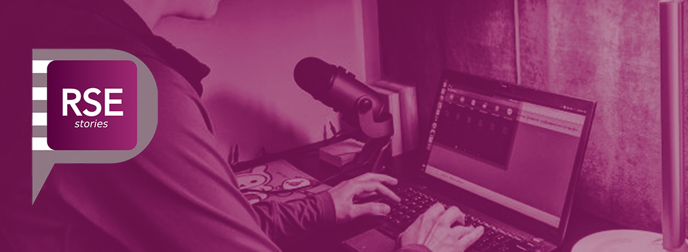

# Research Software Engineer Stories

**Hero Image:**

 - 
 
#### Contributed by [Vanessa Sochat](https://github.com/vsoch "@vsoch on GitHub")

#### Publication date: April 24, 2020

### We look to experts for knowledge, but do they know the whole picture?

I woke up one morning in September of 2019 with something on my mind. I had seen several
papers, talks, and other "academically approved" presentation formats that were defining what
a research software engineer (RSE) is. What was the problem? It didn't reflect my experience.
It didn't reflect the experiences of many of my peers, and presented a very narrow
understanding of a role that was immensely rich and changing. Could it be that the community
would need a source different from publication to derive our truth? What exactly is a
research software engineer anyway? Did I know? I had seen RSEs in high performance computing,
open source development, and of course at national and academic labs. These folks
worked on everything from documentation to user support. What I saw in the real world
didn't reflect what the experts were advocating — research software engineers did not
always exist on some dimension between software engineer and researcher.

### If there is missing information, where can we find it?

This of course wasn't a new problem — I had been chewing on it for a few months now.
How could we best define what an RSE is, but not from some select pool of experts, but 
from RSEs themselves? I had first ventured into tool building and created the 
[RSE Phenotype Generator](https://rseng.github.io/rse-phenotype/) and tried to
encourage folks to use it. They largely didn't. I had also tried encouraging written
stories, but people just didn't have the time to sit down and write a small article.
I had also spent a few weeks writing down all the different kinds of research software
engineers that I knew about, and created a video:

 

<iframe width="560" height="315" src="https://www.youtube.com/embed/trAfA9VWLTQ" frameborder="0" allow="accelerometer; autoplay; encrypted-media; gyroscope; picture-in-picture" allowfullscreen></iframe>

 

That still reflected my narrow life experience — I could never imagine the stories
that I'm just not familiar with. It wasn't good enough. How could I tell all of these real stories?
It hit me like a pillow falling from the ceiling — and it was such a simple idea! 
The research software engineers needed to tell their own stories, and in a format
that wouldn't ask much of their time. In parallel the stories needed to be easy to digest —
many of us are overwhelmed with reading material, but what about when we go for runs?
Or embark on a daily commute? This is when the medium of a podcast is lovely music
for our ears. I decided in a split second moment, and without much thought about
the immense amount of work it takes to create, manage, and maintain a podcast, 
schedule people, edit audio (and edit it again), that I needed to create a podcast.

### How do we do something we've never done before?

When in doubt, ask the internet, and look to the tools that you already know and use.
I figured that I could post the podcast as a static site on [GitHub](https://github.com/usrse/rse-stories), 
deployed via GitHub pages to render at [https://us-rse.org/rse-stories/](https://us-rse.org/rse-stories/).
I needed to do a small amount of searching to figure out what kind of feed was needed for itunes,
and then how to register it. For recording technology, I went to the tools that I already had,
and wound up using a Zoom meeting to record the audio, and then [Audacity](https://www.audacityteam.org/) to edit it.
And that largely is it! It's really important to do your best and stay away from striving
for perfection, especially with audio recording and editing. The RSE Stories podcast,
by way of being entirely done by one software engineer, is not going to be on the same
level as some of my favorite (professionally created) podcasts, but this is OK. 

### So what is a research software engineer?

I suspect my answer will differ from how I perceive the average RSE to be. If you ask me, being a research software engineer 
isn't about being handed a script to optimize, a container to build, or a package to write tests for. Being an RSE is about
predicting the future. It was, back in 2014, realizing that Docker was an amazing container technology, and that I needed
to do whatever was necessary to get it working on high performance computers. It's hugely about open source development,
and taking charge of even the tiniest of bugs that you see hindering the communities that you serve.
It's taking risk to get involved with new communities that you see might be beneficial to make discoveries in science. 
It's about understanding the human element, and putting time into undervalued resources like documentation, making
experiences fun, and teaching people that it's okay to ask for help. It's about being okay that 98 out of the 100 things you
try will not change how people think. Given the current state of the world, it's also about advocating for yourself,
taking care of yourself, and knowing when to say no or step away from something that is no longer meaningful to your
community, or to you personally. If you have a vision for how you want the world to be, you have to be proactive, and passionate. 
It's easy to get distracted by the trending technologies of the moment, and trying to fit into a mold for how
you think you are expected to be. I know that these hard working engineers, dreamers, and advocates are out 
there, and this is what I find so inspiring and compells me to continue the podcast.

### How do I find the podcast?

The episodes are released via a feed that plugs right into itunes, so you can
find it on [Apple Podcasts](https://podcasts.apple.com/us/podcast/rse-stories/id1481504497)
or discover it using your favorite podcast subscription service. The episodes are also
available on the main [RSE Stories](https://us-rse.org/rse-stories/) website,
and announced at time of publication on [@vsoch](https://twitter.com/vsoch/)'s Twitter,
and often the US-RSE and UK-RSE slack channels.

### What I've learned from RSE Stories

Along with hugely expanding my understanding of what an RSE is, I've learned a lot of
technical and social tidbits by way of working on the RSE Stories podcast. I'd like
to share them quickly here:

 - Being social can produce anxiety, but I've learned that if I regularly expose myself to recording, it actually gets easier and I enjoy it. Introverts of the world, listen up! Adding a routine that puts you slightly out of your comfort zone can have unexpected positive benefits for this reason.
 - It's good to know a few things about the person in advance so that you are ready to ask questions. Some people can very fluidly speak about their work, while others will only provide short answers, making your ability to ask good questions hugely important.
 - Every endeavour takes time. You have to make time for the things that you care about. This podcast falls into that bin for me, and hopefully in time others might be interested to help and record episodes.
 - Software wise, you don't need much more than [Audacity](https://www.audacityteam.org/) and a [episode feed](https://github.com/USRSE/rse-stories/blob/master/pages/episodes.rss) to give your podcast life.  
 - Technology wise, it's best for both to record in a quiet, and small room, with minimally a headset with mic.

If you are interested in being featured on RSE Stories, you can read more information about
the podcast and express interest [here](https://us-rse.org/rse-stories/about/). What are you waiting for,
let's share your story!

### Author bio

Vanessa Sochat is a research software engineer for the Stanford Research Computing Center. She received her PhD in Biomedical Informatics in 2016, and stayed at Stanford to focus on open source software development for scientific reproducibility. Her work includes development of container technologies, workflow software, and recipes for continuous integration. She is passionate about programming and system design, and continues to run the Singularity Hub container registry and maintain a large set of open source libraries. When not programming, Vanessa can be found eating avocados, recording podcast episodes or fun videos, making dinosaur noises, and running outside in the snow.

<!---
Publish: yes
RSS update: 2020-04-24
Pinned: no
Topics: Projects and Organizations, Software Engineering, Research Software Engineers
--->
