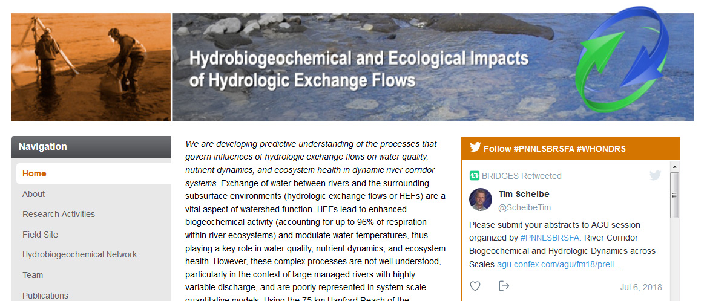

# Do Social Media and Science Mix? Twitter Use in a Large Research Project

#### Contributed by [Tim Scheibe](https://github.com/tscheibe "Tim Scheibe GitHub Profile")

#### Publication date: August 30, 2018 

The use of social media such as Twitter in the context of scientific research may seem like a time-consuming distraction from more productive and rewarding activities, such as writing a paper. Are there any tangible benefits? How can we maximize those benefits while avoiding potential pitfalls? We've been using Twitter and other social media in a large research project, and here are some of our experiences.

I am the Principal Investigator (PI) of a large, multiyear, multi-institutional research project at the Pacific Northwest National Laboratory. I finished graduate school around the time that the first web browser (remember [Mosaic](https://en.wikipedia.org/wiki/Mosaic_(web_browser))?) was released, and I got into the internet revolution on the ground floor. So I just dated myself, but anyway... Today as the senior researcher on the project, I find myself surrounded by younger scientists, many of whom can't remember a time without smart phones, Google, and social media. Armed with seemingly endless energy and a willing PI, they have found creative ways to use social media to develop collaborations, gain visibility for our research, and communicate more effectively. Among other things, we use Twitter (@WHONDRS, #PNNLSBRSFA), [LinkedIn](https://www.linkedin.com/company/whondrs/), [ResearchGate](https://www.researchgate.net/project/Subsurface-Biogeochemical-Research-at-Pacific-Northwest-National-Laboratory), and YouTube as well as a conventional web presence (https://sbrsfa.pnnl.gov/) to share our science with collaborators and the broader community.

[Using Twitter in a large scientific research project]

 
In December 2017 our project kicked off a collaborative network we call WHONDRS. By combining conventional approaches (conference talks and exhibits) with Twitter ([@WHONDRS](https://twitter.com/WHONDRS)) and other social media sites, our network has rapidly grown into an international consortium with hundreds of participants and a lot of enthusiasm.

 

[WHONDRS collaborative site]

 

When I first opened my Twitter account ([@ScheibeTim](https://twitter.com/ScheibeTim)), a few quick searches on keywords of interest led to discovery of a conference workshop on multiscale modeling that I ended up attending. There I met researchers with common interests and open-source tools that were beneficial. However, the researchers do not typically attend the same conferences (or publish in the same journals) as I do, so without the Twitter contact I likely would still be unaware of that body of work. That experience alone was worth the minimal effort involved.

 

Some suggestions from our experience:
- **Select and use a dedicated and distinct project hashtag:** We use #PNNLSBRSFA to tag all tweets related to our project, which enables people to quickly search for related material. 
- **Link multiple forms of media:** Use of the project hashtag enabled us to set up a Twitter feed on our project home page (see headline figure above) that picks up any tweet using that hashtag. Tweets that contain [YouTube videos](https://www.youtube.com/watch?v=bY_o9GEWsI8), even if just simple ones taken with a cell phone, get a lot more attention than simple text.
- **Keep it professional:** We ask that any tweet that uses our project hashtag be posted on a Twitter account used only for professional purposes. It is easy to have a separate personal Twitter handle if so desired, but keep family photos, political views, and so forth off of the professional account. 
- **Get engaged at scientific conferences:** Nearly all conferences now publicize a standard Twitter handle and hashtags, which you can use to post comments about talks and posters, draw attention to new contacts, and share local flavor. 
- **Tweet about your conventional publications:** Posting a link to a new paper is a great way to let your followers know about your latest research, and these often get retweeted. Although I don't have any firm empirical evidence, my guess is that doing so will have a positive impact on your citations and H-index.
- **Be selective about whom you follow:** While it is tempting to follow lots of people with related interests, I'm finding that the large number of tweets coming through my feed make it nearly impossible to keep up with the important ones. I am currently scaling back to limit to those that are well-aligned with my scientific interests and don't post a lot of superfluous tweets.
- **Take advantage of institutional resources:** Once the scientific communications staff at my lab discovered that we actively use social media, they gave me access to tools like [Buffer](http://buffer.com) that make it easier to, for example, execute a pre-planned series of tweets timed to precede scheduled talks by my project team members at a conference. We frequently tag our lab's social media outlets in our tweets, which encourages them to retweet to their followers, thus reaching a larger audience.

The scientific endeavor is increasingly global, interconnected, open, and collaborative. Social media is one avenue to engage; and while it takes some effort and care, it is becoming essential to success in the modern research environment.

<!---
Publish: Yes
RSS update: 2018-08-30
Categories: collaboration
Topics: strategies for more effective teams
Tags: bssw-blog-article
Level: 2
Prerequisites: default
Aggregate: none
--->
