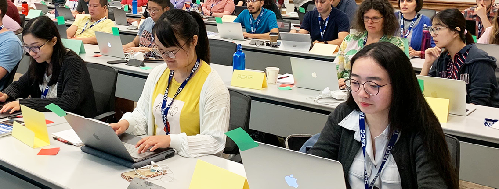

# Software Sustainability in the Molecular Sciences

**Hero Image:**

 - 

#### Contributed by [Theresa L. Windus](https://github.com/twindus "Theresa L. Windus GitHub Profile") and [T. Daniel Crawford](https://github.com/lothian "T. Daniel Crawford GitHub Profile")

#### Publication date: November 14, 2019

The molecular sciences -- including chemistry, materials, biophysics and
biochemistry -- have a long history of developing software to answer core
scientific questions. The field also has a long history of challenges to
software sustainability. This blog article discusses some of the software
sustainability challenges and the opportunities/possible solutions that the
Molecular Sciences Software Institute (MolSSI) is working toward with the molecular sciences software development community.

The [MolSSI](https://molssi.org/)
is an NSF-funded project that is a nexus for science, education, and
cooperation for the global computational molecular sciences community. Funded in
2016,  the MolSSI seeks to provide software expertise and
infrastructure, education and training, and community engagement and leadership
in molecular sciences software development. The fundamental purpose of the
MolSSI is to serve and enhance the software development efforts of the broad
field of computational molecular science.

### Challenges

#### Software, hardware, and educational challenges

Software in the molecular sciences ranges from small utility programs used to
manipulate inputs and outputs, to analysis programs, to libraries that provide a
particular functionality, to monolithic scientific codes that are capable of many
types of simulations. Each code is usually developed and optimized with a
particular computing environment in mind (such as a laptop or workstation, a
small cluster, or the emerging exascale and quantum computers). In toto, this
software runs on the complete suite of computational hardware, from laptops to
supercomputers. In addition, the software is developed with many different types
of languages (Fortran, Python, C++, C, and scripting languages, for example)
with dependencies on different math libraries and compiling environments.

The diversity and evolving set of computational hardware and software stacks
lead to significant sustainability challenges. Molecular computational
scientists, as with most software developers, want their software to be portable
and run on multiple platforms (as appropriate). This is one reason why most
developers are happy to use math libraries that are optimized by the hardware
and software vendors to perform well on a particular platform. Most of these
libraries have common abstract programming interfaces (APIs) that allow the
developer to link in different math libraries without having to make changes to
the application software. Unfortunately, APIs and shared data formats are not
common for most of the rest of the molecular sciences software ecosystem. 
Thus, sharing of software is not as easy as it should be. Also, new or
faster algorithms for particular hardware are usually not adopted by other
codes. Therefore, developers end up optimizing similar application software on
the same hardware and software stacks. This extra work translates into more
resources being needed across the community to sustain the software.

Much of the early software in the field was developed in an academic setting
where little or no software engineering practices were used. To be fair, the
wealth of software engineering practices in vogue today were not taught (or even
developed) at the time of these early programs. In addition, there was generally no formal training of molecular scientists in the computer sciences including use of languages and data structures. Even today, graduate degrees in the
molecular sciences generally require a minimum number of courses, and adding
additional courses is often discouraged in lieu of more time spent on research.
Undergraduate curricula in the molecular sciences already include a significant
amount of coursework, and adding additional requirements can be difficult,
especially if the faculty are not convinced that computational training is
necessary. Unfortunately, even with the advances made in computer science and
engineering as well as changes in the social environment in some molecular
science departments, most of the computer science training for computational
molecular scientists is still ad hoc, although the wealth of online materials
and courses makes obtaining this knowledge much easier than it used to be.

#### Socioeconomic challenges

Sustainability is as much a socioeconomic problem as a technical one; thus,
there is a supply and a demand side to software sustainability. On the supply
side, the cost model for the program needs to be considered, as well as the
commitment of the developer community. If the software is open source, this
includes the cost of the developers for the initial development and incentives
and appropriate licensing models that facilitate external developer communities.
Of importance here are low barriers to entry -- ease of development,
documentation, communication among the software developers, etc. 
Developing this community can take time and effort, and
therefore expense. In addition, the software development must align with 
user needs. Consistent and frequent communication with potential and existing
users is necessary in order to ensure that the demand will be high. Factors that
determine the engagement of users include tangible metrics such as software
quality, as well as intangible metrics such as the external user community's
confidence in the code and process. The software development must be driven by
maximum quality and community confidence in the code. For some software, a cost
recovery model will require providing support of, and services around, software
as opposed to selling per-use licenses. In addition, it must be understood that
not all software should be sustained. Natural attrition of software is something
we should expect in an ever-changing socioeconomic environment.

Another social challenge in the molecular sciences is that academic software is
usually developed only as part of the process of producing simulations or
verifying theoretical developments -- to get the physics right -- for publications
in journals and toward advancement in a graduate degree. In other words, the
software is often not the primary focus; it is just a vehicle used toward a
publication -- the primary metric still used in most science fields. 
Thus, developers often skip the upfront cost necessary for clear and effective
design decisions, instead taking shortcuts in the development to "just get the software
working," skipping testing for end cases, and putting off documentation (that
then never appears). As a result, the software may be difficult to maintain and,
therefore, difficult to sustain. Often, those developers who do take the time to
produce well-thought-out, hardened software produce fewer publications. Although
the social environment is changing, software still is not
considered as important a product as is a publication, although projects such as
the NSF-funded [URSSI project](http://urssi.us) seek to change this status quo.
Careers for such developers often lead into industry positions outside of the
molecular sciences. While these careers can be satisfying, such moves mean that some
of the best computational engineers are enticed out of the very field that
needs them.

### Opportunities/possible solutions

Meeting these challenges can be daunting; however, significant progress has been
made. The molecular sciences community itself has come to recognize that
traditional development methods have sustainability challenges and has sought
out opportunities to change the environment. Indeed, the fact that NSF is now
funding not only the MolSSI effort but other computational science software
development efforts such as the [Institute for Research and Innovation in
Software for High Energy Physics](http://iris-hep.org/) and the [Science
Gateways Community Institute](https://sciencegateways.org/) is a significant
sign that the culture is changing. These funding opportunities allow the
community to implement significant changes in our software ecosystem that might
otherwise not be possible. Here we outline some of those possible solutions that
we have been involved in as part of the MolSSI project.

#### Education and outreach

As one of the most significant parts of our agenda, the MolSSI has engaged in a
large education and outreach effort. The MolSSI offers summer schools,
educational workshops, and tutorials at the undergraduate, graduate, and
postgraduate levels that focus on best practices in software engineering and
applying those techniques to important topics in the molecular sciences. Several
of our workshops also address programming issues related to changing hardware
and high-performance computing. To date, these activities have reached over 300
students, and best software practices are becoming the de facto standard for the
field. Materials also are made available online in a tutorial form for
those who cannot make the formal meetings or who have specific needs. In
addition, the MolSSI has developed an online resource page for best practices
and has partnered with the [Better Scientific Software](https://bssw.io/) effort to
provide general resources from the broader computational sciences community.
Furthermore, the MolSSI has awarded software fellowships to approximately 50
graduate students and postdocs with the intent of providing in-depth training
in software best practices and engineering. These educational opportunities are
gaining a foothold in the community, and we expect they will have a long-term impact
on how the community as a whole develops software as these students progress
into the next phases of their careers.

The MolSSI also sponsors approximately eight software workshops per year,
reaching more than 500 participants, to understand the challenges of software
development in different pockets of the community. Most of these workshops are
open discussions of bottlenecks to software development as well as issues
associated with creating sustainable software. The workshop reports include
specific, actionable recommendations for the MolSSI to aid the developments in
the communities. Many of these recommendations -- such as creating API standards
and key infrastructure to help codes work together to enable world-class science
solutions -- have huge potential to increase software sustainability in the
community. We note that most of these workshops are led by members of
the community and not by the MolSSI itself; we are a key partner in the
workshops, but the organizers determine the primary topics of discussion.

#### Software and data API standards

The MolSSI has also taken a leadership role in the development of code and data
API standards. These common APIs will facilitate a level playing field for all
developers, enabling even the smallest software projects to gain recognition
for a unique feature or performance optimization. In addition, the MolSSI is
developing infrastructure software that uses these APIs to enable tasks that
have proven to be difficult in our community, such as developing commonly
accessible data sets using multiple quantum chemistry codes (the
[QCArchive](https://qcarchive.molssi.org)) and enabling the coupling of
multiple quantum and molecular mechanics codes to perform very large, complex
molecular simulations (the [MolSSI Driver
Interface](https://github.com/MolSSI)). Ultimately,
these types of standardizations enable fair competition, with the users picking
the most successful products for their needs.

#### Best practices and new metrics

Of course, this primarily MolSSI-developed infrastructure software faces its own
sustainability challenges. However, the MolSSI strives to practice what it
preaches: designing and developing with its users (mostly developers of simulation codes, but also actual end users); using thoughtful design to enable modularity, separation of concerns, reusability, and ease of use; using standard APIs that enable a broad swath of developers to engage; developing documentation (both user and developer); using distributed version-control systems, such as GitHub, automatic testing, and messaging tools to engage new developers and track issues; and building the user community through seminars, workshops, and personal communication. The MolSSI will also continue to engage with commercial
interests to provide training (as appropriate) and services associated with the
software that is being developed.

Finally, the MolSSI is working to encourage new metrics within the field to
reward those who take the software development path -- other than a large salary at
 an industrial position not related to molecular sciences. These efforts
include encouraging developers to use DOIs for their software and datasets,
raising the level of a software release to the same level as a publication, and 
using data within tools such as GitHub to show productivity, as well as encouraging the
continued formation of positions related to scientific software development.

### Acknowledgments

This blog post is based on a white paper at the [2019 Collegeville Workshop on
Sustainable Scientific Software
(CW3S19)](https://collegeville.github.io/CW3S19/) and is cross-posted on the
[BSSw](https://bssw.io) and [URSSI](http://urssi.us) sites.

### Author bios

Distinguished Professor [Theresa Windus](mailto:twindus@iasate.edu) is the
Liberal Arts and Sciences Dean's Professor at Iowa State University and a
Laboratory Associate with Ames Laboratory. She received her bachelor’s degree in
chemistry, mathematics, and computer science from Minot State University and her
Ph.D. from Iowa State University. She is currently the Director of the NWChemEx
DOE Exascale Computing Project and Deputy Director of the MolSSI. Her research
focuses on the development of high-performance computational chemistry methods
and their use in practical applications. She is a Fellow of the American
Association for the Advancement of Science and has garnered multiple research
and teaching awards.

Dr. [T. Daniel Crawford](mailto:crawdad@vt.edu) is University Distinguished
Professor of Chemistry at Virginia Tech and the Director of the Molecular
Sciences Software Institute in Blacksburg, Virginia. He received his bachelor's
degree in chemistry in 1992 from Duke University and his Ph.D. in 1996 from the
University of Georgia. His research focuses on quantum chemical models of
molecular response properties in liquid environments. He is a Fellow of the
American Chemical Society and the winner of 2010 Dirac Medal of the World
Association of Theoretical and Computational Chemists.

<!---
Publish: yes
RSS update: 2019-11-14
Topics: Projects and Organizations, Conferences and Workshops, Design, Software Interoperability, Software Sustainability
--->
