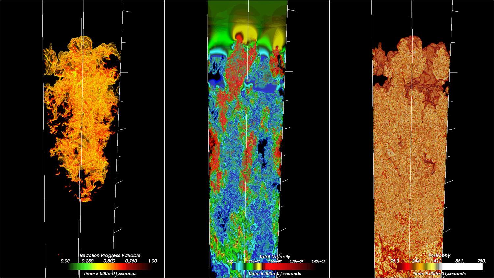

# Software Verification

#### Publication date: August 15, 2018

#### Contributed by [Anshu Dubey](https://github.com/adubey64)

**Hero Image:**
 
- 

In the realm of software, verification is often erroneously conflated with testing. In truth, testing is a proper subset of verification for gaining confidence in the correct behavior of one’s software. It is the holistic process by which the developers convince themselves that their software is doing what it was designed to do. In scientific software this could mean verifying the convergence order, numerical stability, and efficacy of the method in the regime of interest over and above testing for expected results.  Note that verification is limited to ensuring that the implementation matches the model specification, not that the model itself matches reality. The latter is normally a part of the validation process.

### Challenges in verification  
For scientific software, verification is as complex and difficult as it is critical. Of course, this claim may apply to software in any environment when it is meant for exploration as opposed to productization. Difficulties begin with the word "exploration." Verification in some sense implies that one knows the expected outcome of running the software and can satisfy oneself that such an outcome is either achieved or not achieved. However, the idea of exploration contradicts that expectation. Software is meant to help understand what the expected outcome ought to be. The developers thus face a conundrum in attempting to incorporate rigorous verification into their scientific process.
 
### Approaches to verification
Many techniques for verification of scientific software come at the problem sideways. Often a new problem being tackled combines components that can be exercised individually against known, simpler problems. Individual components and their combinations can also be verified against known solutions or manufactured solutions. In this way one can build a scaffolding of tests that help build confidence in an increasingly complex collection of permutations and combinations. Additionally, one can resort to indirect verification such as conservation of physics quantities or obeying scientific laws to satisfy oneself that the application is not doing something unphysical. 

  

[Figure: Nuclear flame in a controlled model validation simulation]

  

### Resources 
Furthermore, validation can become a strong component in a good software assurance process. For example, the image above is from a simulation of [FLASH](https://iopscience.iop.org/article/10.1086/317361) performed to validate the model of nuclear flame, which in turn is used in the simulation of supernova explosions. Though direct experimental data is lacking for the behavior of these flames in high-gravity environments, the statistical properties of the flow are known from observations and can be directly compared.  The following links provide more resources and examples of the verification process employed in scientific software.

<a href="https://figshare.com/articles/Testing_of_HPC_Scientific_Software-_Part_1/6453017" class="link-row">Slides from a tutorial on verification at ISC-2018</a>
<a href="https://www.youtube.com/watch?v=c3bXqkBgxuI&index=6&list=PLGj2a3KTwhRaRHLBOsXfw_SegaYiDlgiw" class="link-row">Video of a lecture on testing and verification</a>
<a href="https://onlinelibrary.wiley.com/doi/abs/10.1002/spe.2220" class="link-row">A paper on scientific software verification and testing</a>

  

Ultimately, when it comes to scientific discovery, any defined process can go only so far. All the tools and techniques can only aid scientific intuition, which in the end has to undergo peer review for acceptance. And even then, the models being solved and methods used to solve them are, at best, approximations based on scientific intuition. All that they guard against is that wrong conclusions are not being drawn through negligence. And that is the foundation stone for a credible scientific process. 

<!---
Publish: Yes
RSS update: 2018-08-15
Categories: Reliability
Topics: testing
Tags: bssw-blog-article
Level: 2
Prerequisites: default
Aggregate: none
--->
