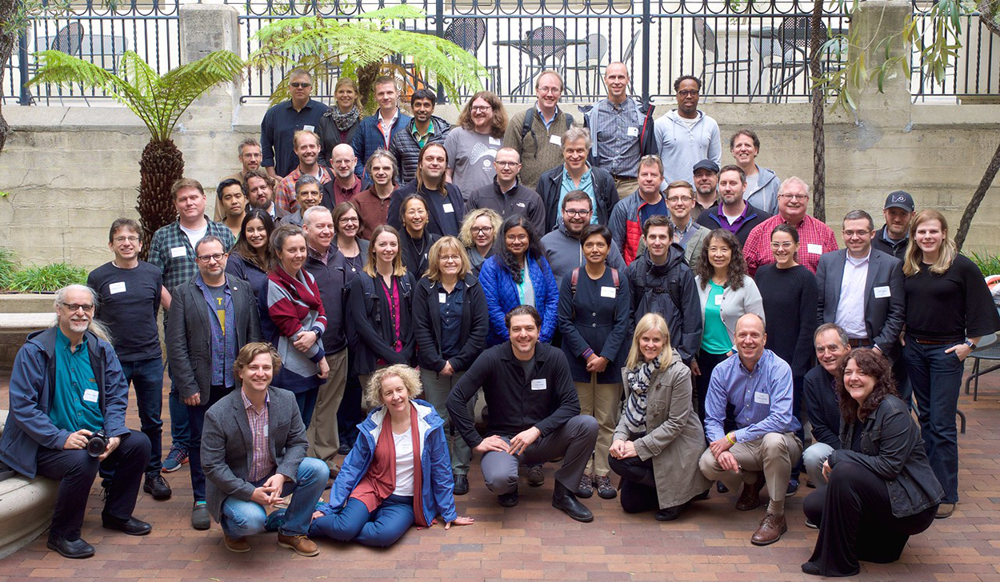

# URSSI: Conceptualizing a US Research Software Sustainability Institute

#### Contributed by [Daniel S. Katz](https://github.com/danielskatz "Daniel S. Katz GitHub Profile"), [Jeff Carver](https://github.com/JeffCarver "Jeff Carver GitHub Profile"), [Sandra Gesing](https://github.com/sandragesing "Sandra Gesing GitHub Profile"), [Karthik Ram](https://github.com/karthik "Karthik Ram GitHub Profile"), and [Nic Weber](https://github.com/nniiicc "Nic Weber GitHub Profile")

#### Publication date: July 30, 2018

The NSF-funded Conceptualization of a US Research Software Sustainability Institute (URSSI) is
making the case for and planning a possible institute to improve science and engineering research by supporting the
development and sustainability of research software in the United States. 

The goal of the [URSSI](http://urssi.us/) conceptualization project is to create a roadmap for a software institute to overcome pervasive concerns in research software.

### Challenges in research software
Research software is essential to progress in the sciences, engineering, humanities, and myriad other fields.  In many
fields, research software is produced within academia, by academics who range in experience and status from students
and postdocs to staff members and faculty.  Important software
components are also developed in national laboratories and industry. Wherever research software is created and
maintained, it can be open source (most likely in academia and national laboratories) or commercial/closed source
(most likely in industry, although industry also produces and contributes to open source).

The open source movement has created a tremendous variety of software, and this plethora of solutions is not easy for researchers to find and use out of the box.
Standards and a platform for categorizing software for communities are lacking, a situation that often leads to inefficient redevelopment
rather than efficient reuse of solutions. Three primary classes of concern are pervasive across research software in all research
disciplines and have stymied research software from achieving maximum impact:

- **Functioning of the individual and team:** issues such as training and education, ensuring appropriate credit for
software development, enabling publication pathways for research software including novel methods beyond “classical”
academic publications, fostering satisfactory and rewarding career paths for people who develop and maintain software,
increasing the participation of underrepresented groups in software engineering, and creating and sustaining pipelines
of diverse developers.

- **Functioning of the research software:** supporting sustainability of the software; expanding the community, evolving governance,
and developing relationships between organizations, both academic and industrial; fostering both testing and
reproducibility, supporting new models and developments (for example, agile web frameworks, software as a service), and
supporting contributions of transient contributors (for example, students).

- **Functioning of the research field itself:** expanding communities around research software and disparate user requirements,
avoiding siloed developments, cataloging extant and necessary software, disseminating new developments, and training
researchers in the usage of software.

 

[First URSSI workshop attendees (Photo credit: Mike Hucka)]

 

### Creating a roadmap
The goal of the conceptualization project is to create a roadmap for URSSI to minimize or at least decrease these
types of concerns. In order to do so, the  URSSI conceptualization has two aims:

- Bring the research software community together to determine how to address the issues about which we have already
learned. In some cases,  subcommunities already are working together on a specific problem,
including those that we are part of; but these subcommunities might not be working with the larger community.
This situation leads to a risk of developing solutions that solve one issue but don't reduce (or might even deepen) other concerns.

- Identify additional issues URSSI should address, identify communities for whom these issues are relevant, determine
how we should address the issues in coordination with the communities, and determine how to prioritize all the issues
in URSSI.

### Collaboration
We are not working in a vacuum, but with other like-minded projects.  In addition to
[Better Scientific Software (BSSw)](https://bssw.io/) and activities around research facilitators
([ACI-REF](https://aciref.org/)) in the United States, there are two ongoing institutes in
[science gateways (SGCI)](https://sciencegateways.org/) and [molecular sciences (MolSSI)](http://molssi.org/); a recently
completed [conceptualization in high energy physics (S2I2-HEP)](http://s2i2-hep.org/); two other conceptualization projects
now under way in [geospatial software](http://gsi.cigi.illinois.edu) and
[fluid dynamics](https://www.colorado.edu/events/cfdsi/); and a large number of software development and maintenance
projects. In the UK, the [Software Sustainability Institute (SSI)](https://www.software.ac.uk/), which has been in
operation since 2010, is an inspiration and a potential model for our work. 

Given these existing activities, part of our challenge is to define how we will work with these other groups.
For example, we might decide that they perform an activity so well that we should point to it, such as the SSI's
software guides. Or we might decide to either duplicate or enhance an activity they do in order to expand its impact, such
as working with the SGCI to offer incubator services to a wider community than just gateway developers. Or we might
decide to collaborate with one or more groups, such as on policy campaigns aimed at providing better career paths
for research software developers in universities.

We have held [one workshop](http://urssi.us/workshops/berkeley/) and are planning three more, in addition to a
community survey we plan to have out soon and a set of ethnographic studies on specific projects. We are
communicating through our [website](http://urssi.us) and a [series of newsletters](http://urssi.us/newsletter/). 

### Get involved!
We welcome members of the BSSw community to join us, both to help us determine how to proceed and to directly
contribute. Please
[sign up for our mailing list](https://urssi.us17.list-manage.com/subscribe/post?u=34c9c3bb4d54665136bd03e49&id=f55b22de1d),
[contribute to our discussions](https://discuss.urssi.us), and potentially publish a
guest [blog post](http://urssi.us/blog/) with us on a topic around software sustainability.

<!---
Publish: yes
RSS update: 2018-07-30
Categories: Collaboration
Topics: projects and organizations, funding sources and programs
Tags: bssw-blog-article
Level: 2
Prerequisites: default
Aggregate: none
--->
