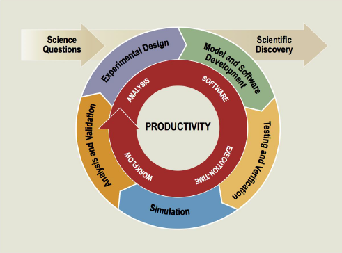

# Understanding CSE Software Productivity

#### Contributed by [Michael A. Heroux](https://github.com/maherou), [Lois Curfman McInnes](https://github.com/curfman),  [David E. Bernholdt](https://github.com/bernhold), Hans Johansen

#### Publication date: Aug 6, 2019

<!-- deck start -->
This article discusses productivity in the context of scientific computing and makes an important point that improving CSE software productivity will enhance scientific productivity.
<!-- deck end -->

**Productivity** is generally a measure of output vs. input. In most situations we care about increasing quantity
or improving quality of output and reducing cost in time and resources of required input.

**Scientific Productivity** is concerned with measuring the number and quality of science results for a research
team over a span of time. If we can measure scientific productivity, we can manage and improve it.

**CSE Software Productivity:** Computational Science and Engineering (CSE) Software Productivity is
concerned with efforts to produce, deliver, maintain, and extend software capabilities that make a science or
engineering team more productive. CSE Software Productivity improves if scientific and engineering impact
improves, resource costs decrease, solution time is quicker, or a combination of these three elements
improves, attributable to the software.

**Extreme-Scale CSE Software Productivity:** Many CSE software products are required to run on the latest
extreme-scale computing systems. Highfidelity,
multiscale, multiphysics simulations with uncertainty
quantification and optimality increase the computing demands up to and beyond the capability of current
leadership systems. At this scale of computing, the disruption of hardware architecture changes, new and
immature system software environments, and the sheer scope and complexity of the target problems can be
serious impediments to realizing science and engineering goals. The capabilities of these systems are the
only vehicle for obtaining some important computational results, but the cost in time and effort can be very
high. A focus on general productivity enhancement is critical at this scale, as is performance portability.

[]
  
CSE is broadly recognized as a peer with experimental and theoretical research in theprocess of scientific discovery. Improving CSE software productivity can play a critical and unique role in accelerating the cycle of scientific discovery on emerging extremescale
architectures.
  
## A Practical Characterization of CSE Software Productivity
A common saying in product development is, “Better, faster, cheaper: Pick two of the three.” Given a fixed level of productivity, this saying acknowledges that if product development is behind schedule, product features must be dropped, the schedule must slip, or more resources must be applied to the project. At least one of the three must be adjusted. Productivity is a volume measure of these three concerns. CSE Software Productivity is this measure applied to software developed for and used by scientists and
engineers.

#### CSE Software Productivity Impacts Scientific Productivity
**Solution quality:** The community has many metrics that attempt to measure the impact of scientific and
engineering efforts. CSE software can improve impact by enabling computer modeling & simulation, design
optimization, and uncertainty quantification to provide answers to important science and engineering
problems. In some problem domains, e.g., astrophysics and nuclear stockpile certification, CSE plays a
particularly important role, since theories are incomplete and direct experimentation is not possible.
Time to solution: CSE software can be used to dramatically reduce time to solution. CSE simulations can
quickly eliminate infeasible solutions, e.g., in molecular dynamics, or provide unique insight into system
behavior. In advanced environments, CSE software is used to provide an optimal solution with error bars.
Resources: CSE software can be used to replace or reduce experimentation costs, e.g., crash simulations.
Consequently, people with good CSE software skills are in high demand, within the scientific research
community and in other industries. Making effective use of skills and increasing CSE software usability are
critically important. ***Improving CSE software productivity will improve scientific productivity.***

#### Why Focus on CSE Software Productivity?
CSE software plays a critical role in science and engineering. At the same time, the CSE community faces
numerous challenges and opportunities in the coming years:

* **Disruptive hardware changes:** The advent of manycore and accelerator processors requires a fundamental change in algorithms and software design.
* **Increased demand for multiscale and multiphysics coupling:** These same disruptive hardware changes provide dramatic growth in computational capabilities. These capabilities enable scientists to consider coupled simulations, which, in turn, demand that multiple CSE software packages be used in
combination to solve a single problem.
* **Increased opportunities to incorporate computation into projects:** CSE software has proven effective in solving many problems, and its impact can spread if we develop the software capabilities.
* **Limited staff resources in high demand:** The skill set for developing CSE software is large, including domain knowledge, mathematics, and computer science. For larger projects, effective team skills are also required. Furthermore, parts of this skill set are in high demand in other areas of the economy, resulting in a shortage of skilled people.

An explicit focus on software productivity will help computational scientists and engineers address challenges
and opportunities by providing a toolset, methodologies, and information to better manage large, complex, and
rapidly changing software systems while delivering higherquality
results faster, with fewer resources.

<!---
Publish: yes
Pinned: no
Track: how to
Topics: software engineering
--->

