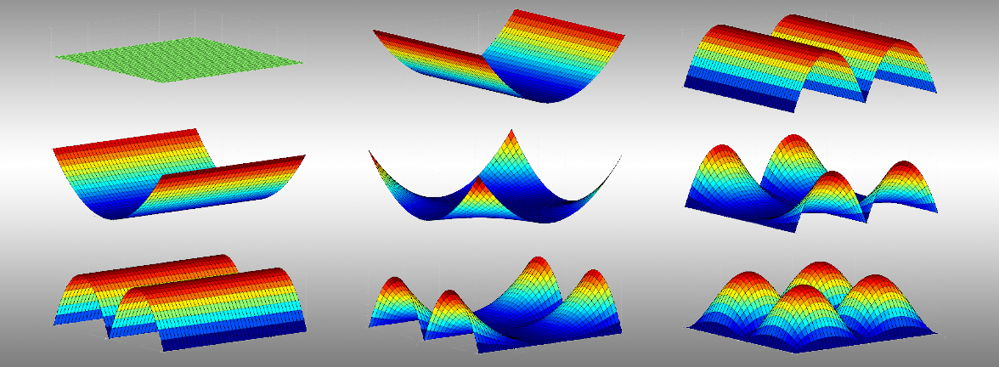

# What Does This Line Do? The Challenge of Writing a Well-Documented Code

**Hero Image:**

 - 

#### Contributed by [Miroslav Stoyanov](https://github.com/mkstoyanov "Miroslav Stoyanov GitHub Profile")

#### Publication date: September 11, 2020

Providing good, current developer-focused documentation pays off for the future -- for you
and your fellow developers.  And it does not have to be that hard to do!

### Documentation is the first thing to go

Documentation that is incomplete or ill-conceived is probably the source of more
frustration than any other challenge in scientific software development.
Virtually everyone agrees that good documentation is important, yet few are
willing to invest the time and effort, and for a wide range of reasons. Our
culture is to brag about codes with more flops and less mops, but we don’t get
to brag about or impress people by codes with good documentation. A mediocre 10-page
paper receives more credit than a 100-page software manual even if the manual
required deeper expertise on the subject. Constraints on
funding and time also lead developers to cut corners, and documentation is usually the first
corner to go. There is also the simple desire to move on to something new and
exciting rather than documenting the old and boring code. And  even if
one has the will and resources, the skills needed for good documentation are often
quite  different from those required to write high-performance code. Just
think how different cascading style sheet (CSS) web formatting is from a linear solver.

In this article, I share some first-hand observations from the
[Tasmanian](https://tasmanian.ornl.gov) project and the recent transition from LaTeX PDF-based to
Doxygen web-based documentation. While I cannot hope to change culture and the
way our community values documentation efforts, I do hope to make the
point that good documentation pays for itself and naturally leads to better
software. Tasmanian has always had a well-documented external API, but not
internal documentation, the lack of which is especially problematic when chasing moving
targets such as GPU support for multiple vendors. Porting code to GPUs is hard,
doubly so when it is undocumented and comes from an external contributor no
longer working on the project. And even if the code was written by the lead maintainer (me), there was
always the vicious cycle of present-me struggling to reverse engineer the
thoughts of past-me and consecutively creating more problems for future-me. As
for the existing documentation, the rigid nature of the PDF made it hard to
update when gaps became apparent, which led to repeated chain mails with users
clarifying the exact same issue and wasting everyone’s time. A code under
development is constantly morphing, and the associated documentation must go
hand in hand with any and all changes.

### Making it a little easier

Doxygen was chosen for the documentation standard because of its comprehensive set
of features, which eventually allowed integrating its web deployment within our
continuous integration setup. Thus the documentation became part of the coding effort
and not a something done on the side. Achieving this required the integration of
Doxygen within the build system, which sounded scary until I realized that CMake
3.10 has a seamless interface that automatically handles the doxy-file, the
paths, and setting with just a few set variables and without any detailed
knowledge of the Doxygen internals. Adding an automated documentation generator
to a proper build system is a fairly easy task; and if  no proper build
system exists -- well, that’s at least as bad as having bad documentation and worthy of
its own dedicated article.

After the build system is in place comes the challenge of organizing a proper
web page. Unfortunately, Doxygen's default colors, fonts, and formatting are barebones
and hard on the eyes, while the path to good formatting goes through the use of
CSS files. The CSS language is fairly remote from anything in the HPC community,
and no one in the Tasmanian team had the necessary expertise; but this is where
the IDEAS-ECP project helped us make a connection with Alex Moore from the ORNL
Research Software Engineering group. After Alex was done with the style sheet and I
showed the web page to users, reactions ranged from "that’s nice and
professional" to "wow, looks good." When establishing the documentation
infrastructure, don’t hesitate to ask for help from someone who knows what they're doing.

Naturally, the most tedious part of the process was writing the actual
documentation. When a project has accumulated a lot of technical debt, it has to be paid
in installments. The documentation process took almost a year, but it was a
gradual effort. First, we established the policy that all new or modified code
must come with documentation; a modification implies that one has already
thought through the relation of this code to the rest of the project and thus it
is easier to document on the spot. The second stage was to document the most
important classes, methods, and data structures; in Tasmanian those were the
`MultiIndexSets` and `MultiIndexManipulators,` which sit as the backbone of the
internal API. Gradually, we moved from totally undocumented code to simply
filling the gaps, which made the process much smoother. The final thrust was the
conversion of the PDF documentation of the external API into Doxygen, half of which was copy-paste.
Every release of Tasmanian prior to 7.0 had been delayed by weeks because of
documentation issues; the latest release 7.1 was the first not to require a
documentation crunch. The documentation debt was converted to an asset, and we
began to reap the dividends.

### Reaping the dividends

Documentation provides an introspection of the code that has benefits far beyond
the obvious ease of understanding and maintenance. The introspection reveals
mislabeled or misplaced methods and locates overlapping and redundant functionality
that should be in a single common procedure. Documentation naturally leads to
better organization. Perhaps most important, documenting while coding forces
the developers to think twice about their approach; and if something is hard to
document, then perhaps there is a better way to code it in the first place. The
two-stage thought process has led to a much cleaner and straightforward
internal API in Tasmanian compared with the old undocumented one. And I mention one unexpected benefit:
the past few months of working at home have made it harder to hold face-to-face
meetings with collaborators, thus increasing our reliance on on-line
resources; and having a well-made professional-looking [web page](https://ornl.github.io/TASMANIAN/rolling/) has made life
much easier.

### Author bio
Dr. Miroslav Stoyanov got his Ph.D. from Virginia Tech in 2009. After a postdoctoral position at Florida State University, he joined ORNL in 2012. His areas of research involve surrogate modeling, uncertainty quantification, high-dimensional approximation, and supercomputing. Dr. Stoyanov is also the lead developer of the ORNL Toolkit for Adaptive Stochastic Modeling and Non-Intrusive Approximation ([Tasmanian](https://tasmanian.ornl.gov)) and one of the main contributors to the library for Highly Efficient Fast Fourier Transform for Exascale (heFFTe).

<!---
Publish: yes
RSS update: 2020-09-11
Track: deep dive
Topics: Documentation
Pinned: no
--->
