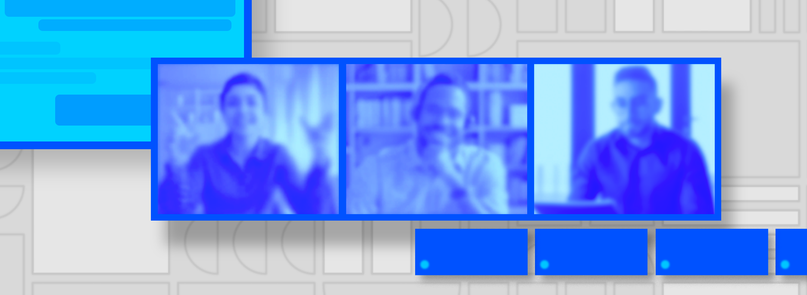

# Working Remotely: The Exascale Computing Project (ECP) Panel Series

**Hero Image:**
 
- 

#### Contributed by [Elaine Raybourn](https://github.com/elaineraybourn "Elaine Raybourn GitHub Profile"), [Reed Milewicz](https://github.com/rmmilewi "Reed Milewicz GitHub Profile"), [David Rogers](https://github.com/frobnitzem "David Rogers GitHub Profile"), [Elsa Gonsiorowski](https://github.com/gonsie "Elsa Gonsiorowski GitHub Profile"), [Ben Sims](https://github.com/bhsims "Ben Sims GitHub Profile"), and [Greg Watson](https://github.com/jarrah42 "Greg Watson GitHub Profile"), 

#### Publication date: July 30, 2020

The [PSIP](https://bssw.io/psip/) team interviews social scientist, Elaine Raybourn, about her experience leading the new panel series [Strategies for Working Remotely](https://www.exascaleproject.org/strategies-for-working-remotely/). The panel series, a partnership between ECP and the IDEAS Productivity project, was conceived to encourage community dialog during the pandemic. Panels bring together staff members of Department of Energy (DOE) laboratories and invited guests to share ideas, lessons learned, and experiences with working remotely and transitioning from co-located and partially distributed teams to fully virtual teams and teams of teams.

**Reed Milewicz:** Elaine, while there has been a dramatic increase in remote work due to COVID-19, remote work arrangements have already been on the rise in the recent years. Do you think this trend will continue, and, if so, how might it reshape our workplaces? 

**Elaine Raybourn:** That’s a great question to start off with! Yes, I do believe this trend will continue especially since now we, as a community of computational scientists, have a more collective experience with working remotely. As you noted, remote work arrangements are nothing new. What is new, however, is that we have all been working remotely together. This alone has reshaped our workplace to allow for increased awareness and, in many cases, illuminate what it’s like to experience work differently. We can now more easily see where our infrastructure and policies can be improved. Our habits and assumptions about productivity, togetherness, isolation, inclusivity, and communication are challenged each day. I’ve only listed a few here for brevity; there are certainly more. I predict that this shift to remote work en masse during a pandemic and social change will create a sea change in how we perceive work productivity in the future and will give us an opportunity to be more inclusive and compassionate. This shift will open doors for technological innovation to support how we work and communicate as teams of scientists, especially in those situations where we lack the most while absent from each other.

**David Rogers:** I have a follow-up question. Computational scientists already work from anywhere. So what’s different now?

**Elaine:** First, let me say that many of us are fortunate to have the opportunity to work remotely, and I want to recognize the daily sacrifices made by colleagues who put themselves at risk during the pandemic to enable us to continue our work as scientists. It’s thanks to our colleagues who keep our laboratories functioning that we can work remotely. Now on to your question. I too have heard it said that computational scientists already work from anywhere, but let’s unpack that statement. I would argue that most of us can work from anywhere but only as long as certain conditions exist. Those conditions are different for each of us. As an example, the conditions for me personally might be access to computing, reliable communication infrastructure, space (mental and physical), etc. The opportunity we have now with respect to working remotely is to determine for ourselves, and with our teams, what those conditions are. The [Strategies for Working Remotely](https://www.exascaleproject.org/strategies-for-working-remotely/) panel series attempts to address this by providing an outlet during the pandemic for our community to express ourselves and learn under which conditions we remain productive, and how we each approach challenges similarly and/or differently. The panel series has also sparked engagement with colleagues across and within the community whom we might not have known before our panel participation.

**Elsa Gonsiorowski and Reed:** Are there specific strategies you’ve learned from leading the panels that address work-life boundaries while working at home? For example, compared to before COVID-19, what have the panels revealed about interaction with coworkers?

**Elaine:** Yes, the panelists have been awesome, and the feedback we have received has been very positive in terms of improving attendees' outlook on the situation. It’s my goal to create a cohort of experts who we learn from as working remotely evolves. For example, we’ve had panels on resiliency strategies, parenting while working remotely, transitioning to virtual teams, and virtual onboarding/mentoring. Our next panel will take a deeper dive into scientific software teams and how they have responded to disruption.
 
To that point, the panels have revealed how much of an insidious disruption COVID-19 has been — even for those of us who have worked remotely for years! As I mentioned previously, working successfully from anywhere means being reliant on an existing set of conditions. When we would work from anywhere before the pandemic, it was our choice; we knew we could go into the office, walk into a colleague’s office for an impromptu white board discussion, or easily have a hallway conversation. We could meet up face-to-face with our geographically dispersed colleagues by traveling. We had a healthy combination of face-to-face and technology-mediated communication each day, both synchronous and asynchronous. We decided how much we wanted, and when. We had agency, or locus of control, as we behavioral scientists say. That’s different now. Now we are all using the same limited communication channels—with each other and with our kids and families, most of the time, whether it’s for work or play. It can be exhausting if we don’t pace ourselves or take breaks. The panels have addressed each of these topics – and given the numbers of attendees we have joining the panels each time, I predict we’ll continue to work through these issues for some time.

**Ben Sims and Greg Watson:** As a social scientist, how does your background inform thinking about the series? What have you learned that has surprised you?
 
**Elaine:** If you were to talk with me and not know I’m a social scientist, you might be inclined to say I overthink the series—its goals, purpose, design, execution, relevancy, etc. However, because I am a social scientist, I approach the series as I would any other scientific endeavor—I use scientific methods to search for and derive insights, patterns, and novelty. I ask both why and why not? Being a social scientist, I’m fascinated by behavioral phenomena at micro – macro levels. The [Strategies for Working Remotely](https://www.exascaleproject.org/strategies-for-working-remotely/) panel series provides an opportunity for us to gain greater understanding about how we can thrive as individuals, teams, and aggregate teams (that is, teams of teams) in evolving socio-technical environments.

For example, one thing I learned at the onset of the pandemic that surprised me was the degree to which many in our community felt a major disruption to suddenly not be able to have spontaneous hallway conversations. I mention this example specifically because it is a good follow-on to my answer about what we’ve learned from the panels about interactions with colleagues. At first I was surprised by the angst associated with not being able to have a hallway conversation; because I have been working remotely for years, I had developed several strategies to address this for myself such as instant messaging, and not being bashful about calling someone, etc. That doesn’t work for everyone though, nor would I expect it to. The initial shift from co-located to virtual work doesn’t feel natural, and we miss face-to-face interactions that we once took for granted. What I’ve learned is that many, if not all, of us want to have spontaneous, synchronous group conversations – we really miss humanity, and that’s still harder to replicate online in a way that is satisfying to all.

**All:** Are there ways to increase engagement further? What are some untapped issues? Where do you go from here?
 
**Elaine:** Most of the panels to date have focused on building individual resiliency skills, which is what our community needed most after we were all sent home due to COVID-19. Now that we’ve been at it for about 5 months, we’ll evolve the panel series to continue to be responsive to the situation. I listen for indications of changes on the horizon, so lately I’ve been thinking about moving the focus of the panels from individual resiliency to team resiliency strategies—that is, bringing co-located teams into balance as a fully virtual team, and exploring how teams whose interactions are largely driven by their code bases develop best practices for engaging within networks of teams, or teams of teams. In terms of the panel format itself—who knows? In the future you can expect that the series will push the boundaries of the way we typically envision “panels.” My personal tendency is toward greater interactivity and full-on immersion, so you can be sure I won’t rest until we’ve explored this in some way or another. Stay tuned.

**Thanks** to [PSIP](https://bssw.io/psip/) team members Reed Milewicz (SNL), David Rogers (ORNL), Elsa Gonsiorowski (LLNL), Ben Sims (LANL), and Greg Watson (ORNL) for their interview questions and review.

### Author bio

Elaine Raybourn is a social scientist in the Statistics and Human Systems Group (Applied Cognitive Science) at Sandia National Laboratories. Her research focuses on virtual teams, software developer productivity, and transmedia learning. She has worked remotely for a combined total of 14 years while at Sandia National Laboratories: from the UK as a guest researcher at British Telecom; Germany (Fraunhofer FIT) and France (INRIA) as a Fellow of the European Research Consortium in Informatics and Mathematics (ERCIM), and most recently from Orlando, Florida as Sandia’s Institutional PI for the IDEAS-ECP productivity project. She leads [PSIP](https://bssw.io/psip/) and the panel series [Strategies for Working Remotely](https://www.exascaleproject.org/strategies-for-working-remotely/).

<!---
Publish: yes
RSS update: 2020-07-30
Pinned: no
Track: community
Topics: Strategies for More Effective Teams
SAND #: SAND2020-7868 O
--->
