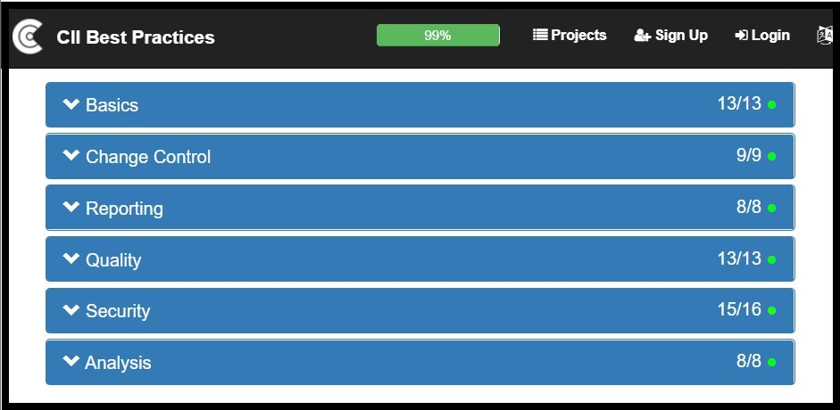
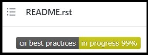

# The CII Best Practices Badge Program

<!-- deck text start -->
The Linux Foundation's CII Best Practices Badge Program represents an impressive collection of the open source community's knowledge-base for creating, maintaining, and sustaining robust, high-quality (and most importantly) secure open-source software.
At its foundation is a powerful and feature-full "Badge App" website which provides a database of projects that document what best practices they support and provides supporting evidence for those best practices.
This set of best practices along with the detailed documentation and supporting justification also serves as an incremental learning tool for software engineering best practices and as a foundation for incremental software process and quality improvements efforts.
<!-- deck text end --> 

#### Contributed by [Roscoe A. Bartlett](http://github.com/bartlettroscoe "Roscoe A. Bartlett")
#### Publication date: ???, 2021

The Linux Foundation's[[lf]] Open Source Security Foundation (OpenSSF)[[openssf]] (the successor to its Core Infrastructure Initiative (CII)[[cii]]) is an effort to improve the security and quality of open source software.
The CII Best Practices Badge Program[[ciibpbp]] (started under the CII and being continued under the OpenSSF) is an effort to collect, document, advocate, and help apply a comprehensive collection of best practices from the open-source software development community to a wide rage of open-source software projects.
The foundation of this badge program is a "Badge App"[[ciibpba]] site that allows projects to create an entry for their project and then to specify if their project meets each best practice, descriptions for how they met the criteria, URLs to evidence, and justification for how the criteria was met or not met.

As of 10/7/2021, the "Badge App" site has 4100 registered projects of which 637 have achieved a Passing-level badge.  In addition, the community registers approximately 700 new open-source projects on the site each year and approximately 158 projects achieve a Passing-level badge each year for the last several years.  This shows this is a well accepted and well adopted program and badge program.

The CII Best Practices and the supporting Badge App site provides a number of benefits by providing:

* a set of practices that have specific actionable criteria which require supporting evidence,

* a power "Badge App" site that enhances the display of the best practice items, expanded descriptions of the best practices, and fields to enter URL and text descriptions of the status of each best practice in the project, 

* a badge that can be displayed on the project hosting site to show that the project follows accepted best practices,

* a particularly strong focus on software security which addresses the White House Executive Order 14028 "Improving the Nation's Cybersecurity"[[eo14028]]  (which is of particular importance to laboratory and government agencies and contractors, including the national labs),

* a learning tool for best practices for developers and projects,

* a roadmap for continual improvement for a project as it incrementally adopts more practices and improves its scores in different areas,

* a standard index into the parts of the projects and how it handles different types of processes,

* a website template and database implementation that can be forked and customized for more targeted communities,

These different aspects of the CII Best Practices Program and Badge App are described below.

<a name="details"/>

## CII Best Practices and Badge App Details

Before getting into the some of the surprising benefits of the CII Best Practices and Badge App site, it is worth going into some detail about the best practices themselves and the "Badge App" website.

The CII Best Practices are broken down in several different ways:

* Required or optional practices:
  * MUST: Required/not optional (unless 'N/A' is allowed)
  * SHOULD: Required unless a strong argument against can be made
  * SUGGESTED: Not required but suggested
* Three different badge levels:
  * Passing: 43 MUST, 10 SHOULD, 14 SUGGESTED
  * Silver: +44 MUST, +10 SHOULD, +1 SUGGESTED
  * Gold: +21 MUST, +2 SHOULD
* Six different categories in each badge level:
  * Basic
  * Change Control
  * Reporting
  * Quality
  * Security
  * Analysis

As noted above, some of the practices can be opted-out as not applicable "N/A" which is quite important in order for the CII Best Practices to be broadly applicable.  For example, almost all of the technical security-related items can be marked as "N/A" if the project does not have any security-critical code.

The CII Best Practices are listed for each badge level individually and as a full set.[[ciibpa]]  They are also listed with or without the detailed description/justification and links to more information.  Each best practice is composted of a short statement of the practice (with the word MUST, SHOULD, or SUGGESTED) and a short HTML anchor name link name (which serves as a link to the practice and as an unambiguous shorthand identifier for that best practice criteria).  Many items also require a short comment field be filled out and provide a URL to evidence.   For example, the first four "Basic" best practices in the Passing level are stated as:

----

**Basics** 
**Basic project website content** 

* The project website MUST succinctly describe what the software does (what problem does it solve?). [[description_good]]
* The project website MUST provide information on how to: obtain, provide feedback (as bug reports or enhancements), and contribute to the software. [[interact]]
* The information on how to contribute MUST explain the contribution process (e.g., are pull requests used?) {Met URL} [[contribution]]
* The information on how to contribute SHOULD include the requirements for acceptable contributions (e.g., a reference to any required coding standard). {Met URL} [[contribution_requirements]]

----

Statistics for the best practices in each level are given in the following table:

<a name="cii_best_practices_stats_table"/>

| Level | Total active | MUST | SHOULD | SUGGESTED | Allow N/A | Met justification required | Require URL | Met justification or URL required | Includes details | New at this level |
| :-- | --: | --: | --: | --: | --: | --: | --: | --: | --: | --: |
| **Passing** | 67 | 43 | 10 | 14 | 27 | 1 | 8 | 9 | 52 | 67 |
| **Silver** | 55 | 44 | 10 | 1 | 40 | 38 | 17 | 54 | 39 | 48 |
| **Gold** | 23 | 21 | 2 | 0 | 9 | 13 | 9 | 22 | 16 | 14 |

**Table: CII Best Practice Breakdown**

 

Note that some practices that are listed as SUGGESTED or SHOULD at a lower level are re-listed as MUST at a higher level.  For example, the Silver level lists the "bus factor" practice as SHOULD:

* The project **SHOULD** have a "bus factor" of 2 or more. {Met URL} [[bus_factor]](https://bestpractices.coreinfrastructure.org/en/criteria#1.bus_factor)

but at the Gold level, it re-lists it as MUST:

* The project **MUST** have a "bus factor" of 2 or more. {Met URL} [[bus_factor]](https://bestpractices.coreinfrastructure.org/en/criteria#2.bus_factor)

(That is why the number of "Total active" practices in the Silver and Gold levels is higher than the number "New at this  level".)

One of the more unique features of the CII Best Practices program is the CII Best Practices "Badge App" site:

* https://bestpractices.coreinfrastructure.org/en/projects

This site allows project maintainers to create an entry for their project (which then creates a unique project ID) and go through the process of reading about each best practice item and marking each as "Met", "Unmet", "N/A", or "?".
(Again, only some items allow an "N/A" response.)
An example of an project's best practice item marked as "Met" with justification and a URL to evidence is given below:

 

<a name="example_badge_app_item"/>

**Example CII Best Practices Badge App Project Item**

 

After a project creates an entry on the CII Best Practices Badge App site, the Badge App site provides scores for each of the six categories separately in each badge level (Passing, Silver and Gold) and provides the percentage completion for the current badge being sought.
For example, one project that has achieved 99% to a passing badge shows the following scores in each category:

 

<a name="example_passing_categories_scores"/>

**Example CII Best Practices Passing-level scores by category**

 

This view of the project on the Badge App makes it easy to see where the project may be weak and might be able to improve.
One can then expand a deficient category (the "Security" category in this example) and see which criteria are not being met and why.
One can also click buttons at the top of the project's Badge App page to show only the unmet criteria in all the categories (i.e. by clicking the "Hide met & N/A" then the "Expand panels" buttons):

 

<a name="example_hide_unmet_expand_panels"/>

**Example CII Best Practices App page showing control buttons**

 

And one can expand to show the details for each practice by either clicking "Show all details" at the top or "Show details" for an individual item to read more about each unmet best practice and the criteria needed to satisfy it.

After a project's maintainers have created a Badge App entry for the project, the project can display it's CII Best Practices Badge (or percentage progress to a badge) using a link to the project's entry on the Badge App site.  For example, a GitHub project's rendered README file can display the CII Best Practices badge at the top like:

 

<a name="example_badge"/>

**Example CII Best Practice Badge as displayed on a GitHub README.rst file**

 

Note that of the 4100 registered projects on the Badge App site (as of 10/7/2021), 637 projects have achieved a Passing-level badge, 21 have achieved a Silver-level badge, and just 10 have achieved a Gold-level badge.
So while approximately 15% of the registered projects have achieved a Passing-level badge, only 0.5% have achieved a Silver-level badge and only 0.24% have achieved a Gold-level badge.
This shows the difficulty (or reluctance) that open-source projects have in even achieving a Silver-level badge after achieved a Passing badge where only 3% of Passing-level projects went on to achieve a Silver-level badge.
But this data shows that about 33% of the projects that achieve a Silver-level badge go on to achieve a Gold-level badge.
Therefore, it would appear that the barrier (or reluctance) of going from the Silver-level to the Gold-level is small compared to going from the Passing-level to the Silver-level.

<a name="focus_on_security"/>

##  CII Best Practices focus on software security

One of the unique features of the CII Best Practices is the significant focus on security best practices.
For example, of the 67 best practices listed at the Passing level, 16 of them are in the area of security.
And of the 55 Silver-level practices and 23 Gold-level practices, 18 and 5, respectively are in the area of security.
The reason that is so interesting is that most of the focus on software engineering best practices only pays a cursory treatment to security.
For example, of the over 900 pages in the book "Code Complete: 2nd Edition" [???], exactly one paragraph is devoted to the area of software security in section 3.5 "Architecture Prerequisite":

> The architecture should describe the approach to design-level and code-level security.
> If a thread model has not previously been built, it should be built at architecture time.
> Coding guidelines should be developed with security implications in mind, including approaches to handling buffers, rules for handling untrusted data (data input from users, cookies, configuration data, and other external interfaces), encryption, level of detail contained in error messages, protected secrete data that's in memory, and other issues.

And other standard texts on software engineering best practices never even mention the word "security".

ToDo: Finish this section!

<a name="learning_tool"/>

## CII Best Practices as a learning tool

As of this writing, there are current unique 129 best practices listed across the three levels in a wide number of categories.
Many of these items have detailed explanatory descriptions and the descriptions link to more information.
Just carefully reading through all of these practices and their descriptions and following a few of the links can take halve a day or more.
And this material and the material being linked to provides what is considered the state-of-the-art in each area in the open source community.
Therefore, the CII Best Practices can serve as an effective learning tool for the state of the art in software engineering best practices.

Even if one has been in the software engineering and open source area for many years, one may not be aware of what is considered the current state-of-the-art and best practice.
For example, for many years Contributor License Agreements (CLAs) were considered best practice and the recommended way for open source projects to manage IP and copyright issues related to contributions from different individuals and organizations.
But apprehension on the part of various institutions to sign CLAs and other practical experience CLAs have lead to the usage of a Developer Certificate of Origin (DCO) to manage these issues instead [[dco]].
And therefore, currently DCO are considered the more recommended practice.
Without a resource like the CII Best Practices, it would be very hard for many projects gain this type of knowledge in such a compact manner.

<a name="continuous_improvement"/>

## CII Best Practices as a road-map for continuous improvement

As described above, the Badge App site provides the current status a percentage completion to the next badge for a given project.
This percentage completion and the number of satisfied practices in each area provides a simple metric and a motivator for improvement for the project.
For example, if a project is currently at 86% of completion for a Passing badge and has only 8 of the 13 Quality practices, then it is clear where to look at where to improve.

Also, the Badge App site is set up to send out regular reminders about the status of one's project and provide encouragement to continue making progress.
For example, below is an email what was sent out by the Badge App for the TriBITS project:

----

From: badgeapp@bestpractices.coreinfrastructure.org <badgeapp@bestpractices.coreinfrastructure.org> 
Sent: Saturday, September 11, 2021 7:00 PM
To: Bartlett, Roscoe A <rabartl@sandia.gov>
Subject: [EXTERNAL] Your project does not yet have the "best practices" badge

**Automated Best Practices Badge Reminder for TriBITS Core**

This is an automated reminder that your project "TriBITS Core" does not currently have a "best practices" badge, and its badge entry has not been updated in a while. 

Your best practices badge entry is at https://bestpractices.coreinfrastructure.org/en/projects/4839 and was last updated on 2021-06-24 15:08:41 UTC. It is currently at 99% (out of 100%). 

We encourage you to keep making progress. Please visit your badge entry at https://bestpractices.coreinfrastructure.org/en/projects/4839 to complete the information and get your badge! 

If you want to see only what you're missing, visit your badge entry, select the button near the top labelled "Expand all panels", and then select the button near the top labelled "Hide met or N/A criteria". If you have questions, or need help, please contact cii-badges-questions-owner@lists.coreinfrastructure.org or file an issue at https://github.com/coreinfrastructure/best-practices-badge/issues (click on "new issue"). 

We don't send reminders if you continue to update your badge entry, and we only send reminders approximately every 30-60 days. However, if you want to disable these reminder messages, edit your badge entry at https://bestpractices.coreinfrastructure.org/en/projects/4839#project_disabled_reminders to turn on "disable inactivity reminder". Be sure to edit the project entry, don't just display it, if you want to change whether or not you'll receive an inactivity reminder. We hope you'll instead keep working at it and eventually earn the badge. 

Thank you for your time. 

--- David A. Wheeler, CII Best Practices Badge Technical Lead 

----

I personally found the reminder helpful and it eas 

<a name="standard_project_index"/>

## CII Best Practices Badge App as a standard index into a project

Blah blah blah ...

<a name="forking_badge_app_website"/>

## Forking and Customizing the CII Best Practices and Badge App Website

Blah blah blah ...

ToDo: Describe:

* Go over my presentation and make sure I am covering everything in that presentation.

* Provides a standard catalog and index into the parts of the projects and how it handles different types of processes.

* Provides a learning tool for best practices for developers and projects.

* Provides up-to-date info on the latest tools and approaches for addressing issues.

* Provides an incremental road map for continuous incremental process and quality improvements for a software project.

* Provides a means for continual improvement for a project as it incrementally adopts more practices and improves its scores in different areas.

* Provides a website template and database implementation that can be forked and customized for more targeted communities.

* White House Executive Order 14028 that requires government and DOE software improve software security may impact CSE software.

* ???

[lf]: https://www.linuxfoundation.org/
[openssf]: https://openssf.org/
[cii]: https://www.coreinfrastructure.org/
[ciibpbp]: https://www.coreinfrastructure.org/programs/best-practices-program/ "CII Best Practices Badge Program"
[ciibpba]: https://bestpractices.coreinfrastructure.org/en/projects "CII Best Practices Badge App"
[ciibpa]: https://bestpractices.coreinfrastructure.org/en/criteria "FLOSS Best Practices Criteria (All Levels)"
[eo14028]: https://www.whitehouse.gov/briefing-room/presidential-actions/2021/05/12/executive-order-on-improving-the-nations-cybersecurity/

[description_good]: https://bestpractices.coreinfrastructure.org/en/criteria/0#0.description_good
[interact]: https://bestpractices.coreinfrastructure.org/en/criteria/0#0.interact
[contribution]: https://bestpractices.coreinfrastructure.org/en/criteria/0#0.contribution
[contribution_requirements]: https://bestpractices.coreinfrastructure.org/en/criteria/0#0.contribution_requirements
[dco]: https://bestpractices.coreinfrastructure.org/en/criteria#1.dco

<!---
 Publish: yes
 Pinned: no
 Topics: revision control, development tools
 RSS update: ???
--->
