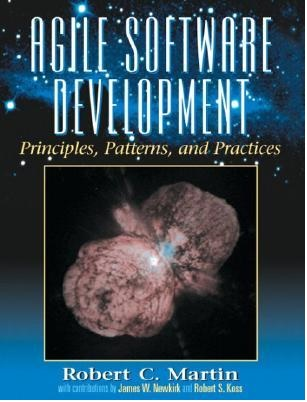

# Digging Deeper into Agile Software Development
<!--deck text start-->
Much of modern software engineering best practices and know-how can be summarized in a few key principles.
This book, *Agile Software Development Principles, Patterns, and Practices*, written by *Robert Martin*, defines eleven of these principles, gives them short helpful names, and shows how they are applied in many different established design patterns in modern software literature. 
<!--deck text end-->

#### Contributed by [Roscoe A. Bartlett](https://github.com/bartlettroscoe)
#### Publication date: September 25, 2020

Resource information | Details 
:--- | :--- 
Book title  | [Agile Software Development Principles, Patterns, and Practices](https://books.google.com/books/about/Agile_Software_Development.html?id=0HYhAQAAIAAJ&source=kp_book_description)
Authors | Robert C. Martin
Publication | 2003, ISBN: 0-13-597444-5

This book does a great job of covering the essence of modern software design principles.
Arguably, the greatest contribution of this book is in chapters 7-9, and 20.
In these chapters, Martin defines eleven different principals of modern software design; five are related to individual classes, and the remaining six are related to collections of classes (i.e. packages).
These eleven principles are:

General OO Principles:

* **1) SRP** (Single Responsibility Principle): Classes should have only one reason to change.

* **2) OCP** (Open-Closed Principle): Software entities (classes, modules, functions, etc.) should be open for extension, but closed for modification.

* **3) LSP** (Liskov Substitution Principle): Subtypes must be substitutable for their base types.

* **4) DIP** (Dependency Inversion Principle): Abstractions should not depend on details. Details should depend on abstractions.

* **5) ISP** (Interface Segregation Principle): Clients should not be forced to depend upon methods that they do not use. Interfaces belong to clients, not to hierarchies.

Package Cohesion OO Principles:

* **6) REP** (Release-Reuse Equivalency Principle): The granule of reuse is the granule of release.

* **7) CCP** (Common Closure Principle): The classes in a package should be closed together against the same kinds of changes. A change that affects a closed package affects all the classes in that package and no other packages.

* **8) CRP** (Common Reuse Principle): The classes in a package are used together. If you reuse one of the classes in a package, you reuse them all.

Package Coupling OO Principles:

* **9) ADP** (Acyclic Dependencies Principle): Allow no cycles in the package dependency graph.

* **10) SDP** (Stable Dependencies Principle): Depend in the direction of stability.

* **11) SAP** (Stable Abstractions Principle): A package should be as abstract as it is stable.

These eleven principles distill a great deal of expert know-how down to short acronyms like OCP (Open-Closed Principle).
Chapters 13-17, 21, and 23-29 describe many design patterns are also very useful.
Some of the design patterns discussed in these chapters are the same as given in the well known book *Design Patterns*[1].
Even with those being the same as those defined in the book "Design Patterns", Martin gives them more context and helps to really flesh them out.

Concerning the book's title *"Agile Software Development"*, while the introductory chapters discuss the Agile methodology *Extreme Programming (XP)*[2], the remaining chapters of the book have little to do with XP specifically and are only mildly related to Agile methods in general.
(Much of this material would apply just as well to Waterfall projects.)
In fact, the discussion in chapter 20 on versioning and releases of packages (while it contains great material) runs contrary to some modern notions of continuous integration (see *Continuous Integration*[3]) and continuous delivery.
Therefore, unless the reader is specifically interested in Agile methods, one may want to just skim through chapters 1-6 in order to get to the real meat of the book.
Also, this book has many detailed examples.  For some readers, going through these examples in detail may be helpful, others may just want to skim them if they already get the ideas the example is trying to convey.
Skimming the examples can really help to improve the flow of material as one reads the book, at least the first read-through.

 

[1-sfer-ezikiw]: #ref1 "E. Gamma, R. Helm, R. Johnson and J. Vlissides. Design Patterns, Addison Wesley, 1995"
[2-sfer-ezikiw]: #ref2 "K. Beck. Extreme Programming Explained (2nd edition), Addison Wesley, 2005"
[3-sfer-ezikiw]: #ref3 "P. Duvall and et. al. Continuous Integration, Addison Wesley, 2007"

 

References | &nbsp;
:--- | :---
1 | [E. Gamma, R. Helm, R. Johnson and J. Vlissides. Design Patterns, Addison Wesley, 1995 (ISBN-13: 978-0201633610)](https://www.amazon.com/Design-Patterns-Elements-Reusable-Object-Oriented/dp/0201633612)
2 | [K. Beck. Extreme Programming Explained (2nd edition), Addison Wesley, 2005 (ISBN-13: 978-0321278654)](https://www.amazon.com/Extreme-Programming-Explained-Embrace-Change/dp/0321278658)
3 | [P. Duvall and et. al. Continuous Integration, Addison Wesley, 2007 (ISBN-13: 978-0321336385)](https://www.amazon.com/Continuous-Integration-Improving-Software-Reducing/dp/0321336380)

 

<!---
Publish: yes
RSS update: 2020-09-25
Categories: Planning
Topics: design
Tags: book
Level: 2
Prerequisites: defaults
Aggregate: none
--->
<!-- DO NOT EDIT BELOW HERE. THIS IS ALL AUTO-GENERATED (sfer-ezikiw) -->
[1]: #sfer-ezikiw-1 "E. Gamma, R. Helm, R. Johnson and J. Vlissides. Design Patterns, Addison Wesley, 1995"
[2]: #sfer-ezikiw-2 "K. Beck. Extreme Programming Explained (2nd edition), Addison Wesley, 2005"
[3]: #sfer-ezikiw-3 "P. Duvall and et. al. Continuous Integration, Addison Wesley, 2007"
<!-- (sfer-ezikiw begin) -->
### References
<!-- (sfer-ezikiw end) -->
* 1[E. Gamma, R. Helm, R. Johnson and J. Vlissides. Design Patterns, Addison Wesley, 1995](#ref1)
* 2[K. Beck. Extreme Programming Explained (2nd edition), Addison Wesley, 2005](#ref2)
* 3[P. Duvall and et. al. Continuous Integration, Addison Wesley, 2007](#ref3)
