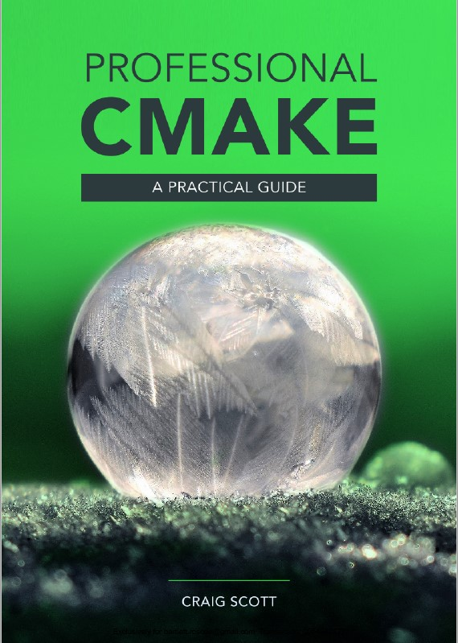

# CMake Tutorial and Reference Resources

<!--deck text start-->
CMake is a large and powerful set of tools to create cross-platform builds from source for C, C++, Fortran and many other compiled programming languages.
CMake continues to rapidly evolve and best practices in its use are changing almost as rapidly.
Here we provide links and descriptions for the best tutorial and reference materials that exist for CMake to help stay current in effective CMake usage.
<!--deck text end-->

#### Contributed by [Roscoe A. Bartlett](https://github.com/bartlettroscoe)
#### Publication date:  Mar 28, 2022

Resource information | Details 
:--- | :--- 
Book title | [Professional CMake](https://crascit.com/professional-cmake/)
Authors | Craig Scott
Publication | Self published, new editions put out after each new CMake release
Web links | https://crascit.com/professional-cmake/

Resource information | Details 
:--- | :--- 
Web Page | [CMake Reference Documentation](https://cmake.org/cmake/help/latest/)
Authors | Kitware Staff
Web links | https://cmake.org/cmake/help/latest/ (and all CMake versions)

Resource information | Details 
:--- | :--- 
Book title | [Mastering CMake](https://crascit.com/professional-cmake/)
Authors | Kitware Staff
Publication | Year 2022, Self published, currently not versioned
Web links | https://crascit.com/professional-cmake/

----

CMake (which includes the executable tools `cmake`, `ctest` and `cpack` with each CMake installation) continues to evolve and improve fairly rapidly from release to release.
Kitware (the organization responsible for CMake development) makes three major releases each year (or about every four months).
Best practices for using CMake evolve as new versions are released.
For example, at the time of this writing, CMake support for [Generator Expressions](https://cmake.org/cmake/help/latest/manual/cmake-generator-expressions.7.html#manual:cmake-generator-expressions(7)) is rapidly evolving and can have a dramatic impact on the best way to write `CMakeList.txt` files.)
The bssw.io editorial team has created this article informed by 13+ years of CMake usage and hundreds of hours of searching for and reading CMake documentation, especially in the years 2021-2022.

----

<!--  -->

Arguably, the best resource for finding up-to-date guidance on how to use CMake is the most recent edition of the book ***Professional CMake*** (the 11th edition covering CMake versions up to 3.22 as of this writing).
The book contains excellent tutorial material for CMake and yet goes into deep concepts in the CMake language where needed (such as the gotchas and workarounds for dealing with lists and function/macro arguments with data containing quotes `"`, spaces ` ` and semi-colons `;`, a frequently misunderstood aspect of CMake).
This book covers every basic CMake feature in great detail.
It explains modern CMake idioms and best practices.
Also, it covers older CMake commands and idioms to avoid and explains why.
This book addresses the "why" and big picture questions about CMake in a way that no other material has matched.
It also provides really critical low-level details and tips that are absent in even the [official CMake reference documentation](https://cmake.org/cmake/help/latest/index.html).
This book is self published by the author in a downloadable PDF format with new editions coming out after each new CMake release (i.e. three new editions each year).
The current edition of the book costs $30 which includes 9 updates for new editions of the book as they come out.
(Therefore, $30 would cover every new edition over a 3 year period which includes 9 new CMake releases or 6 years if only downloading every other updated edition across 18 CMake releases.)
The author is a significant contributor to CMake and collaborates closely with Kitware staff.

Another important source of CMake documentation is Kitware's official online ***CMake Reference Documentation***.
This documentation is produced and versioned for every CMake release and contains a wealth of information including:

* Reference material for the entire CMake language including for every supported command, property, variable and related topic
* Documentation for the large collection of standard `*.cmake` modules that are installed along with CMake
* Targeted guides including:
  * CMake Tutorial (for developers contributing to projects that use CMake)
  * User interaction Guide (for users trying to configure, build, install and test projects that use CMake)
* Release notes for each version of CMake
* Command-line documentation for the `cmake`, `ctest`, and `cpack` executables

As a developer contributing to a project using CMake (i.e. editing the project's `CMakeLists.txt` files), when consulting the official reference documentation, it is advisable to view documentation for only the minimum version of CMake supported by the project (i.e. for the version `X.Y` listed in the project's top-level `CMakeLists.txt` file calling `cmake_minimum_required(VERSION X.Y)`).
For example, if minimum version is 3.17, then one would select that version in the drop-down box (taking you to https://cmake.org/cmake/help/v3.17/).  This helps to avoid accidentally using CMake features available only in newer versions.

If one does not want to spend the $30 for the book "Professional CMake", then one may consider Kitware's ***Mastering CMake*** book.
This is an updated, free online version of Kitware's classic "Mastering CMake" paperback book that used to be sold (last updated for [CMake 3.1 published in 2015](https://www.amazon.com/Mastering-CMake-Ken-Martin/dp/1930934319)).
It also contains tutorial coverage of key CMake concepts and other basic tutorial content (but usually at a less complete and detailed level compared to "Professional CMake").
Note that the "guides" provided in the online CMake Reference Documentation are also precisely duplicated in the online "Mastering CMake" book.

Finally, if one searches the above mentioned documentation sources and does not find the answer, then one can turn to web searches.
(Just be careful to determine if the guidance found is still the best advice for the current state of CMake.)

<!---
Publish: yes 
Pinned: no
RSS update: 2022-03-28
Topics: configuration and builds, release and deployment, development tools, testing, online learning
--->

<!---
LocalWords:  
--->
