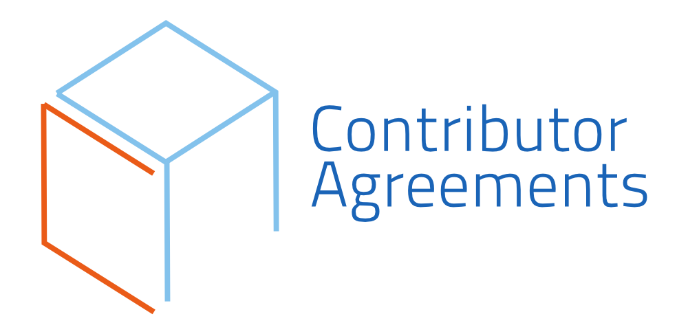

# An Introduction to Contributor Agreements
<!--deck text start-->
Have you heard of *Contributor Agreements*? Learn more about these agreements to proactively avoid future legal issues and code disputes.
<!--deck text end-->

#### Contributed by [David Bernholdt](http://github.com/bernhold "David Bernholdt")
#### Publication date: July 20, 2019 

Resource information | Details 
:--- | :--- 
Resource name  | Contributor Agreements
Website | http://contributoragreements.org/
Focus | Copyright, Code contributions and Licensing

Contributor agreements are a way of managing a variety of legal issues associated with *receiving* (software) contributions to an open collaborative project.  The *[Contributor Agreements](http://contributoragreements.org/)* site provides resources to help projects understand and select a contributor agreement, if they want to use one.  The long-term goal of the effort is to consolidate around a small number of standardized contributor agreements that serve the broad needs of the community, similar to the Creative Commons family of licenses.

<!--- 

--->

<!---
Publish: yes
Categories: collaboration
Topics: licensing
Tags: website
Level: 2
Prerequisites: defaults
Aggregate: none
--->
