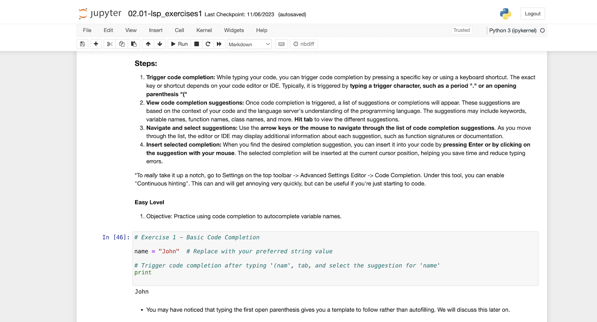

# Jupyter4Science: Better Practices for using Jupyter Notebooks for Science

<!--deck text start-->
[Jupyter4Science](https://jupyter4science.github.io/) is a **knowledge base** of original content and curated resources about developing and sharing Jupyter notebooks as they are used in the context of scientific applications.
<!--deck text end-->

#### Contributed by [Nicole Brewer](https://github.com/nicole-brewer)

#### Publication date: March 31, 2023

Resource information | Details 
:--- | :--- 
Resource name | Accessible Data and Code
Website  | [https://jupyter4.science](https://jupyter4science.github.io/)
Focus | Jupyter notebooks

### Jupyter notebooks and the Jupyter ecosystem

Computational notebooks, including Jupyter notebooks, come in many varieties, but they all have one thing in common: much like traditional laboratory notebooks, computational notebooks contain code cells interspersed with text that can be used to explain their analysis.

Jupyter is a large umbrella project that covers many different software offerings and tools, including the popular Jupyter notebook classic interface and JupyterLab web-based notebook development environments.

### The Jupyter4Science mission

The Jupyter4Science knowledge base is intended for a **research-oriented audience**, including computational scientists, [research software engineers](https://us-rse.org/about/what-is-an-rse/) (RSEs), [academic data scientists](https://academicdatascience.org/community-projects/career-guidebook/), social scientists, digital humanities researchers, students, and anyone else who uses Jupyter notebooks to conduct research. They aim to provide rich resources for researchers, students, and research and data ([RCD](https://carcc.org/)) professionals about **better practices** to improve the **accessibility**, **reuse**, and **reproducibility** of their scientific software, data, and computational workflows.

### Original content and resources

The knowledge base contains original content including tutorials, templates, blog posts, and example notebooks. They also curate and summarize external content like YouTube videos, podcast episodes, and more.

Topics include:

- Development Environments for Jupyter Notebooks
- Reproducible Environments
- Sharing Notebooks
- Creating Publications with Quarto
- Templates and Best Practices
- Jupyter Notebooks as Peer-Reviewed Publications
- Building Data Dashboards and Web Applications with Jupyter Notebooks 

<!---
Publish: yes
Topics: documentation, reproducibility, strategies for more effective teams
--->