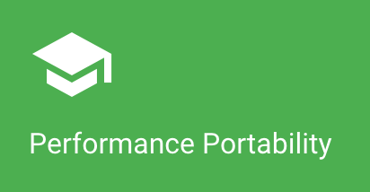

### Portability across DOE Office of Science HPC Facilities
<!-- deck text start --> 
Does your software run on many DOE HPC facilities? This short article discusses an excellent resource that would be helpful for this effort.
<!-- deck text end --> 

#### Contributed by [Tim Williams](https://github.com/zippylab)

#### Publication date: September 06, 2019

Resource information | Details 
:--- | :--- 
Resource name  | DOE performance portability website
Website  | http://performanceportability.org
Focus | Portability

Achieving good performance across a range of platforms is an important goal for high-performance CSE software. This *[DOE performance portability website](http://performanceportability.org)* is intended to be a living/growing documentation hub and guide for applications teams targeting systems at multiple DOE Office of Science HPC facilities. The site discusses differences between the systems, the software environments, and the job-submission processes. The site also discusses how to define and measure performance portability and provides recommendations based on case studies for the most promising performance-portable programming approaches. 

<!---
Publish: yes
Categories: performance
Topics: High-performance computing (HPC), Performance at leadership computing facilities, Performance portability
Tags: site
Level: 2
Prerequisites: default
Aggregate: none
--->
