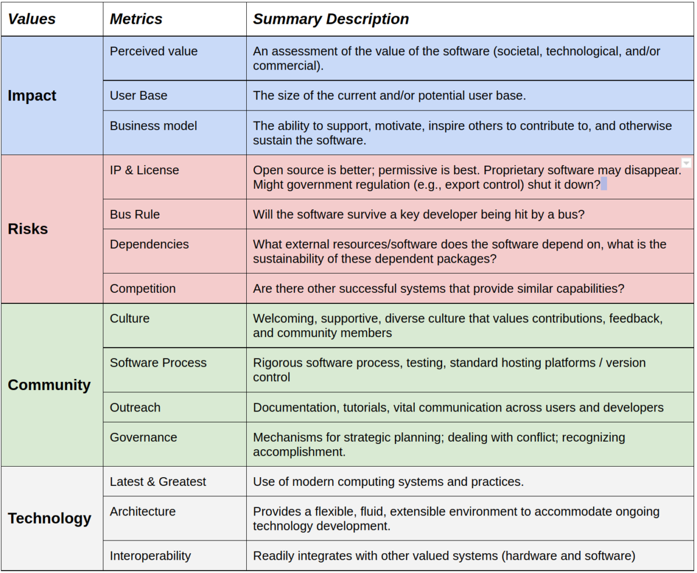

# Software Sustainability Matrix

<!--deck text start-->
The Software Sustainability Matrix (SSM) is an effort to quantify the sustainability of software packages with the goal of guiding efforts to improve the sustainability of software package ecosystems and individual software packages and highlight where to focus improvement efforts.
<!--deck text end-->

#### Contributed by [Roscoe A. Bartlett](https://github.com/bartlettroscoe "Roscoe A. Bartlett GitHub Profile")
#### Publication date: ???

Resource information | Details
:--- | :--- 
Article title |  [How Sustainable is Your Software?](https://www.kitware.com/how-sustainable-is-your-software/)
Authors | Will Schroeder, Jess Tate, Jean-Christophe Fillion-Robin, Christopher Johnson, Dženan Zukić, Matt McCormick, Lee A. Newberg, Daniel White, Alexandra Warner, Ross Whitaker and Rob MacLeod
Publication Details | [Kitware Blog](https://www.kitware.com/blog), January 3, 2020
Focus | Software sustainability

The Software Sustainability Matrix (SSM) is a joint effort of the Scientific Computing and Imaging (SCI) Institute and Kitware to improve the health of the open-source package ecosystem making up the foundational software portfolio for the Center for Integrative Biomedical Computing (CIBC) lead by the SCI for the National Institutes of Health (NIH) [1],[2].
The goal of the SSM effort is to create numerical scores for different aspects of software sustainability for a software package as well of a combined sustainability score.
These SSM sustainability scores are being to guide efforts to improve the sustainability of the software package ecosystem making to CIBC software portfolio, with the hopes that it will encourage support and contributions from the open-source community and reduce the cost and risks to sustain this collection software.
However, the SSM approach may be applicable to other package ecosystems and therefore may be of more general interest.

The SSM score is composed from component scores in the four areas Impact, Risks, Community, and Technology as shown in [Figure 1](#fig_software_sustainability_matrix) and each of these areas are broken down into several different subareas.

<a name="fig_software_sustainability_matrix"/>

 

 

<b>Figure 1:</b> Software Sustainability Matrix

 
 
 
Scores in the range [0-100] in these four areas Impact, Risks, Community, and Technology are then combined in a weighted sum:

&nbsp;&nbsp;&nbsp;&nbsp;SSM Score = FI * I + FR * R + FC * C + FT * T

to produce a single SSM Score [0-100], where FI + FR + FC + FT = 1.
The SCI & Kitware process[3] typically uses the weighting factors FI = FC = 1/3, and FR = FT = 1/6.
It is not specified how the SCI & Ktiware program computes the component scores in the four areas 'I', 'R', 'C', and 'T' for the software packages of interest and the authors state that computing these individual component scores is ultimately a subjective matter.

It is stated by the authors that the primary benefit of estimating the SSM score by a software package team is not in computing the final score, but instead in highlighting areas of possible improvement.
It is stated that many teams make significant improvements in the sustainability for their packages while working through in the process of estimating the SSM score by adopting better processes in different areas.
In this respect, this is similar to the impact of the OpenSSF Best Practices Badge Program[4].
That is, by having a team fill out each best practice item, the team will often implement suggested best practices, especially for practices that are not too difficult to adopt and support.

In summary the Software Sustainability Matrix (SSM) is a promising approach to help triage the sustainability of individual software packages (and collectively an entire software package ecosystem) and then help to dive efforts to make improvements.

<!---
Publish: yes
Pinned: no
Topics: Software process improvement, Software sustainability
RSS update: ???
--->

<!-- References -->

[SCI_and_Kitware_SSM-sfer-ezikiw]: https://www.kitware.com//the-scientific-computing-and-imaging-sci-institute-and-kitware-putting-software-sustainability-into-practice "The Scientific Computing and Imaging (SCI) Institute and Kitware: Putting Software Sustainability into Practice {Will Schroeder, Jess Tate, Jean-Christophe Fillion-Robin, Christopher Johnson, Dženan Zukić, Matt McCormick, Lee A. Newberg, Daniel White, Alexandra Warner, Ross Whitaker and Rob MacLeod. Kitware Blog, January 22, 2021}"

[SCI_and_Kitware_SSM_CIBC-sfer-ezikiw]: https://www.sci.utah.edu/cibc-about/cibc-news/142-general-news-cibc/702-sci-kitware.html "SCI Institute and Kitware: Putting Software Sustainability into Practice {Will Schroeder, Jess Tate, Jean-Christophe Fillion-Robin, Christopher Johnson, Dženan Zukić, Matt McCormick, Lee A. Newberg, Daniel White, Alexandra Warner, Ross Whitaker and Rob MacLeod. Center for Integrative Biomedical Computing Blog}"

[Scoring_the_SSM-sfer-ezikiw]: https://www.kitware.com/scoring-software-sustainability "Scoring Software Sustainability {Will Schroeder, Matt McCormick and Jean-Christophe Fillion-Robin.  Kitware Blog, May 8, 2021}"

[OpenSSF_Best_Practices_Badge_Program-sfer-ezikiw]: https://bssw.io/items/openssf-best-practices-badge-program "OpenSSF Best Practices Badge Program {}"
<!-- DO NOT EDIT BELOW HERE. THIS IS ALL AUTO-GENERATED (sfer-ezikiw) -->
[1]: #sfer-ezikiw-1 "The Scientific Computing and Imaging (SCI) Institute and Kitware: Putting Software Sustainability into Practice"
[2]: #sfer-ezikiw-2 "SCI Institute and Kitware: Putting Software Sustainability into Practice"
[3]: #sfer-ezikiw-3 "Scoring Software Sustainability"
[4]: #sfer-ezikiw-4 "OpenSSF Best Practices Badge Program"
<!-- (sfer-ezikiw begin) -->
### References
<!-- (sfer-ezikiw end) -->
* 1[The Scientific Computing and Imaging (SCI) Institute and Kitware: Putting Software Sustainability into Practice Will Schroeder, Jess Tate, Jean-Christophe Fillion-Robin, Christopher Johnson, Dženan Zukić, Matt McCormick, Lee A. Newberg, Daniel White, Alexandra Warner, Ross Whitaker and Rob MacLeod. Kitware Blog, January 22, 2021](https://www.kitware.com//the-scientific-computing-and-imaging-sci-institute-and-kitware-putting-software-sustainability-into-practice)
* 2[SCI Institute and Kitware: Putting Software Sustainability into Practice Will Schroeder, Jess Tate, Jean-Christophe Fillion-Robin, Christopher Johnson, Dženan Zukić, Matt McCormick, Lee A. Newberg, Daniel White, Alexandra Warner, Ross Whitaker and Rob MacLeod. Center for Integrative Biomedical Computing Blog](https://www.sci.utah.edu/cibc-about/cibc-news/142-general-news-cibc/702-sci-kitware.html)
* 3[Scoring Software Sustainability Will Schroeder, Matt McCormick and Jean-Christophe Fillion-Robin.  Kitware Blog, May 8, 2021](https://www.kitware.com/scoring-software-sustainability)
* 4[OpenSSF Best Practices Badge Program](https://bssw.io/items/openssf-best-practices-badge-program)
