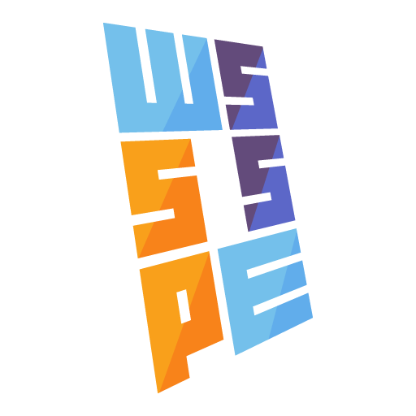

# An Introduction to the WSSSPE Organization

<!-- deck text start -->
The current decade has bought bright focus on sustainable software in the field of science. *WSSSPE* is once such important international community-driven organization that promotes sustainable research software.
<!-- deck text end -->

#### Contributed by [David E. Bernholdt](http://github.com/bernhold)
#### Publication date: July 20, 2019

Resource information | Details 
:--- | :--- 
Organization name  | Working Towards Sustainable Software for Science: Practice and Experiences (WSSSPE)
Website  | [http://wssspe.researchcomputing.org.uk/](http://wssspe.researchcomputing.org.uk/)
Focus | Sustainable software

*[Working Towards Sustainable Software for Science: Practice and Experiences (WSSSPE)](http://wssspe.researchcomputing.org.uk/)* is an international community-driven organization that promotes sustainable research software by addressing challenges related to the full lifecycle of research software through shared learning and community action.

The progress in scientific research is dependent on the quality and accessibility of software at all levels and it is now critical to address many new challenges related to the development, deployment, and maintenance of reusable software. In addition, it is essential that scientists, researchers, and students are able to learn and adopt a new set of software-related skills and methodologies. Established researchers are already acquiring some of these skills, and in particular a specialized class of software developers is emerging in academic environments who are an integral and embedded part of successful research teams. The *WSSSPE* organization provides a forum for discussion of the challenges, including both positions and experiences, and a forum for the community to assemble and act.

<!--- Too large

--->

<!---
Publish: yes
Categories: Collaboration
Topics: Projects and organizations, conferences and workshops
Tags: workshop-series
Level: 2
Prerequisites: defaults
Aggregate: none
--->
