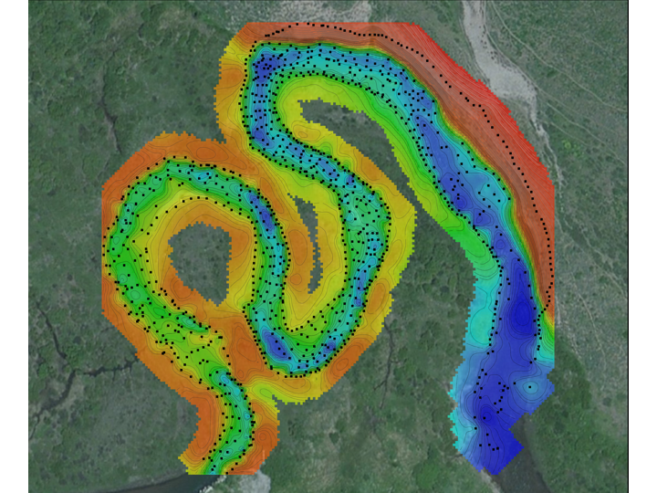

# Kitchen-sink resource test

#### Contributed by [Unique Display Name](https://github.com/bartlettroscoe)

#### Publication date: December 12, 2017

The quick brown fox jumps over the lazy dog. The quick brown fox jumps over the lazy dog. The quick brown fox jumps over the lazy dog. The quick brown fox jumps over the lazy dog. The quick brown fox jumps over the lazy dog. The quick brown fox jumps over the lazy dog. The quick brown fox jumps over the lazy dog. The quick brown fox jumps over the lazy dog.

- [What is good documentation?](https://www.github.com/BSSWimageteam/bsswimagery/IDEAS-DocumentationHowToWriteGoodDocumentation-V0.1.pdf)
- [How to write good documentation](HowToWriteGoodDocumentation.md)


## Test with links

The quick brown fox jumps over the lazy dog. The quick brown fox jumps over the lazy dog. <a href="#_" class="link-inline">The quick brown</a> fox jumps over the lazy dog. The quick brown fox jumps over the lazy dog. The quick brown fox jumps over the lazy dog. <a href="#_" class="link-inline">The quick brown</a> fox jumps over the lazy dog. The quick brown fox jumps over the lazy dog. The quick brown fox jumps over the lazy dog.

<a href="#_" class="link-row">Row link one</a>
<a href="#_" class="link-row">Row link two</a>
<a href="#_" class="link-row">Row link three</a>

Could link rows use a markdown horizontal rule.

[Link One](DocumentationTools.Doxygen.md)
___
[Link Two](DocumentationTools.ReadTheDocs.md)
___
[Link Three](DocumentationTools.Sphinx.md)
___


## Test strong and emphasis

The *quick brown fox* jumps over the **lazy dog**. The quick brown fox jumps over the lazy dog. The quick brown fox jumps over the lazy dog. The quick brown fox jumps over the lazy dog. The *quick brown fox* jumps over the **lazy dog**. The quick brown fox jumps over the lazy dog. The quick brown fox jumps over the lazy dog. The quick brown fox jumps over the lazy dog.

The second sentence uses the `<mark>` tag. The quick brown fox jumps over the lazy dog. The <mark> quick brown fox </mark> jumps over the lazy dog. 


## Test subhead and lists

### Subhead

- Unorderd list item
- Unorderd list item
- Unorderd list item

1. Ordered list item
2. Ordered list item
3. Ordered list item

The quick brown fox jumps over the lazy dog. The quick brown fox jumps over the lazy dog. The quick brown fox jumps over the lazy dog. The quick brown fox jumps over the lazy dog.

#### Subsubhead

The quick brown fox jumps over the lazy dog. The quick brown fox jumps over the lazy dog. The quick brown fox jumps over the lazy dog. The quick brown fox jumps over the lazy dog.

- Unorderd list item
- Unorderd list item
- Unorderd list item


## Test table

The quick brown fox jumps over the lazy dog. The quick brown fox jumps over the lazy dog. The quick brown fox jumps over the lazy dog. The quick brown fox jumps over the lazy dog. The quick brown fox jumps over the lazy dog. The quick brown fox jumps over the lazy dog. The quick brown fox jumps over the lazy dog. The quick brown fox jumps over the lazy dog.

### Subhead

A | Test | Table
--- | ---: | ---:
1 | 2 | 3

Second | Test | Table
--- | --- | ---
The quick brown fox jumps over the lazy dog. | The quick brown fox jumps over the lazy dog. | The quick brown fox jumps over the lazy dog. The quick brown fox jumps over the lazy dog. The quick brown fox jumps over the lazy dog. The quick brown fox jumps over the lazy dog.

Concept Name | Summary | Example Tools or Techniques
--- | --- | ---
**Software Gardener Lattices** | &nbsp; | &nbsp;
Kickoff training/meeting | Use the scientific method to understand and build software gardens. | Scientific Method, Objective and Key Results, Agile Methodology Sprint Goal-setting
Growing together: Cognitive apprenticeship | Work with others in the context of learning opportunities, leveraging cognitive apprenticeship techniques and similar. | Cognitive Apprenticeship techniques, Pull Request Reviews, Pair Programming
Ascendant fortitude: Courage, vulnerability, and resilience | Embody bravery and vulnerability to overcome uncertainty and grow within software gardens. | Psychological Safety, Open communication, Mistake accountability and growth
**Code: Software Gardening Senescence** | &nbsp; | &nbsp;
Living fences: Environmental boundaries and replicability | Use environment managers by default to build protected, replicable contexts for your software garden. | Conda, Poetry, Renv
Adventitious code: Software development velocity and linting | Add and require software linting tools in order to weed inconsistent, obsolete, or dangerous code “volunteers” which may naturally appear. | Pre-commit, Pylint, Stylr, Ruff
Multi-generational adaptation: Surviving through fluidity | Use abstraction and fitness testing to keep and ensure code flexibility by design and goal alignment. Remove code which becomes disintegrated or overly complex. | Object-oriented design, Fitness functions, Decoupling strategies
**Season: Software Archeology, Nowness, and Proactivity** | &nbsp; | &nbsp;
Software archeology: Wisdom of the ancients | Hark past development by using existing software to full potential, reference existing implementations, and remove archived or otherwise “dead” code. | Documentation, GitHub Search, GitStats
Nowness rooting: Code maintenance kairos | Orient work towards what needs to happen today, respecting that our conception of the present consistently shifts. | Mindfulness, Kanban task status, Time blocking techniques
Garden proactivity: Anticipating and preparatory growth | Hope for the best and plan for the worst, setting aspirational but measurable goals and avoiding known risks, weaknesses, or threats by observing them in your software garden planning. | Backcasting, SWOT Analysis, Risk Matrices


Feature | Zoom | WebEx Meetings<sup>[aw](#webex-notes-aw)</sup> 
--- | --- | ---
&nbsp; | &nbsp; | &nbsp;
**The Basics** ([details below](#the-basics)) | &nbsp; | &nbsp;
[Free Plan](#free-plans) | [Yes](https://zoom.us/pricing) | [Yes](https://www.webex.com/pricing/index.html) 
[Plan Pricing<br>$/mo/host](#plan-pricing) | 0/15/20 | 0/15/20/30 
[Size Limit](#size-limits) | 100-1000<sup>[az](#zoom-notes-az)</sup> | 50-200<sup>[bw](#webex-notes-bw),[cw](#webex-notes-cw)</sup> 
[Length Limit](#length-limits) | &le;24h<sup>[bz](#zoom-notes-bz)</sup> | &le;24h 
[Supported Devices](#supported-devices) | [A]/[W]/[M]/[L] | [A]/[W]/[M]/[L]/[VCS](https://help.webex.com/en-us/7yxpa9/Join-a-Webex-Meeting-from-a-Video-System)
[No Install<br>option](#no-install-option) | [Partial](https://support.zoom.us/hc/en-us/articles/214629443-Zoom-web-client)<sup>[cz](#zoom-notes-cz)</sup> | [Partial](https://help.webex.com/en-us/ozygebb/Join-a-Cisco-Webex-Meeting#Join-a-Meeting-from-the-Webex-Meetings-Desktop-App-or-Mobile-App)<sup>[ew](#webex-notes-ew)</sup>
[HD Video](#high-definition-video) | No | [Maybe](https://help.webex.com/en-us/fw8u4j/Webex-Video-Support)
[Test Meeting](#test-meeting) | [Yes](https://zoom.us/test) | [Yes](https://www.webex.com/test-meeting.html) | [Yes](https://bluejeans.com/111/) | [Partial](https://ucstatus.com/2019/06/26/how-to-place-a-test-call-in-microsoft-teams/) | [Yes](https://support.goto.com/meeting/help/join-a-test-session-g2m050001) | [Partial](https://www.businessinsider.com/how-to-test-skype-video)
[Free Dial-in option](#free-dial-in-option) | [Maybe](https://support.zoom.us/hc/en-us/articles/201362663-Joining-a-meeting-by-phone) | [Maybe](https://help.webex.com/en-us/WBX25713/How-Do-I-Find-the-Global-Dial-In-Number-for-My-Meeting)
&nbsp; | &nbsp; | &nbsp;
**Content Sharing** ([details below](#content-sharing)) | &nbsp; | &nbsp;
[Screen Sharing](#screen-sharing) | [Yes](https://support.zoom.us/hc/en-us/articles/201362153-Sharing-your-screen) | [Yes](https://help.webex.com/en-us/i62jfl/Share-Your-Screen-or-Application-in-a-Cisco-Webex-Teams-Meeting)
[App Sharing](#app-sharing) | [Yes](https://support.zoom.us/hc/en-us/articles/115005706806-Using-annotation-tools-on-a-shared-screen-or-whiteboard) | [Yes](https://help.webex.com/en-us/utfx63/Share-an-Application-in-Cisco-Webex-Meetings)
[Shared Whiteboard](#shared-whiteboard) | [Yes](https://support.zoom.us/hc/en-us/articles/205677665-Sharing-a-whiteboard) | [Yes](https://help.webex.com/en-us/5ddww5/Share-Content-in-Cisco-Webex-Meetings-and-Cisco-Webex-Events)
[Shared Annotations](#shared-annotations)  | [Yes](https://support.zoom.us/hc/en-us/articles/115005706806-Using-annotation-tools-on-a-shared-screen-or-whiteboard) | [Yes](https://help.webex.com/en-us/hc3tig/Options-Available-on-the-Annotate-Toolbar-in-the-Cisco-Webex-Meetings-Suite)
[Able chat](#able-chat) | [Yes](https://support.zoom.us/hc/en-us/articles/203650445-In-Meeting-Chat)<sup>[dz](#zoom-notes-dz)</sup> | [TBD](#tbd)
[Polling/Voting](#voting-or-polling) | [Yes](https://support.zoom.us/hc/en-us/articles/213756303-Polling-for-Meetings) | [Yes](https://help.webex.com/en-us/n0pdj9x/Start-a-Poll-in-Cisco-Webex-Meetings) | [Partial](https://support.bluejeans.com/s/article/Event-Polling) | [Yes](https://support.office.com/en-us/article/create-a-poll-in-microsoft-teams-a3f9112c-01e1-4ee4-bd88-25e4e243b80b) | No | [Yes](https://support.microsoft.com/en-us/office/take-a-poll-in-a-skype-for-business-meeting-6eb1fb85-18a6-422c-ae48-55519841f296?ui=en-us&rs=en-us&ad=us)
[File sharing](#file-sharing) | [Maybe](https://support.zoom.us/hc/en-us/articles/209605493-In-Meeting-File-Transfer#h_35f5965f-bae8-49b2-a1a9-8956fb8022ff) | [Yes](https://help.webex.com/en-us/5ddww5/Share-Content-in-Cisco-Webex-Meetings-and-Cisco-Webex-Events)
[Recording](#recording) | [Yes](https://support.zoom.us/hc/en-us/sections/200208179-Recording) | Maybe<sup>[gw](#webex-notes-gw)</sup>
[Transcription](#transcription) | [Yes](https://support.zoom.us/hc/en-us/articles/115004794983-Automatically-Transcribe-Cloud-Recordings-) | [TBD](#tbd)
[Closed captioning](#closed-captioning) | [Partial](https://support.zoom.us/hc/en-us/articles/207279736-Getting-started-with-closed-captioning) | [Maybe](https://www.webex.com/ai-assistant.html)<sup>[hw](#webex-notes-hw)</sup>
[Live Streaming](#live-streaming) | Maybe<sup>[ez](#zoom-notes-ez)</sup> | [Yes](https://help.webex.com/en-us/n97pcak/Live-Stream-Your-Webex-Meetings)
&nbsp; | &nbsp; | &nbsp;
**Compatibility** ([details below](#compatibility)) | &nbsp; | &nbsp;
Windows Desktop |[8]/[10h]/[10p] | [8]/[10h]/[10E]
Linux Desktop | [U]/[D]/[C]/[R]/[O]/[F]/[+][+z] | [U]/[R]/[O]/[F]
macOS Desktop | [&ge;10.7][osx] | [&ge;10.13][osx]
Presenter Browser | **[Ch]**/[Ed] | **[Ch]**/**[Fi]**/[Sa]
Attendee Browser | **[Ch]**/[Ed]/[Fi]/[Sa] | **[Ch]**/**[Fi]**/[Sa]
Presenter Mobile | [And]/[iOS] | [And]/[iOS]
Attendee Mobile | [And]/[iOS] | [And]/[iOS]


## Test code block

The quick brown fox jumps over the lazy dog. The quick brown fox jumps over the lazy dog. The quick brown fox jumps over the lazy dog. The quick brown fox jumps over the lazy dog. The quick brown fox jumps over the lazy dog. The quick brown fox jumps over the lazy dog. The quick brown fox jumps over the lazy dog. The quick brown fox jumps over the lazy dog.

### Subhead

```
<fox class='quick brown'>
	stuff stuff stuff
</fox>

<dog class='lazy'>
	stuff stuff stuff
</dog>
```


## Test blockquote

> The quick brown fox jumps over the lazy dog. The quick brown fox jumps over the lazy dog. The quick brown fox jumps over the lazy dog. The quick brown fox jumps over the lazy dog. 

Below are markdwon styles in the blockquote

> The quick brown fox jumps over the *lazy dog*. The **quick brown fox** jumps over the lazy dog. The quick brown fox jumps over the lazy dog.

## Test of HTML comment handling

HTML comments look like this: `<!-- arbitrary text -->` (which we can see becasuse we marked it up as code)

Comments in regular text <!-- like this --> should be interpreted as comments.  They should be visible in the resulting HTML source, but not in the rendered version.

### Comments after headings <!-- should also be treated like comments -->

There should be some real text here, just for the sake of appearances

### References <!-- sfer_ezikiw -->

But due to a bug they were being rendered as visible text.

## Test image

The quick brown fox jumps over the lazy dog. The quick brown fox jumps over the lazy dog. The quick brown fox jumps over the lazy dog. The quick brown fox jumps over the lazy dog. The quick brown fox




[test caption]

[Caption goes here.]


The quick brown fox jumps over the lazy dog. The quick brown fox jumps over the lazy dog. The quick brown fox jumps over the lazy dog. The quick brown fox jumps over the lazy dog. The quick brown fox


The quick brown fox jumps over the lazy dog. The quick brown fox jumps over the lazy dog. The quick brown fox jumps over the lazy dog. The quick brown fox jumps over the lazy dog. The quick brown fox

## Test images with relative paths
These images are referenced using relative URLs.  As of 2021-03, we are transitioning to prefer this approach over using fully qualified URLs.  All img URLs should reference
the bssw.io/images directory to work nicely with the typical authoring/development setup.  The front-end will translate such references to the images directory into GH URLs so that the content is ultimately served from the GH repo, as we have been doing.

[URL prefix: /images (should work on GH)]
[URL prefix: ../images (should work on GH)]
[URL prefix: ../../images (should *not* work on GH)]

## Test images subdirectories
The following image calls test subdirectories in the images directory and filename collisions between images and its subdirectories.

[images/cats subdirectory: should be a cat]
[images directory: should be the MolSSI logo]


**Subresources:**
- [Doxygen](DocumentationTools.Doxygen.md)
- [ReadTheDocs](DocumentationTools.ReadTheDocs.md)
- [Sphinx](DocumentationTools.Sphinx.md)


# the-basics


<!---
Publish: yes
Track: Deep Dive
Categories: Planning, Reliability
Topics: testing
Tags: [import from subresources]
Level: 2
Prerequisites: [import from subresources]
Aggregate: base
Slug: special-kitchen-sink-url
--->
