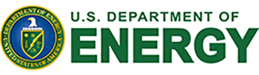

# BSSw Fellowship Program

The Better Scientific Software (BSSw) Fellowship Program gives recognition and funding to leaders and advocates of high-quality scientific software.

## About Our Fellows Program

The main goal of the BSSw Fellowship program is to foster and promote practices, processes, and tools to improve developer productivity and software sustainability of scientific codes.  We also anticipate accumulating a growing community of BSSw Fellowship alums who can serve as leaders, mentors, and consultants to increase the visibility of those involved in scientific software production and sustainability in the pursuit of scientific discovery.

**BSSw Fellows are selected annually based on an application process that includes the proposal of a funded activity that promotes better scientific software through a publicly available artifact.  We select at least three Fellows per year and honorable mentions as appropriate.  Each 2024 BSSw Fellow will receive up to $25,000 for an activity that promotes better scientific software.**
Activities can include organizing a workshop, preparing a tutorial, or creating content to engage the scientific software community, including broadening participation or promoting diversity, equity, and inclusion.

BSSw Fellows receive funds through their respective institution for one year.  We encourage BSSw Fellows to continue to serve the scientific software community as alums by helping select future classes of Fellows and providing leadership in their communities.

### Become a BSSw Fellow

Do you have something to share with the scientific software community?  Do you have a passion to learn and teach others about better software?  Apply for a BSSw Fellowship.  Help the community, and receive funding and recognition for your efforts.

### Who Should Apply

Applicants must be affiliated with a U.S.-based institution that is able to receive Federal funding.  Typically such institutions include U.S. government labs, U.S. universities, and U.S.-based corporations.

Beyond this categorical requirement, we are looking for applications from people with the following characteristics:
- Passionate about scientific software.
- Interested in contributing powerful ideas, tools, methodologies, and more that improve the quality of scientific software.
- Able to use the fellowship to broadly benefit the scientific software community.
- Willing to participate as an alum in subsequent years to guide selection of future fellows and promote better scientific software in their community.

We encourage applicants at all career stages, ranging from students through early-career, mid-career, and senior professionals, especially those from underrepresented groups, including people who are Black or African American, Hispanic/Latinx, American Indian, Alaska Native, Native Hawaiian, Pacific Islanders, women, persons with disabilities, and first generation scholars.

### 2024 BSSw Fellowships

<!-- [2024 BSSw Fellowship Application Form](https://forms.gle/14X8uWY6asoEPD828) - Submissions Open! -->

<!-- Applications will open on August 15, 2022 for the 2024 BSSw Fellowship Program. Check back for info about the application process or [subscribe to our mailing list](https://bssw.io/pages/receive-our-email-digest) to receive details.-->

Applications are now closed for the 2024 BSSw Fellowship Program. Check back in summer 2024 for info about the 2025 application process.

### More Information

- Read the [highlights of the 2024 BSSw Fellowship Q&A Session](https://bssw.io/blog_posts/highlighted-topics-from-bssw-fellowship-q-a-session)
- Read about work of the [2022 BSSw Fellows and their perspectives on the program](https://bssw.io/blog_posts/2022-bssw-fellows-projects-and-perspectives)
- Read about the [2023 BSSw Fellows](https://bssw.io/blog_posts/introducing-the-2023-bssw-fellows)
- Read about work of the [2021 BSSw Fellows and their perspectives on the program](https://bssw.io/blog_posts/2021-bssw-fellows-projects-and-perspectives)
- Read about the [2021 BSSw Fellows](https://bssw.io/blog_posts/introducing-the-2021-bssw-fellows) and new [NSF-sponsorship of 2021 BSSw Fellows](https://bssw.io/blog_posts/nsf-sponsored-2021-bssw-fellows)
- More info about work and perspectives of the [2020 BSSw Fellows](https://bssw.io/blog_posts/2020-bssw-fellows-projects-and-perspectives), [2019 BSSw Fellows](https://bssw.io/blog_posts/2019-bssw-fellows-guide-developers-through-each-stage-of-the-scientific-software-lifecycle), and [2018 BSSw Fellows](https://bssw.io/blog_posts/2018-bssw-fellows-tackle-scientific-productivity-challenges)

- [FAQ for the BSSw Fellowship Program](https://bssw.io/pages/bssw-fellowship-faq) ... Check back for updates; we will post additional Q&A here as these arise.
- If you have additional questions, please contact us at <info@bssw.io>.

<!-- Removing the older links, but we could keep a longer running record
- Read about work of the [2020 BSSw Fellows and their perspectives on the program](https://bssw.io/blog_posts/2020-bssw-fellows-projects-and-perspectives)
- Read about work of the [2019 BSSw Fellows and their perspectives on the program](https://bssw.io/blog_posts/2019-bssw-fellows-guide-developers-through-each-stage-of-the-scientific-software-lifecycle)
- [2019 BSSw Fellows](https://bssw.io/blog_posts/introducing-the-2019-bssw-fellows) ... Read about the 2019 BSSw Fellows.
- [2018 BSSw Fellows: Projects and Perspectives](https://bssw.io/resources/bssw-fellows-2018-projects-and-perspectives) ... Read about work of the 2018 BSSw Fellows and their perspectives on the program.
-->

 

**The BSSw Fellowship is sponsored by the U.S. Department of Energy and National Science Foundation.**

  

  

<!--
Publish: yes
OpenGraph image: Blog_2308_Fellows.png
-->
